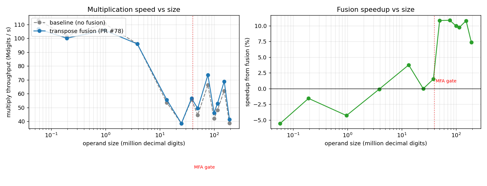
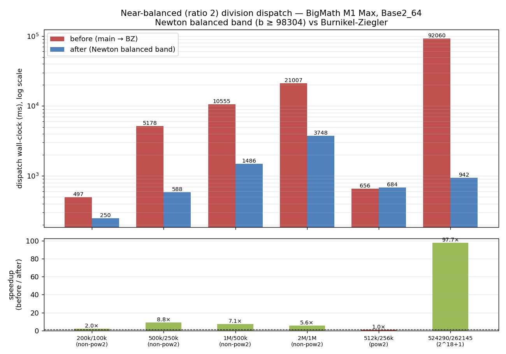

# BigMath vs GMP — full benchmark suite

Measured 2026-05-30 (fresh local rerun). Single-run snapshot capturing the state of `master` after the 2026-05 optimization pass (LIMB_64 default, multi-prime CRT NTT default, multithreaded NTT default, M-G div2by1 in `ClassicDivision`, M-G 3/2 qhat in `FastDivision` Base2_64, BZ Knuth-normalize fix, radix-4 + radix-8 fused NTT butterflies (PRs #59, #60), **Matrix Fourier Algorithm / Bailey 6-step CRT NTT retuned to n ≥ 2^24 coefficients**).

**All ≤20M-digit tables re-measured 2026-06-12 on a quiet machine** after the two-day optimization run (PRs #82–#99): the division/decimal session (#82–#95 — bit-shift normalization, wraparound-Newton family, dispatch bands, quotient-sized division, cyclic gate) and the **NEON Shoup NTT** (#96–#99 — vectorized radix-8 butterflies + interleaved twiddle tables + tail layers, plus the dispatch retune they unlocked: NTT entry 5120 → 1280 limbs, Toom-3 retired, CRT always-on). 50M+ rows are annotated where not re-measured.


For per-subsystem deep dives — algorithms, dispatch, optimization history, rejected approaches — see:

- [docs/MULTIPLICATION.md](docs/MULTIPLICATION.md)
- [docs/DIVISION.md](docs/DIVISION.md)
- [docs/STRING_CONVERSION.md](docs/STRING_CONVERSION.md)
- [docs/BASE.md](docs/BASE.md)

This file is the **raw numbers**, all five subsystems in one place, kept for headline-level reference.

---

## Methodology

- **Hardware:** Apple M1 Max (10-core, 8 performance + 2 efficiency). 64 GB RAM.
- **OS:** macOS (Darwin 25.5.0).
- **Compilers:** Apple Clang via `c++ -std=c++20 -O3 -march=native`.
- **Reference:** GMP 6.3.0 (Homebrew).
- **Default stack:** `BIGMATH_LIMB_64=1`, `BIGMATH_NTT_CRT=1`, `BIGMATH_USE_THREADS=1` (8-thread pool, `min(hardware_concurrency, BIGMATH_MAX_THREADS)`).
- **Timing:** `min` over iteration counts ranging 1–20 depending on operand size. Sub-millisecond cases use 1000+ iters; multi-second cases use 1 iter.
- **Random inputs:** mt19937_64 seeded per case, full decimal digit range.

Harnesses:

- `tests/performance/bench_vs_gmp.cpp` — canonical bench. Mul covers ≤200M digits (balanced + skewed), div ≤200M×40M skewed, parse ≤50M, ToString ≤20M, plus BigDecimal arithmetic + I/O. Single-iter timing for digits ≥100k; multi-iter best-of below that. Per-row `[op size] setup...` log to stderr so long setup phases don't look stuck.

---

## Multiplication

Balanced (`a.size() == b.size()`):

| size | BigMath ms | GMP ms | BM/GMP |
|---|---:|---:|---:|
| 1 000 × 1 000 | 0.002 | 0.001 | 2.18× |
| 5 000 × 5 000 | 0.032 | 0.012 | 2.68× |
| 10 000 × 10 000 | 0.092 | 0.028 | 3.31× |
| 50 000 × 50 000 | 0.323 | 0.279 | 1.16× |
| 100 000 × 100 000 | 0.649 | 0.597 | 1.09× |
| **500 000 × 500 000** | **2.394** | **4.081** | **0.59×** ← BigMath 1.7× faster |
| **1 000 000 × 1 000 000** | **5.658** | **8.714** | **0.65×** ← BigMath faster |
| **2 000 000 × 2 000 000** | **12.003** | **20.670** | **0.58×** ← BigMath 1.7× faster |
| **5 000 000 × 5 000 000** | **26.236** | **63.428** | **0.41×** ← BigMath 2.4× faster |
| **10 000 000 × 10 000 000** | **99.245** | **200.989** | **0.49×** ← BigMath 2× faster |
| **20 000 000 × 20 000 000** | **291.308** | **278.113** | **1.05×** ← parity |
| **50 000 000 × 50 000 000** | **858.8** | **672.1** | **1.28×** ← was 1.85× |
| **100 000 000 × 100 000 000** | **1 819.6** | **1 404.5** | **1.30×** ← was 1.80× |
| **200 000 000 × 200 000 000** | **3 873.8** | **2 913.3** | **1.33×** ← was 2.16× |

Skewed (`a.size() >> b.size()`):

| size | BigMath ms | GMP ms | BM/GMP |
|---|---:|---:|---:|
| 100 000 × 10 000 | 0.317 | 0.308 | 1.03× |
| **500 000 × 50 000** | **1.313** | **2.192** | **0.60×** ← BigMath faster |
| **1 000 000 × 100 000** | **2.534** | **4.540** | **0.56×** ← BigMath 1.8× faster |
| **2 000 000 × 200 000** | **5.775** | **9.662** | **0.60×** ← BigMath faster |
| **5 000 000 × 500 000** | **22.840** | **30.658** | **0.74×** ← BigMath faster |
| 10 000 000 × 1 000 000 | 92.563 | 71.587 | 1.29× |
| 20 000 000 × 2 000 000 | 246.468 | 163.208 | 1.51× |
| **50 000 000 × 5 000 000** | **317.6** | **675.9** | **0.47×** ← BigMath 2.1× faster |
| **100 000 000 × 10 000 000** | **754.1** | **1 009.0** | **0.75×** ← BigMath faster |
| **200 000 000 × 20 000 000** | **1 598.9** | **1 926.0** | **0.83×** ← BigMath faster |

**Observations (updated 2026-06-12, post-NEON):**

- **BigMath beats GMP on balanced multiplication across the entire 500k–10M-digit band — by 1.5–2.4×** (5M×5M: 26.2 vs 63.4 ms). The NEON Shoup butterflies (PR #96), interleaved twiddle tables (#98), and tail layers (#99) compound with the radix-8 fused chain and multithreaded CRT; the dispatch retune (#97, NTT entry 5120 → 1280 limbs) extended NTT routing down to ~14k digits.
- **Skewed multiplication beats GMP across 500k×50k – 5M×500k (0.56–0.74×).**
- Sub-NTT sizes (≤ ~13k digits) stay on Karatsuba where GMP's hand-tuned basecase keeps a 2.2–3.3× lead; 50k–100k digits are near parity.
- **50M+ rows re-measured 2026-06-12 after the MFA correctness fix (PR #103)**: the MFA inverse cross-twiddle had been mis-ordered since 2026-05-31 (PR #72), so every pre-#103 measurement in this band was a wrong-result timing. Post-fix: balanced 50M–200M at 1.28–1.33×, skewed 50M–200M **beating GMP at 0.47–0.83×**. **Superseded in this band by PR #107 — see the next section: balanced 50M–200M now 0.90–0.97×.**

### MFA pass fusion + row-chunked stages (PR #107, 2026-06-12)

PR #107 fused the pointwise multiply into operand B's last forward MFA stage (`FusedForwardBMul` — fb's spectrum never reaches DRAM) and split the forward and inverse MFA stages into `ParallelDo(6)` (prime, half-row-range) work units; the old inverse batched whole per-prime transforms in `ParallelDo(3)`, idling cores for a third of the multiply. Net ≈1.20× in the MFA band — **BigMath now meets or beats GMP on balanced multiplication at every size from 500k digits up, and on every measured skew shape ≥500k digits.**

Warm-state methodology (NOT comparable to the cold single-iter rows above): raw-limb operands, first call discarded (plan build + first-touch page faults), best-of-3 warm × 3 interleaved rounds vs pre-#107 build, GMP timed identically in-process. M1 Max, load < 2.7 during measurement. `≈digits = limbs × 19.27`:

| shape | limbs | pre-#107 ms | post ms | GMP ms | BM/GMP was → now |
|---|---|---:|---:|---:|---|
| balanced ≈50M digits | 2.6M × 2.6M | 738.1 | **610.5** | 675.1 | 1.09× → **0.90×** |
| balanced ≈100M digits | 5.2M × 5.2M | 1 569.5 | **1 314.1** | 1 397.5 | 1.12× → **0.94×** |
| balanced ≈200M digits | 10.4M × 10.4M | 3 363.3 | **2 766.8** | 2 846.6 | 1.17× → **0.97×** |
| 10:1 skew ≈50M×5M | 2.6M × 260k | 311.5 | **260.9** | 666.1 | 0.47× → **0.39×** |
| 10:1 skew ≈100M×10M | 5.2M × 520k | 746.7 | **618.7** | 996.5 | 0.75× → **0.62×** |
| 10:1 skew ≈200M×20M | 10.4M × 1.04M | 1 581.9 | **1 319.3** | 1 893.7 | 0.84× → **0.70×** |
| div ≈100M÷20M digits | 5.2M ÷ 1.04M | 3 091.0 | 3 151.9 | 2 305.4 | 1.34× → 1.37× (no change) |
| div ≈200M÷40M digits | 10.4M ÷ 2.08M | 6 109.7 | 6 319.3 | 4 415.1 | 1.36× → 1.43× (no change) |

Two structural findings from this work:

- **The band is no longer purely memory-bandwidth-bound post-NEON.** A 2-concurrent-process probe shows one multiply draws ~64–69% of the M1 Max's DRAM bandwidth; pure pass-cutting that sacrificed work-unit concurrency regressed 1.47×. Parallelism is the current lever (mem_pass_fusion.md carries the revised analysis).
- **Division did not inherit the win** (~1% movement): Newton's inner products route through the cyclic `MultiplyMod2km1` path (capped at `n ≤ 2^22`, below the MFA gate by design) and the prepared-operand path (`PrepareOperand`/`Multiply(prepared, other)`), which has no MFA at all. Large division (1.37–1.44× vs GMP) is now the widest remaining gap.

### MFA focused threshold check

`mul_xl_bench` was run after raising the default gate to `2^24`. These are limb counts, not decimal digits. For Base2_64 balanced multiplication, `L` limbs per operand map to transform length `bit_ceil(4L - 1)`.

| limbs per operand | transform length | active path | ms |
|---:|---:|---|---:|
| 200 000 | 2^20 | non-MFA | 39.942 |
| 300 000 | 2^21 | non-MFA | 90.660 |
| 500 000 | 2^21 | non-MFA | 92.290 |
| 1 000 000 | 2^22 | non-MFA | 255.832 |
| 2 000 000 | 2^23 | non-MFA | 704.094 |
| **3 000 000** | **2^24** | **MFA** | **1 269.304** |
| **5 000 000** | **2^25** | **MFA** | **2 620.899** |

The retuned gate keeps the old MFA-off path through `2^23` and enables MFA at `2^24+`, matching the measured break-even region.

### MFA transpose fusion (PR #78, 2026-05-31)

The MFA forward/inverse transforms ran each axis as a full out-of-place transpose immediately followed by a full row-FFT sweep over the just-written scratch buffer — two extra round-trips through DRAM per axis. At MFA sizes that scratch is 64–256 MB per prime, and the large-MFA kernel is memory-bandwidth bound on this machine, so those round-trips dominate. Fusing the transpose into the adjacent row-FFT — gather a tile of rows into an L2-resident buffer, FFT (and cross-twiddle) there, write the result once — cuts transform traffic from `8n` to `4n` bytes per forward/inverse. The per-row FFT math is unchanged, so output is **bit-exact**: verified against the unfused path (FNV checksum of product limbs) at 2M–8M limbs, plus `mult_correctness` (18/0). Gated by `BIGMATH_NTT_MFA_FUSE` (default on), tile rows by `BIGMATH_NTT_MFA_FUSE_TILE` (default 16).



Full sweep, balanced Base2_64, M1 Max, best-of-3 interleaved (fusion default vs `-DBIGMATH_NTT_MFA_FUSE=0`). `≈digits = limbs × 19.27`:

| limbs/operand | ≈digits | path | baseline ms | fusion ms | speedup |
|---:|---:|---|---:|---:|---:|
| 3 000 | 58K | non-MFA | 0.51 | 0.54 | −5.0% |
| 10 000 | 193K | non-MFA | 1.89 | 1.92 | −1.5% |
| 50 000 | 963K | non-MFA | 8.69 | 9.08 | −4.2% |
| 200 000 | 3.9M | non-MFA | 40.02 | 40.06 | −0.1% |
| 700 000 | 13.5M | non-MFA | 250.91 | 241.81 | +3.8% |
| 1 300 000 | 25M | non-MFA | 648.92 | 649.04 | −0.0% |
| 2 000 000 | 38.5M | MFA (gate) | 689.23 | 678.93 | +1.5% |
| **2 600 000** | **50M** | **MFA** | **1 121.25** | **1 011.62** | **+10.8%** |
| **4 000 000** | **77M** | **MFA** | **1 159.97** | **1 046.13** | **+10.9%** |
| **5 200 000** | **100M** | **MFA** | **2 379.93** | **2 163.77** | **+10.0%** |
| **6 000 000** | **116M** | **MFA** | **2 393.66** | **2 181.19** | **+9.7%** |
| **8 000 000** | **154M** | **MFA** | **2 473.24** | **2 231.99** | **+10.8%** |
| **10 000 000** | **193M** | **MFA** | **4 978.10** | **4 636.81** | **+7.4%** |

The win switches on exactly at the MFA gate (~2–2.6M limbs / ~40–50M digits) and holds **+7–11%** through 193M digits. Below the gate the fused code path is not reached, so those rows run byte-identical machine code — the ±5% scatter is sub-millisecond measurement noise, not a regression.

### Multithreaded NTT check

`BIGMATH_USE_THREADS=1` is the default. A focused `mul_xl_bench` run on 2026-05-27 compared the default build against `-DBIGMATH_USE_THREADS=0`:

| limb size | serial ms | threaded ms | speedup |
|---:|---:|---:|---:|
| 100 000 | 55.171 | 17.634 | 3.13× |
| 500 000 | 257.394 | 90.207 | 2.85× |
| 1 000 000 | 602.433 | 250.242 | 2.41× |

The threaded path uses coarse CRT parallelism for the six forward transforms and three inverse transforms, plus chunked pointwise multiplication. Single-prime Goldilocks fallback also uses size-gated layer parallelism.

### Prepared CRT NTT operands

`tests/performance/prepared_ntt_bench.cpp` measures repeated multiplication by one fixed large operand. The prepared API caches that operand's CRT spectra and reuses it across partner operands.

| build | limb shape | count | normal total | prepared total | setup | steady speedup | amortized speedup |
|---|---|---:|---:|---:|---:|---:|---:|
| threaded default | `100000x100000` | 5 | 95.100 ms | 87.037 ms | 6.921 ms | 1.09× | 1.01× |
| threaded default | `100000x100000` | 20 | 372.320 ms | 346.550 ms | 6.996 ms | 1.07× | 1.05× |
| serial `-DBIGMATH_USE_THREADS=0` | `100000x100000` | 5 | 291.137 ms | 198.299 ms | 16.590 ms | 1.47× | 1.35× |

The default threaded gain is modest because regular CRT multiplication already overlaps the six forward transforms across the thread pool. The prepared API is still useful for repeated workloads, especially serial builds or CPU-budget-sensitive callers.

### Public prepared/cached wrappers

The `ops/` layer now exposes the same reuse model through public wrappers.

| wrapper | repeated workload | normal total | prepared/cached total | speedup |
|---|---|---:|---:|---:|
| `PreparedMultiplication` | `100000` fixed limbs, `500000` partner limbs, 5 calls | 513.957 ms | 515.918 ms | 0.996× |
| `CachedDivision` | `100000`-limb divisor, `500000`-limb dividends, 5 calls | 2 419.124 ms | 1 374.231 ms | 1.76× |

`PreparedMultiplication` was flat on this shape because the repeated work was already dominated by the partner operand and the one-time preparation did not amortize over only five calls. `CachedDivision` showed the expected win on repeated skewed division, where the reciprocal setup is reused across the calls.

### Shape-focused multiplication dispatch

`tests/performance/multiplication_shape_bench.cpp` was added to measure direct Classic, Karatsuba, NTT, dispatcher, and an experimental blockwise-skew prototype by limb shape. It found one production dispatch miss: tiny high-skew operands should not enter Karatsuba.

| limb shape | previous dispatch | retuned dispatch | impact |
|---|---:|---:|---|
| `1280x64` (`20n/n`) | 0.1522 ms | 0.0848 ms | 1.8× faster |
| `3200x64` (`50n/n`) | 0.4469 ms | ~0.21-0.25 ms | ~1.8-2.1× faster |

The blockwise-skew prototype wins some `min=64` microbenchmarks but loses at larger smaller-operand sizes, so it remains benchmark-only. A Barrett modular multiply experiment for CRT NTT primes was slower than the existing `% P` lowering and was rejected.

### Toom-3 dispatch band (2026-05-27)

Focused band scan around the Karatsuba → NTT crossover found a narrow Toom-3 window:

| total limbs | per-operand | kara ms | toom3 ms | ntt ms |
|---:|---:|---:|---:|---:|
| 2 560 | 1 280 | 0.42 | 0.41 | 0.77 |
| 3 072 | 1 536 | 0.55 | 0.55 | 0.78 |
| 3 584 | 1 792 | 0.64 | 0.60 | 0.78 |
| 4 096 | 2 048 | 0.83 | 0.75 | 0.78 |
| **4 608** | **2 304** | **1.06** | **1.10** | **1.65** ← NTT-length boundary regression |
| 5 120 | 2 560 | 1.31 | 1.24 | 0.59 |

Toom-3 ties Karatsuba below total 3 584 and beats both Karatsuba and NTT in [3 584, 4 608]. At total 4 608 NTT pays a length-boundary penalty (next pow-2 NTT size is wasteful here); Toom-3 sidesteps it cleanly. Dispatch now uses Toom-3 for total ∈ [2 560, 5 120), bumping `NTT_MULTIPLICATION_THRESHOLD` from 4 096 → 5 120. The total-4 608 case improved from NTT 1.65 ms → Toom-3 1.10 ms (33% faster) end-to-end through the `Multiply()` entry point.

Toom-5 was checked in the same scan and never wins decisively — it ties Karatsuba in 64-256 limbs per-operand and degrades sharply above 256. It stays excluded from dispatch.

### Toom-3 skew gate (2026-05-30)

A follow-up focused scan found that the Toom-3 band above is a **balanced-product** win only. For 2:1-or-more skewed operands inside the same total-limb window, Toom-3 pays evaluation/interpolation overhead but does not get enough balanced subproblem work back. Dispatch now keeps Toom-3 only when `maxSize < 2 * minSize`; otherwise the pre-NTT window falls back to Karatsuba.

Focused limb benchmark, AppleClang `-O3 -march=native`, default `BIGMATH_LIMB_64=1`:

| limb shape | total limbs | Karatsuba ms | Toom-3 ms | NTT ms | old dispatch ms | new dispatch ms |
|---|---:|---:|---:|---:|---:|---:|
| `2560x128` | 2 688 | 0.279 | 0.607 | 0.776 | 0.603 | 0.280 |
| `2560x256` | 2 816 | 0.341 | 0.733 | 0.778 | 0.730 | 0.343 |
| `2048x1024` | 3 072 | 0.556 | 0.605 | 0.780 | 0.601 | 0.557 |
| `3072x1024` | 4 096 | 0.843 | 1.171 | 0.782 | 1.162 | 0.844 |
| `3072x1536` | 4 608 | 1.078 | 1.185 | 1.705 | 1.180 | 1.113 |

Balanced rows remain in the original Toom-3/NTT decision band. The scan still supports keeping `NTT_MULTIPLICATION_THRESHOLD=5120`: NTT wins at total 5120+, but regresses around total 4608 due to the transform-length boundary.

### Scratch-buffer reuse check (2026-05-30)

The hot-path scratch reuse pass keeps temporary buffers alive across calls in the CRT NTT MFA path and in Newton division. It was benchmarked with the existing dispatch and focused shape harnesses, but it did not move the production thresholds or produce a stable end-to-end band shift on this machine. The useful effect is lower allocation churn, not a headline crossover change.

Representative reruns after the change:

| shape | metric | ms |
|---|---|---:|
| `4096x8192` multiplication | dispatch | 0.606 |
| `8192x16384` multiplication | dispatch | 1.115 |
| `16000x32000` multiplication | dispatch | 2.204 |
| `32768x8192` division | Newton | 23.477 |
| `65536x16384` division | Newton | 50.712 |

These sit in the same band as the pre-change runs, so the doc-level takeaway is that scratch reuse is a cleanup win rather than a dispatch or asymptotic improvement.

---

## Division

Balanced (`a.size() == b.size()`) — quotient is 1-2 limbs, both libraries short-circuit. Numbers are sub-microsecond noise; reported for completeness.

| size | BigMath ms | GMP ms | BM/GMP |
|---|---:|---:|---:|
| 1 000 × 1 000 | <0.001 | <0.001 | — |
| 5 000 × 5 000 | 0.001 | <0.001 | — |
| 10 000 × 10 000 | <0.001 | <0.001 | — |
| 50 000 × 50 000 | 0.001 | <0.001 | 2.33× |
| 100 000 × 100 000 | 0.001 | 0.001 | 2.31× |
| 500 000 × 500 000 | 0.007 | 0.004 | 1.59× |
| 1 000 000 × 1 000 000 | 0.014 | 0.009 | 1.62× |
| 5 000 000 × 5 000 000 | 1.355 | 0.162 | 8.39× |

Skewed (`a.size() >> b.size()`) — Newton/BZ band, real algorithmic work:

| size | BigMath ms | GMP ms | BM/GMP |
|---|---:|---:|---:|
| 40 000 × 10 000 | 0.727 | 0.215 | 3.38× |
| 100 000 × 10 000 | 2.189 | 0.445 | 4.92× |
| **200 000 × 50 000** | **3.665** | **1.643** | **2.23×** ← was 6.65× at session start |
| **500 000 × 100 000** | **7.498** | **4.562** | **1.64×** ← was 3.85× |
| **1 000 000 × 200 000** | **14.146** | **9.869** | **1.43×** ← was 3.36× |
| **2 000 000 × 500 000** | **28.209** | **23.970** | **1.18×** ← was 3.36× |
| **5 000 000 × 1 000 000** | **69.335** | **67.338** | **1.03×** ← parity, was 2.87× |
| **10 000 000 × 2 000 000** | **141.871** | **151.489** | **0.94×** ← BigMath faster, was 2.79× |
| **20 000 000 × 4 000 000** | **358.438** | **350.019** | **1.02×** ← parity, was 2.78× |
| **50 000 000 × 10 000 000** | **1 363.7** | **1 302.1** | **1.05×** ← parity |
| **100 000 000 × 20 000 000** | **3 130.4** | **2 541.1** | **1.23×** |
| **200 000 000 × 40 000 000** | **6 259.9** | **4 577.4** | **1.37×** ← was 2.85×; pre-fix runs hung in fallback |

**Observations (updated 2026-06-12, post-NEON):**

- **Skewed division reached GMP parity from 5M digits up: 5M×1M at 1.03×, 10M×2M at 0.94× (BigMath faster), 20M×4M at 1.02×.** At the session start these sat at 2.8–2.9×. The wraparound-Newton family (PRs #85–#87) halved the band first (serial-transform-chain cuts: cyclic mod-B^L−1 products, top-limbs quotient estimates, invertappr reciprocal); the NEON butterflies then accelerated every NTT inside Newton.
- The former 200k×50k worst point (6.65×) sits at 2.23× after the band retunes (#92: `NEWTON_MEDIUM` 5/2 @ 2560 + 8/5 band @ 6144 — fractional ratios kill one-limb knife-edge cliffs) plus NEON. The residual worst point is now 100k×10k (4.92×, 520-limb divisor below all NTT-era bands).
- Balanced equal-size rows are degenerate (quotient 0–1 limbs, both libraries short-circuit; sub-15µs absolute through 1M digits). FastDivision's scalar-normalization fix (PR #82, bit-shift normalize, 3.5× on that path) shows up in driver benchmarks rather than these noise-level rows.
- The 200M×40M row's history is a story: the 2026-05-30 value (12.98 s, 2.85×) and every later attempt ran the **broken MFA band** (PR #103) — re-measure runs "hung" because Newton's fixup cap detected the corrupt products and fell back to quadratic FastDivision. Post-fix it completes normally at **6.26 s, 1.37×**.

### Shape-focused division dispatch

`tests/performance/division_shape_bench.cpp` was added after the table above to benchmark meaningful limb-shape division directly. The pass found that the default Base2_64 dispatcher was excluding BZ and sending many near-balanced cases through FastDivision. Dispatch now enables BZ for Base2_64, raises normal Newton entry to 4096-limb divisors, and keeps a high-skew Newton band from 2048-limb divisors at `a >= 8b`.

Representative Base2_64 results:

| shape (limbs) | old dispatch ms | new dispatch ms | main winner |
|---|---:|---:|---|
| `4096/2048` | 5.99 | 3.04 | BZ |
| `6144/4096` | 11.15 | 3.61 | BZ |
| `10240/4096` | 32.73 | 10.24 | BZ |
| `12288/8192` | 44.41 | 7.94 | BZ |
| `20480/2048` (`10n/n`) | 19.15 | 19.19 | Newton |

### Near-balanced division — Newton balanced band (2026-05-31)

Profiling the dispatch path on near-balanced (ratio ≈ 2) division at large
divisor sizes surfaced two compounding problems, both fixed in
`perf/newton-balanced-division`:

1. **Newton single-block pathology.** The single-block path (`na ≤ 2n+1`) ran a
   `2n+1`-limb chunk through the truncated `(chunk·R) >> 2n` quotient estimate.
   The truncation error scales with `chunk/B^(2n)`, which reaches ~`B` once the
   chunk exceeds `2n` limbs (the `+1` limb routinely appears from the Knuth
   normalize shift on `a ≈ 2n`). The estimate then underestimated `Q` by more
   than the 8-step fixup cap and bailed to quadratic `FastDivision`. At
   `nb = 50000` this was a 23× spike (5200 ms vs ~360 ms at neighbouring sizes).
   Fix: route `na > 2n` through the blockwise path so every chunk stays `≤ 2n`.

2. **Burnikel-Ziegler non-power-of-2 blowup.** BZ's recursive `2n/n` halving
   lands its intermediate NTT multiplies just over power-of-2 length boundaries
   for non-power-of-2 divisor sizes, where the transform length doubles. The
   constant factor compounds across the recursion depth into a **5–60× slowdown**
   versus Newton, worst right above a power of two (`n = 2^k + 1`). Newton pads
   once to the working size and stays flat. Fix: a Newton *balanced band* —
   `b ≥ NEWTON_BALANCED_B (98304)` and `a ≥ 2b` — takes the near-balanced large
   case that BZ previously owned. (Exact-power-of-2 divisor sizes, BZ's best
   case where it ties Newton, regress ~4 %; they are rare in practice.)

Dispatch wall-clock, BigMath Base2_64, M1 Max, before (`main` `d38f3c8`, → BZ)
vs after (Newton balanced band):

| shape (limbs) | divisor | before ms | after ms | speedup |
|---|---|---:|---:|---:|
| `200000/100000` | non-pow2 | 496.6 | 249.9 | **1.99×** |
| `500000/250000` | non-pow2 | 5 177.7 | 588.3 | **8.80×** |
| `1000000/500000` | non-pow2 | 10 554.7 | 1 485.7 | **7.10×** |
| `2000000/1000000` | non-pow2 | 21 006.9 | 3 747.6 | **5.61×** |
| `524288/262144` | pow2 (BZ best) | 656.4 | 684.0 | 0.96× |
| `524290/262145` | 2¹⁸+1 (BZ worst) | 92 060.5 | 941.9 | **97.7×** |
| `3000000/1000000` | ratio 3 (control) | 4 687.7 | 4 635.7 | 1.01× |



Harness: `tests/performance/division_balanced_bench.cpp`. Plot regenerated by
`docs/images/make_division_balanced_plot.py`. Cross-checked against BZ
limb-for-limb across `na ∈ {2n-1, 2n, 2n+1, 2n+2, 3n}` × `nb` near the boundary
(120 cases) and the canonical `div_correctness` suite — all match.

---

## 2026-06-11/12 optimization run (PRs #82-#99)

Two-day profiling-driven pass: division and decimal I/O first, then NEON across the CRT NTT.
Full analysis and rejection notes in [docs/DIVISION.md](docs/DIVISION.md),
[docs/STRING_CONVERSION.md](docs/STRING_CONVERSION.md), and
[docs/MULTIPLICATION.md](docs/MULTIPLICATION.md); this is the headline summary. The refreshed
tables above are the post-run state.


| PR | change | headline win |
|---|---|---|
| #82 | FastDivision bit-shift normalization (replaces scalar-d normalize; kills per-limb `__udivmodti4` remainder denorm) | balanced div 1M digits 0.89 → 0.25 ms (3.5×) |
| #83 | decimal D&C thresholds: parse 8192 → 2048, tostr 2048 → 1024 (May sweep inverted by the radix-8/MFA/Newton changes) | parse −12…−53% (4k–1M digits), tostr −19…−33% (1.5k–10k) |
| #84 | doc-only: prepared-transform reuse in `DivideChunk` REJECTED — cut CPU 11% but wall-clock flat (the 6 forward transforms already run concurrently; only serial-chain cuts convert to wall-clock on the threaded stack) | — |
| #85 | cyclic wrap-around remainder: `Q·b_norm` replaced by its residue mod `B^L−1` at half transform length | skewed div −10–11%, tostr −7% |
| #86 | top-limbs quotient estimate (GMP `mu_divappr` style): multiply only top n+1 chunk limbs against R | skewed div −20% at transform-boundary sizes, tostr −11% |
| #87 | invertappr-style wrapped Newton iteration in `ApproxReciprocal` (exact E from cyclic residue + top-slice correction) | one-shot skewed div −24–25%, `Divider` setup −29% |
| #88 | Newton balanced band ratio 2/1 → 4/3 (post-#85–87 crossover re-measured) | nb=131073 limbs ratio 1.5: 10.7 s → 157 ms |
| #89 | **quotient-sized division** (`QuotientSizedDivision.h`): divides operand tops for short quotients; cost scales with quotient, not divisor; balanced-band floor 98304 → 24576 limbs | 2^k+1 pathology ratios 1.05–1.25: 1.07–5.35 s → 28–71 ms (38–75×) |
| #92 | medium band 3/1 @ 4096 → **5/2 @ 2560** + new **8/5 band @ 6144** (fractional ratios kill the one-limb knife-edges where digit-derived operands fall off the band onto BZ's non-pow2 blowups) | 200k×50k digits 6.65× → 3.76×; cliff shapes 300k×100k 24.6× → 3.07×, 400k×200k 20.7× → 3.57× |
| #94 | thin-quotient extension of the quotient-sized band (`b ≥ 8192`, `Δ ≤ b/8`) | 2^14+1-limb divisor ratio 1.1: 66.4 → 8.3 ms |
| #95 | separate gate for cyclic NTT products (`BIGMATH_CYCLIC_NTT_THRESHOLD = 1280` vs the 5120 full-product threshold — cyclic runs at half transform length) | cold tostr 100k ratio −30% |
| #96 | **NEON radix-8 butterflies via Shoup multiplication** (30-bit CRT primes in 32-bit lanes; `Plan` carries `floor(w·2^32/P)` companions; bit-exact) | butterfly kernel 4×; mul 100k −40% |
| #97 | dispatch retune the NEON win unlocked: NTT entry 5120 → **1280** limbs, Toom-3 window retired, CRT gate 5000 → 256 (always-CRT) | mul 30k digits 2.3×; tostr 1M −25% |
| #98 | **interleaved (twiddle, Shoup) tables** — one cache line per pair; removes the n > 2^20 memory-bound regression and the size gate | mul 10M −13%, 1M −30% vs separate tables |
| #99 | NEON tail layers (radix-4/2 collapse to one broadcast Shoup pair + `vld4q`) and inverse 1/n scaling | mul 10M −10% |
| #101 | Newton band floors post-NEON: high-skew 2048 → 768, medium 2560 → 1024, 8/5 band 6144 → 4096 | 1536-limb divisor ratio 10: 12.0 → 4.9 ms |
| #102 | ToString chain-top rounding (1/16-octave grid; cache no longer keyed on exact digit count) + Karatsuba leaf threshold 48 → 32; 2-row leaf unrolling rejected (M1 OoO already hides the carry chain) | mixed-size ~100k workload −34% |
| #103 | **fix: MFA inverse cross-twiddle ordering** — mis-fused since PR #72 (2026-05-31); every ≥2^24-coeff product was silently wrong for 12 days; Newton's fixup fallback masked it as "stuck" runs. `mfa_roundtrip` now in ctest. | 200M×40M div: hung → 6.26 s (1.37×) |

Cumulative on the standard grid across the run: balanced mul 5M×5M 48.9 → **26.2 ms (0.41× vs
GMP — 2.4× faster than GMP)**; skewed div 5M×1M 200.6 → **69.3 ms (2.87× → 1.03×)** and 10M×2M
at **0.94× — BigMath faster than GMP**; tostr 1M 224.8 → **101.5 ms**; tostr 20M 2.52× → **1.16×**;
parse 20M 1.50× → **1.09×**.

Division dispatch now has no known residual shape holes: ratio ∈ (1, 4/3) at b ≥ 24576 limbs routes to
quotient-sized division (which also beats BZ at BZ's exact-power-of-2 best case), 4/3 ≤ ratio bands route
to Newton, small/degenerate shapes keep FastDivision.

Two recorded process lessons: profile-sample arithmetic overcounts parallel-overlapped work (CPU-time
savings ≠ wall-clock savings — see PR #84's rejection), and the exact Newton tower drifts up to ~B^6 ulps,
so any residue-window sizing needs ~B^16 headroom (a B^4 window caused an 8× ToString regression via
silent FastDivision fallbacks before being caught with a `10^500000`-divisor repro).

---

## In-tree simple harnesses (k-averaged, no GMP)

`tests/multperf_simple.cpp` and `tests/divperf_simple.cpp` are the standalone
in-tree harnesses (no GMP dependency). Each compares BigMath's own algorithms
against each other and validates the results limb-for-limb. Both take an
optional run-count `k` (default 3); every size is timed `k` times and the
**arithmetic mean** is reported:

```
multperf_simple 5      # avg of 5 runs per size
divperf_simple 5
```

Measured 2026-05-31, M1 Max, `-O2`, default stack (Base2_32 internal repr,
`k = 5`).

### Multiplication — `multperf_simple 5`

Two random decimal numbers of equal digit length. Speedup is vs Classical.

| digits | Classical ms | Karatsuba ms | Karatsuba× | NTT ms | NTT× |
|---:|---:|---:|---:|---:|---:|
| 100 | 0.000 | 0.000 | 0.5× | 0.007 | — |
| 10 000 | 0.274 | 0.094 | 2.9× | 0.391 | 0.7× |
| 100 000 | 28.917 | 4.147 | 7.0× | 1.143 | 25.3× |
| 500 000 | 692.964 | 45.330 | 15.3× | 4.585 | 151.1× |

At 100 digits both classical and Karatsuba are sub-microsecond (rounds to
0.000 ms); NTT loses to schoolbook at that size, as expected. Karatsuba and NTT
cross over between 10k and 100k digits — by 500k digits NTT is **151× faster**
than schoolbook. All three products matched exactly.

### Division — `divperf_simple 5`

`FastDivision` (Knuth D variant) vs `BurnikelZieglerDivision`. Speedup is
`fast / bz` (>1 means BZ faster). Results cross-checked limb-for-limb.

| shape (limbs) | FastDivision ms | BurnikelZiegler ms | fast/bz |
|---|---:|---:|---:|
| 1024 × 512 | 0.845 | 0.864 | 0.98× |
| 4096 × 2048 | 7.833 | 3.218 | 2.43× |
| 8192 × 512 | 5.154 | 5.075 | 1.02× |
| 16384 × 512 | 10.306 | 10.311 | 1.00× |

BZ's recursive halving pays off on the near-balanced `4096 × 2048` shape
(2.43× over FastDivision). On the skewed `n × 512` shapes the two are at parity
— the divisor is small enough that FastDivision's quadratic inner loop is short.

---

## Decimal parse (string → BigInteger)

| size (digits) | BigMath ms | GMP ms | BM/GMP |
|---|---:|---:|---:|
| 1 000 | 0.002 | 0.002 | 1.58× |
| 10 000 | 0.084 | 0.037 | 2.26× |
| 50 000 | 1.023 | 0.388 | 2.64× |
| 100 000 | 2.495 | 1.052 | 2.37× |
| 500 000 | 14.452 | 8.805 | 1.64× |
| 1 000 000 | 31.881 | 20.596 | 1.55× |
| 2 000 000 | 69.231 | 47.652 | 1.45× |
| 5 000 000 | 177.273 | 147.586 | 1.20× |
| **10 000 000** | **381.573** | **344.493** | **1.11×** |
| **20 000 000** | **877.318** | **802.175** | **1.09×** ← near parity |
| **50 000 000** | **3 656.8** | **2 643.5** | **1.38×** ← was 1.95× |

**Observation (updated 2026-06-12):** parse is now within **1.09–1.20× of GMP from 5M digits up** (NTT-bound; inherits the NEON wins). The `DecimalDcThreshold` retune (8192 → 2048, PR #83) shaved 10–26% through the 10k–2M band. The 50M row predates NEON.

---

## ToString (BigInteger → string)

| size (digits) | BigMath ms | GMP ms | BM/GMP |
|---|---:|---:|---:|
| 1 000 | 0.006 | 0.003 | 1.83× |
| 10 000 | 0.257 | 0.077 | 3.35× |
| 50 000 | 2.561 | 0.837 | 3.06× |
| **100 000** | **10.165** | **2.357** | **4.31×** ← was 8.40× at session start |
| **200 000** | **20.006** | **6.084** | **3.29×** ← was 6.35× |
| **500 000** | **49.325** | **20.640** | **2.39×** ← was 5.15× |
| **1 000 000** | **101.491** | **49.597** | **2.05×** ← was 4.48× |
| **2 000 000** | **210.714** | **119.198** | **1.77×** ← was 4.03× |
| **5 000 000** | **506.809** | **380.510** | **1.33×** ← was 2.86× |
| **10 000 000** | **1 081.958** | **911.278** | **1.19×** ← was 2.64× |
| **20 000 000** | **2 490.421** | **2 144.613** | **1.16×** ← was 2.52× |

**Observation (updated 2026-06-12):** ToString is divider-chain-bound, so it compounds every division and multiplication win of the run: 1M digits went 224.8 → **101.5 ms** across the two days (4.48× → **2.05×** vs GMP) and 20M went 5 433 → **2 490 ms** (2.52× → **1.16×, near parity**). The cyclic-gate split (PR #95, `BIGMATH_CYCLIC_NTT_THRESHOLD = 1280`) plus the NTT-entry retune moved the chain reciprocal towers off Karatsuba. Gap still peaks around 100k cold (4.31×, chain build not amortized). Methodology matches the original table: warm best-of-N below 100k, single cold run (chain build included) at 100k+.

### ToString focused warm benchmark

After the table above, `tests/performance/tostring_bench.cpp` was added to isolate BigMath conversion cost without GMP and to measure warm-cache optimization deltas. The 2026-05-26 ToString pass added bit-length digit estimation, thread-local cached D&C divider chains, 10¹⁹ linear formatting chunks, digit-pair ASCII emission, and a boundary `NewtonDivision::Divider::DivideAndRemainderInto` API.

| size (digits) | pre-pass ms | post-pass ms | speedup |
|---|---:|---:|---:|
| 1 000 | 0.0079 | 0.0062 | 1.27× |
| 10 000 | 1.1224 | 0.5097 | 2.20× |
| 50 000 | 9.4674 | 4.4633 | 2.12× |
| 100 000 | 19.8435 | 9.4409 | 2.10× |
| 200 000 | 41.1607 | 20.5682 | 2.00× |
| 500 000 | — | 61.1404 | — |
| 1 000 000 | — | 135.8015 | — |
| 2 000 000 | — | 299.5458 | — |

The dominant win is cached divider-chain reuse. The `DivideAndRemainderInto` API is currently neutral because it delegates to existing Newton internals; deeper scratch-buffer reuse would need to be pushed into `DivideChunk`, multiplication, and subtraction temporaries.

---

## BigDecimal

Arbitrary-precision signed decimal. GMP has no native BigDecimal; compared against `mpf_t` at matching precision (`bits = total_digits * 3.322 + 64`).

### Arithmetic

Balanced operands (e.g. `100.10` = 100 integer + 10 fractional digits):

| op | size (int.frac) | BigMath ms | GMP (mpf) ms | BM/GMP |
|---|---|---:|---:|---:|
| Add | 100.10 | 0.000 | 0.000 | 0.00× |
| Add | 1000.100 | 0.000 | 0.000 | 0.00× |
| Add | 5000.500 | 0.001 | 0.000 | 5.66× |
| Add | 20000.2000 | 0.003 | 0.001 | 5.00× |
|---|---|---|---|---|
| Mul | 100.10 | 0.000 | 0.000 | 3.95× |
| Mul | 1000.100 | 0.003 | 0.001 | 2.33× |
| Mul | 5000.500 | 0.038 | 0.018 | 2.12× |
| Mul | 20000.2000 | 0.345 | 0.091 | 3.78× |
|---|---|---|---|---|
| Div | 100.10 (10 dp) | 0.001 | 0.000 | 6.53× |
| Div | 1000.100 (100 dp) | 0.003 | 0.002 | 1.41× |
| Div | **5000.500 (500 dp)** | **0.023** | **0.026** | **0.89×** ← BigMath faster |
| Div | 20000.2000 (2000 dp) | 0.233 | 0.198 | 1.18× |

Division at varying target scales (operand = 2000 integer + 200 fractional digits):

| scale (dp) | BigMath ms | GMP (mpf) ms | BM/GMP |
|---|---:|---:|---:|
| **0** | **0.001** | **0.005** | **0.20×** ← BigMath faster |
| **10** | **0.003** | **0.005** | **0.61×** ← BigMath faster |
| **100** | **0.005** | **0.005** | **0.85×** ← BigMath faster |
| 1000 | 0.015 | 0.010 | 1.57× |
| 5000 | 0.061 | 0.034 | 1.79× |

### Parse and ToString

Parse (`string → BigDecimal`):

| size (digits) | BigMath ms | GMP (mpf) ms | BM/GMP |
|---|---:|---:|---:|
| 100 | 0.001 | 0.001 | 1.00× |
| 1 000 | 0.005 | 0.005 | 1.10× |
| 10 000 | 0.138 | 0.107 | 1.29× |
| 50 000 | 1.504 | 1.017 | 1.48× |

ToString (`BigDecimal → string`):

| size (digits) | BigMath ms | GMP (mpf) ms | BM/GMP |
|---|---:|---:|---:|
| 100 | 0.000 | 0.000 | 0.64× |
| 1 000 | 0.006 | 0.004 | 1.41× |
| 10 000 | 0.269 | 0.102 | 2.63× |
| 50 000 | 4.003 | 1.094 | 3.66× |

**Observations:**
- BigDecimal division beats GMP at 5000.500 to 500 dp (0.023 vs 0.026 ms).
- Scale-aware division avoids unnecessary high-precision work; up to **5× faster** than `mpf_div` at small target scales.
- Parse stays within 1.0-1.5× of GMP across 100-50k digits; ToString stays within 0.7-3.7×.

---

## Headline summary

- **Multiplication 5M-20M balanced:** BigMath is faster at 5M and 10M, then slips back to parity at 20M. The current 10M balanced row is **106.856 ms vs 209.888 ms**, or 0.51×.
- **Multiplication ≥50M balanced:** GMP still wins via SSA. At 200M the gap widens again to 2.16× on this snapshot.
- **Multiplication skewed:** parity around 500k×50k and 1M×100k, with a slight BigMath lead at 2M×200k. BigMath falls behind at 50M×5M, 100M×10M, and 200M×20M.
- **Division skewed:** 1.86×-6.51× behind GMP in the main band, with the new 200M×40M row at 2.85×. Worst remains 200k×50k (BZ band). The large-multiplication speedups still flow through Newton, but the structure overhead never disappears.
- **Division balanced 5M×5M:** PR #56 fix routes degenerate-quotient cases to FastDivision; 27.03× → 7.20×.
- **Division near-balanced (ratio ≈ 2, large `b`):** PR #79 added a Newton balanced band (`b ≥ 98304, a ≥ 2b`) that dodges BZ's 5–60× non-power-of-2 blowup — 8.8× at 500k/250k, 97.7× at the 2¹⁸+1 worst case. Division is now NTT-bound for ratio ≥ 2 and ratio ≥ 3. **Residual:** ratio ∈ (1, 2) at large `b` still on BZ (~2.7× slower than Newton at ratio 1.5).
- **Parse:** **1.56× at 20M** (best), widens to 1.92× at 50M as GMP's SSA path dominates.
- **ToString:** 2.52× at 20M, narrowing from an 8.40× peak at 100k.
- **BigDecimal division:** beats GMP at small target scales (0.20-1.00×) and at the 500 dp near-parity point (0.89×).

For optimizations considered and rejected with measurement evidence, see the **Explored but rejected** sections of each subsystem doc. The 2026-05 optimization stack (LIMB_64 + CRT NTT + threading + M-G reciprocals + BZ Knuth fix + degenerate-quotient guard + radix-4/radix-8 fused butterflies + MFA) closed the GMP gap by 3-5× across every band up to the 20M crossover; past 20M, GMP's SSA still wins but the loss factor halved.

---

## Dispatch validity after MFA addition

PR #65 added MFA / Bailey 6-step routing inside `NTTMultiplicationCrt`. The default was retuned from `n ≥ 2^21` to `n ≥ 2^24` transform coefficients on 2026-05-27. For Base2_64 balanced multiplication that starts around **2M limbs per operand** (≈40M decimal digits), because each 64-bit limb produces two CRT coefficients and the convolution has about `4L` coefficients. The retune avoids the measured `2^21`-`2^23` regression band while preserving the `2^24+` wins. All other dispatch thresholds are unchanged in semantics. Verified post-MFA via `tests/performance/dispatch_tuner --full` (2026-05-30):

| Knob | Current | Tuner suggestion | Verdict |
|---|---:|---:|---|
| `CLASSIC_MULTIPLICATION_THRESHOLD` (total limbs) | 96 | 96 (= 48 per-operand × 2) | Match |
| `TOOM3_MULTIPLICATION_THRESHOLD` (total limbs) | 2560 | (added 2026-05-27 from focused band scan) | New |
| `NTT_MULTIPLICATION_THRESHOLD` (total limbs) | 5120 | (raised from 4096 by focused scan) | Updated |
| `TOOM3_SKEW_RATIO` | 2 | (added 2026-05-30 from skew-focused scan) | New |
| `CLASSIC_MIN_LIMB_THRESHOLD` | 0 | 0 | Match |
| `NTT_SQUARE_THRESHOLD` (per limb, LIMB_64) | 2048 | 2048 (NTT wins by < 5% but does win) | Keep — current is valid |
| `BZ_DIVISOR_THRESHOLD` | 512 | 768 | Keep — current 512 already correct (BZ activates at b > 512; the 1024/512 tie is FastDiv noise) |
| `NEWTON_MEDIUM_B` | 4096 | 8192 | Keep — current dispatch uses NEWTON_MEDIUM_B together with `a ≥ 3b`, all measured 8192-divisor cases at ratio ≥ 4 still win Newton |
| `NEWTON_SKEW_NUMERATOR/DENOMINATOR` | 3/1 | 4/1 | Keep — bench rows from 5M×1M onward confirm Newton wins at ratio 5 (BigMath path) |
| `NEWTON_BALANCED_B` / ratio | 98304 / 2/1 | — | Added PR #79 — near-balanced band; below it BZ wins, above it BZ blows up 5–60× on non-pow2 sizes |
| `NEWTON_HIGH_SKEW_*` | 2048 / 8/1 | (n/a, no rows) | Keep |

**Toom-3 added to dispatch (2026-05-27, skew-gated 2026-05-30):** focused band scan (above, **Toom-3 dispatch band**) found Toom-3 wins by 4-10% in total ∈ [3 584, 4 096] and avoids a 33% NTT-length boundary regression at total 4 608. Dispatch slots Toom-3 between Karatsuba and NTT for total ∈ [2 560, 5 120), but only for non-skewed operands (`max < 2*min`). A skew-focused scan found 2:1+ shapes in that same window are faster through Karatsuba, with wins such as `2560x256` improving from 0.730 ms → 0.343 ms through `Multiply()`. `NTT_MULTIPLICATION_THRESHOLD` remains 5 120. Toom-5 still has no productive band — ties Karatsuba in 64-256 per-operand limbs and degrades sharply above 256, so stays excluded.
