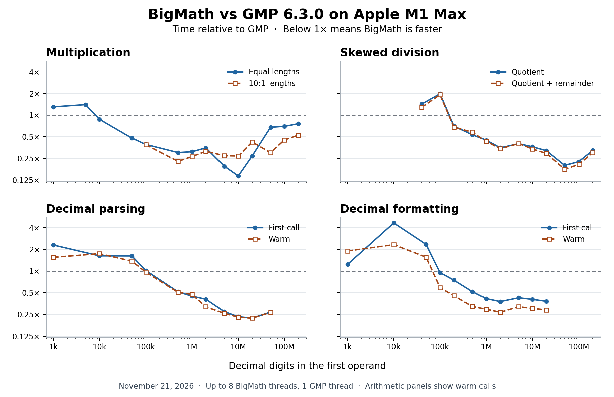
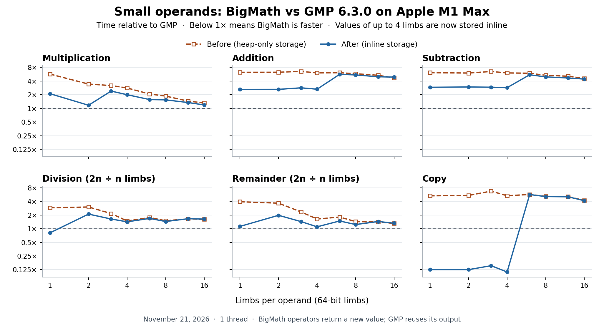

# BigMath vs GMP benchmark results

## Single-thread comparison

On November 21, 2026, BigMath and GMP 6.3.0 each used one thread on the Apple M1 Max (10 cores, 32 GiB). The full split benchmark ran the two libraries sequentially on the same 91 operand sets as the default-build run below, and both comparisons use the same GMP pass. The Release build used Apple Clang 21, native arm64 instructions and the default 64-bit limbs. The library and its benchmark executable were both compiled with `-DBIGMATH_USE_THREADS=0`. The measured revision is `main` after two changes to the large NTT: padded transpose tiles in the two-pass (MFA) transform (#159), and, in single-thread builds only, the truncated `H + L` transform extended from `H = 2^20` to `2^25` on cache-blocked transforms (#160). Against the previous run, the equal-length products from 20 million digits per operand took 17–63% less time (50 million: 2.15 s → 804 ms, 3.31× → 1.24× GMP's time), the skewed products from 20 million × 2 million took 53–56% less, the 100 million ÷ 20 million and 200 million ÷ 40 million divisions 11–27% less, and the 50-million-digit parse 23% less. 61 of the other 64 rows of 10 µs or longer moved by under 5%. [Measured revision](https://github.com/mmurshed/biginteger/tree/b240bd2) · [Previous single-thread run](docs/benchmarks/2026-11-21-toom-m1-max-single-thread.csv)

The full CSV includes the first call, fastest subsequent call, warm repetition count and arithmetic check status for all 111 rows. Most large sizes have one warm observation per library. All 24 product checks and 40 division checks matched GMP’s reference hashes. Each division mode was checked against the corresponding GMP operation. [README performance table](README.md#performance-numbers) · [Single-thread CSV](docs/benchmarks/2026-11-21-ntt-trunc-m1-max-single-thread.csv) · [Single-thread figure](docs/images/bigmath_vs_gmp_single_thread.png)

To repeat the single-thread run, give the driver its own build and results directory. The figure generator uses the checked-in CSVs and requires Matplotlib.

```sh
CXXFLAGS=-DBIGMATH_USE_THREADS=0 BENCH_DIR="$PWD/.benchcache/single-thread" \
  HISTORY_MD="$PWD/.benchcache/single-thread/history.md" \
  bash tests/performance/benchsuite/run_benchmark.sh full --force-gmp
python3 docs/images/make_benchmark_plots.py --ratio-only
```

## Default build with up to eight BigMath threads

The November 21, 2026 run measured `main` after the padded MFA transpose tiles (#159) and the single-thread truncated transform (#160, inactive in this build) on an Apple M1 Max, with balanced multiplication through 200 million digits per operand and skewed division through 200 million ÷ 40 million digits. Both libraries produced the requested outputs on the same inputs. All 24 product checks and 40 division checks matched the GMP reference hashes. Against the previous run, products from 50 million digits per operand took 19–24% less time (equal lengths) and 16–24% less (skewed), and 200 million ÷ 40 million division 10–12% less. [Full results CSV](docs/benchmarks/2026-11-21-ntt-trunc-m1-max.csv) · [Measured revision](https://github.com/mmurshed/biginteger/tree/b240bd2) · [Previous run (Toom-3 tier, #157)](docs/benchmarks/2026-11-21-toom-m1-max.csv) · [Run before that (inline storage, #156)](docs/benchmarks/2026-11-21-sbo-m1-max.csv)

**Run-to-run variation.** GMP was not re-run for these CSVs; both comparisons reuse the GMP pass of the previous run. A separate single-thread pass that re-measured GMP on the same day put its 55 rows of 1 ms or longer within 3.6% of that pass (median +0.4%), except the 500,000-digit product (+12%). The published CSVs come from the second of two runs of both BigMath passes. The first ran straight after the build and was discarded: products of up to 100,000 digits measured 20–84% slow, in rows these changes do not touch, and GMP showed the same 63–111% slowdown on its small products in the re-measured pass. Rows with a single warm observation still vary between runs, and the multithreaded ones most. Other 8-thread rows moved by up to ±20% against the previous run: the 2,000,000-digit and 100,000 × 10,000-digit products were 15% and 20% slower, parsing at 500,000 and 5,000,000 digits 15% and 20% slower, and 1,000,000 ÷ 200,000-digit division 13–17% faster. Single-thread rows outside the changed band moved much less; the exceptions were three sub-3 ms division rows: equal-length quotient and remainder at 1,000,000 digits (−16%) and 5,000,000 digits (0.071 → 0.225 ms, against 0.071–0.094 ms in the three previous runs), and 200,000 ÷ 50,000-digit quotient and remainder (+7%).



The arithmetic panels show warm calls. The division panel covers dividend-to-divisor digit ratios from 4:1 to 10:1. The conversion panels show both the first and warm calls. The dashed horizontal line marks equal time.

### Methodology

- The host had 10 CPU cores and 32 GiB of memory and ran macOS 27.2 (Darwin 27.2.0). Apple Clang 21 compiled the C++20 Release build with `-O3 -march=native -DNDEBUG`. BigMath used its default 64-bit limbs, CRT NTT, NEON and up to eight threads. GMP 6.3.0 ran single-threaded.
- The full split benchmark generated 91 deterministic operand sets. It ran GMP and BigMath in separate processes, sequentially, reading identical decimal operands from disk. Each of the 20 division sets was timed in both output modes, giving 111 result rows. Parsing operands, disk I/O and result hashes are outside the arithmetic timers.
- **First** means the first timed call for that operation and input in an already running benchmark process. **Warm** is the minimum of the following repetitions on the same input. Earlier cases can populate caches. Most cases above 100k digits have a single warm observation. The CSV records the actual repetition count and both timings for every row.
- Ratios are BigMath time divided by GMP time. A ratio below 1 means BigMath was faster. A zero-duration observation is shown as “<1 tick”. Its ratio is omitted. Crossovers refer to sampled operand sizes on this host.
- Earlier published division tables used BigMath quotient-only against GMP quotient and remainder. Compare each new division series with its matching output mode. [Earlier tables](https://github.com/mmurshed/biginteger/blob/c9c3e56222a17f520f7725b65c03d33232c71416/BENCHMARK.md) · [PR #129–#150 review](docs/PERFORMANCE_REVIEW_PR129.md)

To repeat the default-build run with fresh GMP timings, run the full profile from the repository root. The driver saves the paired CSV in `$BENCH_DIR/results/`.

```sh
bash tests/performance/benchsuite/run_benchmark.sh full --force-gmp
```

A separate run of `./build/bench_vs_gmp` on PR #152 measured both libraries in one process on different seeded operands. It completed 151 measurements. Its single 200-million-digit balanced product took 3,721 ms in BigMath and 3,057 ms in GMP (1.22×). [In-process output](docs/benchmarks/2026-11-21-pr152-in-process.txt)

### Multiplication

The equal-length series measures two independently generated operands. The skewed series holds their digit-length ratio at 10:1.

#### Equal lengths

| Operand digits | BigMath first ms | GMP first ms | First ratio | BigMath warm ms | GMP warm ms | Warm ratio | Warm reps |
|---|---:|---:|---:|---:|---:|---:|---:|
| 1,000 × 1,000 | 0.1259 | 0.1118 | 1.13× | 0.001292 | 0.000959 | 1.35× | 7 |
| 5,000 × 5,000 | 0.02367 | 0.03833 | 0.62× | 0.01688 | 0.01221 | 1.38× | 5 |
| 10,000 × 10,000 | 0.5109 | 0.03175 | 16.09× | 0.02246 | 0.02804 | 0.80× | 5 |
| 50,000 × 50,000 | 0.4583 | 0.2815 | 1.63× | 0.1098 | 0.2734 | 0.40× | 3 |
| 100,000 × 100,000 | 0.8806 | 0.6323 | 1.39× | 0.2278 | 0.588 | 0.39× | 3 |
| 500,000 × 500,000 | 2.264 | 4.277 | 0.53× | 1.191 | 4.234 | 0.28× | 1 |
| 1,000,000 × 1,000,000 | 4.931 | 8.949 | 0.55× | 2.859 | 8.847 | 0.32× | 1 |
| 2,000,000 × 2,000,000 | 11.31 | 20.31 | 0.56× | 8.285 | 20.33 | 0.41× | 1 |
| 5,000,000 × 5,000,000 | 18.36 | 66.13 | 0.28× | 11.41 | 62.79 | 0.18× | 1 |
| 10,000,000 × 10,000,000 | 45.5 | 202.8 | 0.22× | 28.48 | 199.9 | 0.14× | 1 |
| 20,000,000 × 20,000,000 | 92.63 | 266.4 | 0.35× | 64.31 | 265.3 | 0.24× | 1 |
| 50,000,000 × 50,000,000 | 455.1 | 660.8 | 0.69× | 342.6 | 650.7 | 0.53× | 1 |
| 100,000,000 × 100,000,000 | 980.7 | 1,393 | 0.70× | 757.4 | 1,376 | 0.55× | 1 |
| 200,000,000 × 200,000,000 | 3,733 | 2,862 | 1.30× | 1,720 | 2,828 | 0.61× | 1 |

#### Skewed lengths

| Operand digits | BigMath first ms | GMP first ms | First ratio | BigMath warm ms | GMP warm ms | Warm ratio | Warm reps |
|---|---:|---:|---:|---:|---:|---:|---:|
| 100,000 × 10,000 | 0.1417 | 0.3218 | 0.44× | 0.1227 | 0.3015 | 0.41× | 3 |
| 500,000 × 50,000 | 0.497 | 2.068 | 0.24× | 0.4796 | 2.039 | 0.24× | 1 |
| 1,000,000 × 100,000 | 1.286 | 4.455 | 0.29× | 1.272 | 4.429 | 0.29× | 1 |
| 2,000,000 × 200,000 | 3.038 | 9.312 | 0.33× | 3.217 | 9.244 | 0.35× | 1 |
| 5,000,000 × 500,000 | 9.274 | 30.85 | 0.30× | 7.905 | 30.84 | 0.26× | 1 |
| 10,000,000 × 1,000,000 | 23.06 | 70.04 | 0.33× | 20.26 | 69.68 | 0.29× | 1 |
| 20,000,000 × 2,000,000 | 69.11 | 158.6 | 0.44× | 60.9 | 158.2 | 0.39× | 1 |
| 50,000,000 × 5,000,000 | 168 | 662.8 | 0.25× | 165.7 | 660.4 | 0.25× | 1 |
| 100,000,000 × 10,000,000 | 374.6 | 996.3 | 0.38× | 369.5 | 994.4 | 0.37× | 1 |
| 200,000,000 × 20,000,000 | 851.2 | 1,893 | 0.45× | 839.1 | 1,890 | 0.44× | 1 |

### Division

Quotient-only uses BigMath `/` and GMP `mpz_tdiv_q`. Quotient and remainder uses BigMath `DivideAndRemainder` and GMP `mpz_tdiv_qr`. Both modes use the same dividend and divisor. Equal-digit operands can produce a quotient of zero or one, so those results depend on the sampled values.

#### Skewed dividends

| Dividend ÷ divisor digits | BigMath Q ms | GMP Q ms | Q ratio | BigMath QR ms | GMP QR ms | QR ratio | Warm reps |
|---|---:|---:|---:|---:|---:|---:|---:|
| 40,000 ÷ 10,000 | 0.2863 | 0.2001 | 1.43× | 0.2859 | 0.2249 | 1.27× | 3 |
| 100,000 ÷ 10,000 | 0.8486 | 0.4268 | 1.99× | 0.8494 | 0.4409 | 1.93× | 3 |
| 200,000 ÷ 50,000 | 1.005 | 1.507 | 0.67× | 0.9758 | 1.626 | 0.60× | 1 |
| 500,000 ÷ 100,000 | 2.244 | 4.207 | 0.53× | 2.291 | 4.491 | 0.51× | 1 |
| 1,000,000 ÷ 200,000 | 4.227 | 9.476 | 0.45× | 4.336 | 10.08 | 0.43× | 1 |
| 2,000,000 ÷ 500,000 | 8.34 | 22.23 | 0.38× | 8.309 | 23.92 | 0.35× | 1 |
| 5,000,000 ÷ 1,000,000 | 23.79 | 63.21 | 0.38× | 24.14 | 67.66 | 0.36× | 1 |
| 10,000,000 ÷ 2,000,000 | 54.83 | 144.5 | 0.38× | 54.08 | 154.2 | 0.35× | 1 |
| 20,000,000 ÷ 4,000,000 | 100.9 | 319.7 | 0.32× | 102.1 | 342.2 | 0.30× | 1 |
| 50,000,000 ÷ 10,000,000 | 220.8 | 1,213 | 0.18× | 222.3 | 1,276 | 0.17× | 1 |
| 100,000,000 ÷ 20,000,000 | 506 | 2,288 | 0.22× | 509.8 | 2,490 | 0.20× | 1 |
| 200,000,000 ÷ 40,000,000 | 1,161 | 4,137 | 0.28× | 1,175 | 4,452 | 0.26× | 1 |

At 200,000 ÷ 50,000 digits, the in-process run measured warm ratios of 0.92× for quotient-only and 1.04× for quotient and remainder. Each suite took one warm measurement per library at that size. Both suites favored BigMath in both modes from the next sampled shape, 500,000 ÷ 100,000, through 200 million ÷ 40 million digits. [In-process output](docs/benchmarks/2026-11-21-pr152-in-process.txt)

#### Equal digit counts

| Dividend ÷ divisor digits | BigMath Q ms | GMP Q ms | Q ratio | BigMath QR ms | GMP QR ms | QR ratio | Warm reps |
|---|---:|---:|---:|---:|---:|---:|---:|
| 1,000 ÷ 1,000 | 0.000083 | <1 tick | — | 0.000166 | 0.000042 | 3.95× | 7 |
| 5,000 ÷ 5,000 | 0.000125 | <1 tick | — | 0.000458 | 0.000167 | 2.74× | 5 |
| 10,000 ÷ 10,000 | 0.000041 | <1 tick | — | 0.000208 | 0.000042 | 4.95× | 5 |
| 50,000 ÷ 50,000 | 0.000125 | <1 tick | — | 0.003917 | 0.001666 | 2.35× | 3 |
| 100,000 ÷ 100,000 | 0.000125 | 0.000125 | 1.00× | 0.00825 | 0.003583 | 2.30× | 3 |
| 500,000 ÷ 500,000 | 0.000041 | 0.000167 | 0.25× | 0.009208 | 0.004292 | 2.15× | 1 |
| 1,000,000 ÷ 1,000,000 | 0.000083 | 0.000167 | 0.50× | 0.0155 | 0.008583 | 1.81× | 1 |
| 5,000,000 ÷ 5,000,000 | 0.000125 | 0.00025 | 0.50× | 0.09883 | 0.04288 | 2.31× | 1 |

### Decimal parse (string → BigInteger)

| Digits | BigMath first ms | GMP first ms | First ratio | BigMath warm ms | GMP warm ms | Warm ratio | Warm reps |
|---|---:|---:|---:|---:|---:|---:|---:|
| 1,000 | 0.005667 | 0.004542 | 1.25× | 0.002375 | 0.001541 | 1.54× | 7 |
| 10,000 | 0.07712 | 0.05375 | 1.43× | 0.06346 | 0.03771 | 1.68× | 5 |
| 50,000 | 0.5662 | 0.4271 | 1.33× | 0.5259 | 0.3946 | 1.33× | 3 |
| 100,000 | 0.6414 | 1.078 | 0.60× | 0.5641 | 1.061 | 0.53× | 3 |
| 500,000 | 2.987 | 9.019 | 0.33× | 3.382 | 8.93 | 0.38× | 1 |
| 1,000,000 | 7.617 | 20.99 | 0.36× | 6.54 | 20.78 | 0.31× | 1 |
| 2,000,000 | 15.04 | 49.72 | 0.30× | 14.92 | 47.15 | 0.32× | 1 |
| 5,000,000 | 38.22 | 146.3 | 0.26× | 43.33 | 146 | 0.30× | 1 |
| 10,000,000 | 78.29 | 341.6 | 0.23× | 78.76 | 343.4 | 0.23× | 1 |
| 20,000,000 | 175.4 | 805.9 | 0.22× | 176.2 | 802.5 | 0.22× | 1 |
| 50,000,000 | 668.5 | 2,627 | 0.25× | 661.5 | 2,650 | 0.25× | 1 |

### ToString (BigInteger → string)

| Digits | BigMath first ms | GMP first ms | First ratio | BigMath warm ms | GMP warm ms | Warm ratio | Warm reps |
|---|---:|---:|---:|---:|---:|---:|---:|
| 1,000 | 0.02088 | 0.0065 | 3.21× | 0.00625 | 0.003375 | 1.85× | 7 |
| 10,000 | 0.4646 | 0.09275 | 5.01× | 0.176 | 0.07733 | 2.28× | 5 |
| 50,000 | 1.834 | 0.888 | 2.07× | 1.296 | 0.8432 | 1.54× | 3 |
| 100,000 | 2.174 | 2.285 | 0.95× | 1.335 | 2.267 | 0.59× | 1 |
| 200,000 | 4.652 | 6.026 | 0.77× | 2.783 | 5.961 | 0.47× | 1 |
| 500,000 | 10.34 | 20.1 | 0.51× | 6.555 | 20.08 | 0.33× | 1 |
| 1,000,000 | 19.95 | 49.15 | 0.41× | 14.24 | 49.38 | 0.29× | 1 |
| 2,000,000 | 43.39 | 117.6 | 0.37× | 31.41 | 117.4 | 0.27× | 1 |
| 5,000,000 | 162.5 | 376.8 | 0.43× | 119.5 | 376.6 | 0.32× | 1 |
| 10,000,000 | 351.7 | 893.7 | 0.39× | 270.3 | 901.9 | 0.30× | 1 |
| 20,000,000 | 805.4 | 2,092 | 0.39× | 608.2 | 2,094 | 0.29× | 1 |

### BigDecimal

BigMath uses decimal fixed-point arithmetic and HALF_EVEN rounding for division. The comparison uses GMP binary floating-point (`mpf_t`), with precision derived from the digit count and requested scale. The split runner times these operations without an equality check. A size of `1,000.100` denotes 1,000 integer digits and 100 fractional digits.

| Operation | Size | BigMath warm ms | GMP warm ms | Ratio | Warm reps |
|---|---:|---:|---:|---:|---:|
| add | 100.10 digits | 0.000083 | <1 tick | — | 7 |
| mul | 100.10 digits | 0.000041 | 0.000041 | 1.00× | 7 |
| add | 1000.100 digits | 0.000125 | <1 tick | — | 7 |
| mul | 1000.100 digits | 0.0015 | 0.001042 | 1.44× | 7 |
| add | 5000.500 digits | 0.000333 | 0.000125 | 2.66× | 5 |
| mul | 5000.500 digits | 0.01896 | 0.01321 | 1.44× | 5 |
| add | 20000.2000 digits | 0.001125 | 0.0005 | 2.25× | 3 |
| mul | 20000.2000 digits | 0.04713 | 0.09292 | 0.51× | 3 |
| div | 100.10 / 10 dp | 0.000291 | 0.000083 | 3.51× | 7 |
| div | 1000.100 / 100 dp | 0.000916 | 0.001833 | 0.50× | 7 |
| div | 5000.500 / 500 dp | 0.009709 | 0.02558 | 0.38× | 5 |
| div | 20000.2000 / 2000 dp | 0.06196 | 0.1921 | 0.32× | 3 |
| div | 2000.200 / 0 dp | 0.0005 | 0.005 | 0.10× | 5 |
| div | 2000.200 / 10 dp | 0.000708 | 0.005083 | 0.14× | 5 |
| div | 2000.200 / 100 dp | 0.001375 | 0.005458 | 0.25× | 5 |
| div | 2000.200 / 1000 dp | 0.007333 | 0.009333 | 0.79× | 5 |
| div | 2000.200 / 5000 dp | 0.03 | 0.03367 | 0.89× | 5 |
| parse | 100 digits | 0.000375 | 0.000459 | 0.82× | 7 |
| parse | 1000 digits | 0.004541 | 0.004542 | 1.00× | 7 |
| parse | 10000 digits | 0.08483 | 0.1045 | 0.81× | 5 |
| parse | 50000 digits | 0.6176 | 0.9947 | 0.62× | 3 |
| tostr | 100 digits | 0.000292 | 0.0005 | 0.58× | 7 |
| tostr | 1000 digits | 0.006583 | 0.004583 | 1.44× | 7 |
| tostr | 10000 digits | 0.1762 | 0.1012 | 1.74× | 5 |
| tostr | 50000 digits | 1.282 | 1.084 | 1.18× | 3 |

## Small operands

`tests/performance/small_ops_vs_gmp.cpp` times the BigInteger operators against GMP on operands of 1–16 limbs (up to about 300 decimal digits), where per-call overhead and allocation decide the cost. It ran single-threaded on the same machine against two builds: **before** is `main` at 3dafa62, where every value lives in a heap-allocated vector; **after** is the inline-storage revision ([43aa64f](https://github.com/mmurshed/biginteger/tree/43aa64f), #156), which stores values of up to 4 limbs inside the object and computes operands of up to 16 limbs in a stack buffer. Each figure is the fastest of seven rounds of 400,000 calls. BigMath operators return a new value each call; the GMP loop writes into an output it reuses, which is GMP's usual pattern. Division and remainder use a 2n-limb dividend and an n-limb divisor. [CSV](docs/benchmarks/2026-11-21-small-operands.csv)



| Operation | Limbs | Before ns | After ns | GMP ns | Before ratio | After ratio |
|---|---:|---:|---:|---:|---:|---:|
| Multiply | 1 | 21.1 | 8.0 | 3.8 | 5.71× | 2.11× |
| Multiply | 2 | 31.0 | 10.6 | 9.1 | 3.44× | 1.17× |
| Multiply | 4 | 41.1 | 29.4 | 14.7 | 2.82× | 2.00× |
| Multiply | 8 | 73.0 | 60.9 | 39.5 | 1.87× | 1.54× |
| Multiply | 16 | 170.6 | 152.5 | 128.1 | 1.31× | 1.19× |
| Add | 1 | 22.5 | 9.6 | 3.7 | 6.25× | 2.62× |
| Add | 2 | 23.4 | 9.8 | 3.7 | 6.27× | 2.63× |
| Add | 4 | 24.9 | 10.6 | 4.0 | 6.06× | 2.65× |
| Add | 8 | 27.1 | 26.2 | 4.8 | 5.82× | 5.46× |
| Add | 16 | 29.1 | 30.3 | 6.2 | 4.70× | 4.89× |
| Subtract | 1 | 23.6 | 10.9 | 3.7 | 6.12× | 2.92× |
| Subtract | 2 | 25.0 | 11.6 | 3.9 | 6.02× | 2.96× |
| Subtract | 4 | 26.3 | 12.4 | 4.3 | 6.05× | 2.86× |
| Subtract | 8 | 27.1 | 25.9 | 5.2 | 5.36× | 4.95× |
| Subtract | 16 | 31.4 | 30.0 | 6.8 | 4.59× | 4.43× |
| Divide (2n ÷ n) | 1 | 34.6 | 16.3 | 20.1 | 2.90× | 0.81× |
| Divide (2n ÷ n) | 2 | 68.2 | 47.8 | 22.7 | 3.02× | 2.10× |
| Divide (2n ÷ n) | 4 | 94.0 | 89.8 | 63.1 | 1.49× | 1.42× |
| Divide (2n ÷ n) | 8 | 170.7 | 163.9 | 113.5 | 1.50× | 1.44× |
| Divide (2n ÷ n) | 16 | 368.2 | 367.3 | 225.2 | 1.61× | 1.63× |
| Remainder (2n ÷ n) | 1 | 49.0 | 14.1 | 12.5 | 3.94× | 1.13× |
| Remainder (2n ÷ n) | 2 | 88.2 | 48.1 | 24.3 | 3.67× | 1.98× |
| Remainder (2n ÷ n) | 4 | 115.4 | 77.8 | 70.5 | 1.64× | 1.10× |
| Remainder (2n ÷ n) | 8 | 194.3 | 166.8 | 134.9 | 1.44× | 1.24× |
| Remainder (2n ÷ n) | 16 | 397.6 | 398.6 | 300.9 | 1.31× | 1.32× |
| Copy | 1 | 13.2 | 0.3 | 2.5 | 5.32× | 0.12× |
| Copy | 2 | 13.5 | 0.3 | 2.5 | 5.43× | 0.12× |
| Copy | 4 | 15.0 | 0.3 | 2.8 | 5.36× | 0.11× |
| Copy | 8 | 14.5 | 14.3 | 2.8 | 5.19× | 5.13× |
| Copy | 16 | 15.8 | 15.7 | 3.8 | 4.22× | 4.16× |

Values of up to 4 limbs no longer allocate: a copy takes 0.3 ns instead of 13 ns and is faster than GMP's `mpz_set`, and a 1-limb product takes 8 ns instead of 21 ns. Above 4 limbs every result still needs one allocation, so addition stays about 5× behind GMP there; the products and quotients gain only where the stack path replaced the dispatcher's temporary vectors.

To repeat: `cmake --build build --target small_ops_vs_gmp && ./build/small_ops_vs_gmp after`.

## Internal algorithm crossovers

The November 21 run of `multperf_simple 5` used equal-length random operands. Times are the mean of five calls, and speedups are relative to classical multiplication. All products matched at all four tested sizes.

| digits | Classical ms | Karatsuba ms | Karatsuba× | NTT ms | NTT× |
|---:|---:|---:|---:|---:|---:|
| 10,000 | 0.196 | 0.070 | 2.8× | 0.107 | 1.8× |
| 100,000 | 15.479 | 2.111 | 7.3× | 0.468 | 33.1× |
| 500,000 | 379.127 | 27.560 | 13.8× | 1.608 | 235.7× |

The default 64-bit NTT path requires at least 640 total limbs, 64 limbs in
the shorter operand and an area of at least 96,000 limb pairs. With a parked
pool the area floor is 262,144. Balanced entry is 320 limbs per operand
when warm and 512 when cold.

In `divperf_simple 5`, Burnikel–Ziegler and Knuth division returned matching quotients and remainders at all four tested shapes. At 4,096 ÷ 2,048 limbs they averaged 0.846 ms and 3.028 ms respectively. This harness draws 32 random bits per limb.

---

## Optimization history (condensed)

The margins above are the product of the 2026-05/06 campaign and the two
2026-11 passes. Full analysis,
profiles, and rejection evidence live in the subsystem docs; per-release
summary in [CHANGELOG.md](CHANGELOG.md). The major steps, in order:

| when | change | headline effect |
|---|---|---|
| 2026-05 | 64-bit limbs (`BIGMATH_LIMB_64`), 3-prime CRT NTT, thread pool, M-G reciprocals, radix-4/8 fused butterflies, MFA layout | closed the GMP gap 3–5× across every band up to ~20M digits |
| #82–#95 | division/decimal session: bit-shift normalization, wrap-around Newton family (cyclic remainders, top-limbs quotient estimate, invertappr reciprocal), Newton band frontier, quotient-sized division, decimal D&C retunes | skewed div 5M×1M 2.87× → ~1.0×; killed the BZ non-pow2 5–60× blowups (97.7× at 2^18+1) |
| #96–#99 | **NEON Shoup butterflies** + interleaved twiddle tables + tail layers; dispatch retune they unlocked (NTT entry 5120 → 1280 limbs, Toom-3 window retired, CRT always-on) | butterfly kernel ~4×; mul 100k digits −40% |
| #103 | **fix: MFA inverse cross-twiddle ordering** — every ≥2^24-coefficient product had been silently wrong for 12 days; Newton's fixup fallback masked it as "stuck" runs. `mfa_roundtrip` added to ctest; all earlier 50M+ rows were invalid timings | 200M×40M div: hung → 6.3 s |
| #107–#114 | fused-MFA pass fusion (pointwise rides operand B's last forward stage), row-chunked `ParallelDo(6)` stages, **MFA gate 2^24 → 2^20**, cyclic products on the fused pipeline up to the 2^26 CRT ceiling, F3 on-the-fly packing | mul n=2^22 3×; div 100M÷20M 1.37× → 0.55×; 200M÷40M 6.5 s → 3.1 s |
| #116–#117 | **BZ odd-size bottom-padding fix** (odd divisor limb counts fell back to quadratic Knuth D — 1.3–10× on ~half of real shapes), basecase 512 → 128, full Newton frontier re-sweep | 12289-limb divisor ratio 1.5: 95 → 8.1 ms |
| #118–#119 | parallel D&C subtree fan-out for ToString and parse | both directions flipped to a 1.4–2.6× win ≥500k digits |
| #120–#124 | codebase audit: FastDivision MG top-equal qhat fix (silent wrong quotients on structured operands), remainder-sign fix, CRT-squaring dispatch (2.5–5.8× on Square, parse-cold −14…25%), dedups, header hygiene | correctness + Square/parse-cold wins |
| #129–#139 | **multiplication pass** (2026-11-20): flag-chain limb kernels (`addmul_1` 2.5–3.3 → 1.7 cycles/limb), NEON tail kernels + leaner Shoup butterfly, thread-pool rewrite (claim-based, spin-before-park; also fixes concurrent callers), NEON + parallel Garner finalize, six-unit inverse, truncated `H + L` transform length, area-rule dispatch; **fix: Karatsuba workspace heap overflow on skewed operands** | mul 1.5–4.5× at every size, GMP crossover 500k → 10k digits; div/parse/ToString 1.3–2.8× for free |
| #141–#149 | **division pass** (2026-11-21): raw-buffer Knuth D on a flag-chain `submul_1` (basecase 2.2–3.5× → 1.1–1.6× of GMP), in-place divide-and-conquer Burnikel–Ziegler (1.5–2.4×), Newton reciprocal on a guarded precision schedule with no refinement pass, dispatcher re-swept to one rule per regime, quotient-only division from the operand tops, single-limb kernel, schoolbook leading block in Newton; thread pool: pool-temperature-aware small-NTT entry and lock-free job pickup | division beats GMP from 200k-digit dividends (was 500k) and is 1.14–1.58× faster across the 12 published skewed cases; ToString cold beats GMP from 200k digits (was 1M) |
| #159–#160 | **large-NTT pass** (2026-11-21): padded MFA transpose tiles (the tile rows sat one L1 way apart, 16 KB, and thrashed the 8-way cache), and in single-thread builds the truncated `H + L` transform extended to `H = 2^25` on cache-blocked transforms, one prime at a time | mul 50M–200M digits −19–24% threaded; single-threaded 50M digits 3.31× → 1.24× GMP's time, 200M 3.75× → 1.52× |

Two history figures are kept with their original data:


*MFA transpose fusion (#78): fusing the transpose into the adjacent row-FFT
cut transform traffic from 8n to 4n bytes — +7–11% across the MFA band,
bit-exact.*


*Newton balanced band (#79): BZ's recursive halving lands intermediate NTT
multiplies just over power-of-2 transform boundaries on non-pow2 divisor
sizes (5–60× blowup, 97.7× at 2^18+1); Newton pads once and stays flat. The
band's floor and the residual ratio < 4/3 slice were later rebuilt by #88/#89
(quotient-sized division) and re-swept after #116/#117.*

Process lessons recorded along the way:

- Profile-sample arithmetic overcounts parallel-overlapped work — CPU-time
  savings ≠ wall-clock savings on the threaded stack (#84's rejection).
- The exact Newton tower drifts up to ~B^6 ulps; residue-window sizing needs
  ~B^16 headroom (a B^4 window caused an 8× ToString regression via silent
  FastDivision fallbacks).
- Warm-state-only measurement for chain-/plan-heavy ops; single-iter cold
  rows on those shapes scatter ±20–60% with process state.
- A documented "wall" deserves a kernel-level measurement before it is
  accepted: the sub-NTT gap to GMP was attributed to assembly for months, and
  cycles-per-limb on `addmul_1` showed it was the carry idiom (#136).
- Wall-clock is not CPU time: the finalize pass looked like 3–5% in summed
  profiles and was 17–33% of a threaded multiply's wall-clock (#134).
- There is no sanitizer job in CI. The Karatsuba workspace overflow (#137)
  shipped for months and was only caught when a later change made it crash.
- Random-input cross-checks miss structured-operand bug classes entirely —
  the seeded adversarial-limb fuzz (`test_adversarial_fuzz.cpp`, #125) now
  gates every ctest run.
