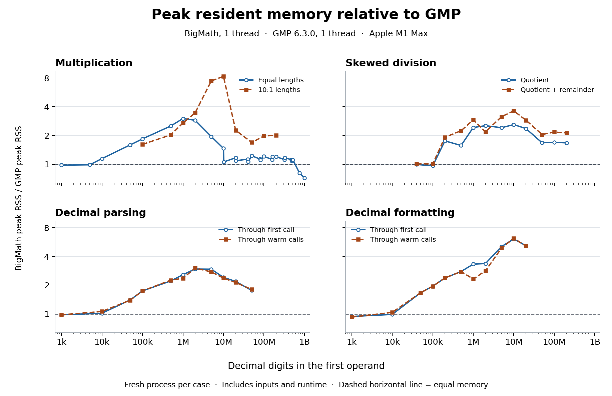
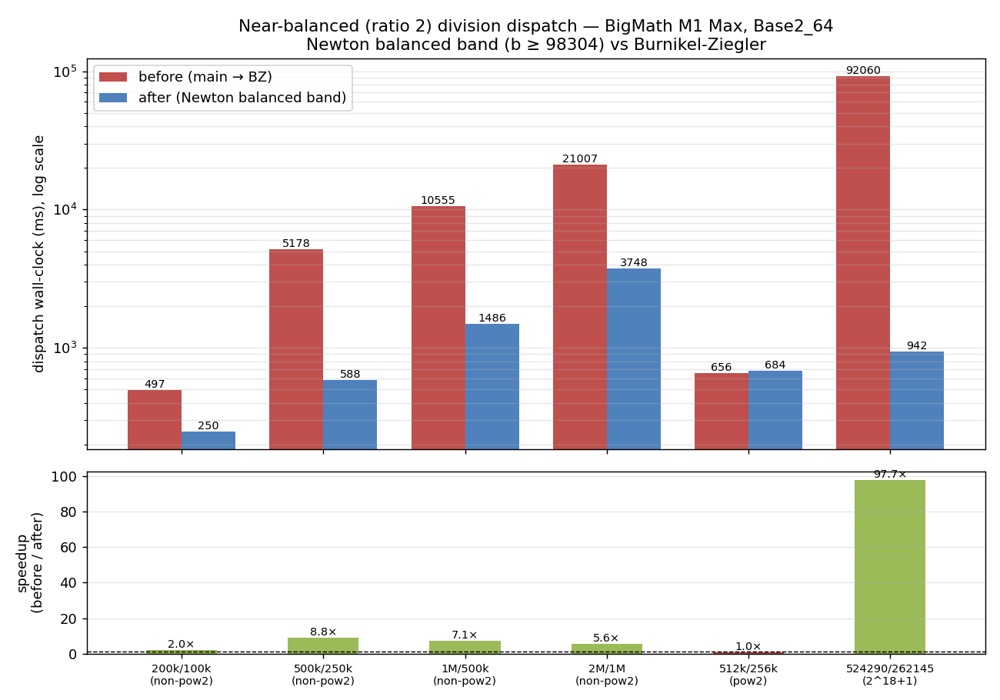

# BigMath vs GMP benchmark results

## Single-thread comparison

The November 21, 2026 full timing run measured revision `9d3f1d4` on the Apple M1 Max. At 200M digits per operand the single-thread build took 2.88 s and GMP took 2.85 s. At 50M and 100M digits BigMath used 0.96× and 0.99× GMP’s time. [Measured revision](https://github.com/mmurshed/biginteger/tree/9d3f1d4)

The full CSV includes the first call, fastest subsequent call, warm repetition count and arithmetic check status for all 111 rows. Most large sizes have one warm observation per library. All 24 product checks and 40 division checks matched GMP’s reference hashes. Each division mode was checked against the corresponding GMP operation. [README performance table](README.md#performance-numbers) · [Single-thread CSV](docs/benchmarks/2026-11-21-blocked-crt-m1-max-single-thread.csv) · [Single-thread figure](docs/images/bigmath_vs_gmp_single_thread.png)

The timing figures also show a separate series for balanced multiplication from 200M to 1B digits. Its ratios use the warm times from the isolated run for both libraries. [Isolated measurements](docs/benchmarks/2026-11-21-blocked-crt-memory-m1-max.csv)

To repeat the single-thread run, give the driver its own build and results directory. The figure generator uses the checked-in CSVs and requires Matplotlib.

```sh
CXXFLAGS=-DBIGMATH_USE_THREADS=0 BENCH_DIR="$PWD/.benchcache/single-thread" \
  HISTORY_MD="$PWD/.benchcache/single-thread/history.md" \
  bash tests/performance/benchsuite/run_benchmark.sh full --force-gmp
python3 docs/images/make_benchmark_plots.py --ratio-only
```

## Default build with up to eight BigMath threads

With up to eight BigMath threads, equal-length products at 50M, 100M and 200M digits took 172.2, 388.4 and 723.8 ms. The 200M-digit product used 0.25× GMP’s time. [Full results CSV](docs/benchmarks/2026-11-21-blocked-crt-m1-max.csv) · [Previous full run](docs/benchmarks/2026-11-21-factored-mfa-m1-max.csv)


The arithmetic panels show warm calls. The division panel covers dividend-to-divisor digit ratios from 4:1 to 10:1. The conversion panels show both the first and warm calls. The dashed horizontal line marks equal time.

### Methodology

- The host had 10 CPU cores and 32 GiB of memory and ran macOS 27.2 (Darwin 27.2.0). Apple Clang 21 compiled the C++20 Release build with `-O3 -march=native -DNDEBUG`. BigMath used its default 64-bit limbs, CRT NTT, NEON and up to eight threads. GMP 6.3.0 ran single-threaded.
- This run reused the full profile’s 91 deterministic operand sets. GMP ran first, followed by the default and single-thread BigMath builds. Each process read the same decimal operands from disk. Each of the 20 division sets was timed in both output modes, giving 111 result rows. Parsing operands, disk I/O and result hashes are outside the arithmetic timers.
- **First** means the first timed call for that operation and input in an already running benchmark process. **Warm** is the minimum of the following repetitions on the same input. Earlier cases can populate caches. Most cases above 100k digits have a single warm observation. The CSV records the actual repetition count and both timings for every row.
- Ratios are BigMath time divided by GMP time. A ratio below 1 means BigMath was faster. A zero-duration observation is shown as “<1 tick”. Its ratio is omitted. Crossovers refer to sampled operand sizes on this host.
- Earlier published division tables used BigMath quotient-only against GMP quotient and remainder. Compare each new division series with its matching output mode. [Earlier tables](https://github.com/mmurshed/biginteger/blob/c9c3e56222a17f520f7725b65c03d33232c71416/BENCHMARK.md) · [PR #129–#150 review](docs/PERFORMANCE_REVIEW_PR129.md)

To repeat the default-build run with fresh GMP timings, run the full profile from the repository root. The driver saves the paired CSV in `$BENCH_DIR/results/`.

```sh
bash tests/performance/benchsuite/run_benchmark.sh full --force-gmp
```

A separate run of `./build/bench_vs_gmp` on PR #152 measured both libraries in one process on different seeded operands. It completed 151 measurements. Its single 200-million-digit balanced product took 3,721 ms in BigMath and 3,057 ms in GMP (1.22×). [In-process output](docs/benchmarks/2026-11-21-pr152-in-process.txt)

### Multiplication

The equal-length series measures two independently generated operands. The skewed series holds their digit-length ratio at 10:1.

#### Equal lengths

| Operand digits | BigMath first ms | GMP first ms | First ratio | BigMath warm ms | GMP warm ms | Warm ratio | Warm reps |
|---|---:|---:|---:|---:|---:|---:|---:|
| 1,000 × 1,000 | 0.035 | 0.009041 | 3.87× | 0.001333 | 0.000917 | 1.45× | 7 |
| 5,000 × 5,000 | 0.02358 | 0.01725 | 1.37× | 0.01746 | 0.0115 | 1.52× | 5 |
| 10,000 × 10,000 | 0.4359 | 0.03158 | 13.80× | 0.03596 | 0.02796 | 1.29× | 5 |
| 50,000 × 50,000 | 0.4592 | 0.2735 | 1.68× | 0.1058 | 0.2795 | 0.38× | 3 |
| 100,000 × 100,000 | 0.883 | 0.6333 | 1.39× | 0.206 | 0.594 | 0.35× | 3 |
| 500,000 × 500,000 | 2.217 | 4.508 | 0.49× | 1.165 | 4.34 | 0.27× | 1 |
| 1,000,000 × 1,000,000 | 4.915 | 9.105 | 0.54× | 2.948 | 9.133 | 0.32× | 1 |
| 2,000,000 × 2,000,000 | 10.85 | 22.66 | 0.48× | 7.721 | 22.22 | 0.35× | 1 |
| 5,000,000 × 5,000,000 | 12.61 | 62.98 | 0.20× | 7.418 | 61.95 | 0.12× | 1 |
| 10,000,000 × 10,000,000 | 26.46 | 205.6 | 0.13× | 16.52 | 201.9 | 0.08× | 1 |
| 20,000,000 × 20,000,000 | 52.38 | 268.7 | 0.19× | 37.66 | 268.6 | 0.14× | 1 |
| 50,000,000 × 50,000,000 | 213.9 | 671.3 | 0.32× | 172.2 | 660 | 0.26× | 1 |
| 100,000,000 × 100,000,000 | 452.1 | 1,396 | 0.32× | 388.4 | 1,392 | 0.28× | 1 |
| 200,000,000 × 200,000,000 | 913.3 | 2,878 | 0.32× | 723.8 | 2,852 | 0.25× | 1 |

#### Skewed lengths

| Operand digits | BigMath first ms | GMP first ms | First ratio | BigMath warm ms | GMP warm ms | Warm ratio | Warm reps |
|---|---:|---:|---:|---:|---:|---:|---:|
| 100,000 × 10,000 | 0.1565 | 0.3233 | 0.48× | 0.1157 | 0.3222 | 0.36× | 3 |
| 500,000 × 50,000 | 0.4659 | 2.137 | 0.22× | 0.4761 | 2.115 | 0.23× | 1 |
| 1,000,000 × 100,000 | 1.215 | 4.612 | 0.26× | 1.177 | 4.596 | 0.26× | 1 |
| 2,000,000 × 200,000 | 2.863 | 9.616 | 0.30× | 2.983 | 9.565 | 0.31× | 1 |
| 5,000,000 × 500,000 | 7.372 | 31.72 | 0.23× | 8.157 | 31.84 | 0.26× | 1 |
| 10,000,000 × 1,000,000 | 22.57 | 75.12 | 0.30× | 16.22 | 74.93 | 0.22× | 1 |
| 20,000,000 × 2,000,000 | 38.98 | 160.6 | 0.24× | 37.17 | 159.4 | 0.23× | 1 |
| 50,000,000 × 5,000,000 | 87.32 | 670.4 | 0.13× | 79.45 | 669.6 | 0.12× | 1 |
| 100,000,000 × 10,000,000 | 184.1 | 995.4 | 0.18× | 180 | 995.7 | 0.18× | 1 |
| 200,000,000 × 20,000,000 | 366.1 | 1,907 | 0.19× | 372.6 | 1,907 | 0.20× | 1 |

### Division

Quotient-only uses BigMath `/` and GMP `mpz_tdiv_q`. Quotient and remainder uses BigMath `DivideAndRemainder` and GMP `mpz_tdiv_qr`. Both modes use the same dividend and divisor. Equal-digit operands can produce a quotient of zero or one, so those results depend on the sampled values.

#### Skewed dividends

| Dividend ÷ divisor digits | BigMath Q ms | GMP Q ms | Q ratio | BigMath QR ms | GMP QR ms | QR ratio | Warm reps |
|---|---:|---:|---:|---:|---:|---:|---:|
| 40,000 ÷ 10,000 | 0.2858 | 0.1992 | 1.43× | 0.286 | 0.219 | 1.31× | 3 |
| 100,000 ÷ 10,000 | 0.8585 | 0.427 | 2.01× | 0.8478 | 0.4417 | 1.92× | 3 |
| 200,000 ÷ 50,000 | 1.018 | 1.577 | 0.65× | 1.481 | 1.662 | 0.89× | 1 |
| 500,000 ÷ 100,000 | 2.456 | 4.21 | 0.58× | 2.36 | 4.518 | 0.52× | 1 |
| 1,000,000 ÷ 200,000 | 5.71 | 9.54 | 0.60× | 4.529 | 10.12 | 0.45× | 1 |
| 2,000,000 ÷ 500,000 | 8.815 | 22.12 | 0.40× | 8.837 | 23.7 | 0.37× | 1 |
| 5,000,000 ÷ 1,000,000 | 25.61 | 63.06 | 0.41× | 26.28 | 67.71 | 0.39× | 1 |
| 10,000,000 ÷ 2,000,000 | 53.45 | 145.9 | 0.37× | 54.36 | 153 | 0.36× | 1 |
| 20,000,000 ÷ 4,000,000 | 85.71 | 320.1 | 0.27× | 89.64 | 342.6 | 0.26× | 1 |
| 50,000,000 ÷ 10,000,000 | 165 | 1,221 | 0.14× | 168.5 | 1,276 | 0.13× | 1 |
| 100,000,000 ÷ 20,000,000 | 341.7 | 2,320 | 0.15× | 342.7 | 2,507 | 0.14× | 1 |
| 200,000,000 ÷ 40,000,000 | 720.6 | 4,187 | 0.17× | 711 | 4,427 | 0.16× | 1 |

At 200,000 ÷ 50,000 digits the current full run measured 0.65× GMP’s time for the quotient and 0.89× for quotient and remainder. The earlier in-process run on PR #152 measured 0.92× and 1.04× on different operands. Both suites took one warm measurement per library at that size. [In-process output](docs/benchmarks/2026-11-21-pr152-in-process.txt)

#### Equal digit counts

| Dividend ÷ divisor digits | BigMath Q ms | GMP Q ms | Q ratio | BigMath QR ms | GMP QR ms | QR ratio | Warm reps |
|---|---:|---:|---:|---:|---:|---:|---:|
| 1,000 ÷ 1,000 | 0.000084 | <1 tick | — | 0.000166 | 0.000041 | 4.05× | 7 |
| 5,000 ÷ 5,000 | 0.000083 | <1 tick | — | 0.000416 | 0.000208 | 2.00× | 5 |
| 10,000 ÷ 10,000 | 0.000042 | <1 tick | — | 0.000208 | 0.000083 | 2.51× | 5 |
| 50,000 ÷ 50,000 | 0.000125 | <1 tick | — | 0.003875 | 0.00175 | 2.21× | 3 |
| 100,000 ÷ 100,000 | 0.000125 | 0.000125 | 1.00× | 0.008208 | 0.003667 | 2.24× | 3 |
| 500,000 ÷ 500,000 | 0.000084 | 0.000167 | 0.50× | 0.008917 | 0.004375 | 2.04× | 1 |
| 1,000,000 ÷ 1,000,000 | 0.000083 | 0.000208 | 0.40× | 0.01671 | 0.008583 | 1.95× | 1 |
| 5,000,000 ÷ 5,000,000 | 0.000083 | 0.000167 | 0.50× | 0.125 | 0.04304 | 2.90× | 1 |

### Decimal parse (string → BigInteger)

| Digits | BigMath first ms | GMP first ms | First ratio | BigMath warm ms | GMP warm ms | Warm ratio | Warm reps |
|---|---:|---:|---:|---:|---:|---:|---:|
| 1,000 | 0.005583 | 0.004042 | 1.38× | 0.002666 | 0.001542 | 1.73× | 7 |
| 10,000 | 0.07958 | 0.05667 | 1.40× | 0.06575 | 0.0375 | 1.75× | 5 |
| 50,000 | 0.7134 | 0.4288 | 1.66× | 0.511 | 0.3975 | 1.29× | 3 |
| 100,000 | 0.6112 | 1.088 | 0.56× | 0.5205 | 1.064 | 0.49× | 3 |
| 500,000 | 2.944 | 8.788 | 0.34× | 3.145 | 8.738 | 0.36× | 1 |
| 1,000,000 | 6.584 | 20.67 | 0.32× | 6.689 | 20.35 | 0.33× | 1 |
| 2,000,000 | 18.42 | 47.06 | 0.39× | 14.9 | 46.72 | 0.32× | 1 |
| 5,000,000 | 38.54 | 148.7 | 0.26× | 37.54 | 148 | 0.25× | 1 |
| 10,000,000 | 75.56 | 346.4 | 0.22× | 79.84 | 344.9 | 0.23× | 1 |
| 20,000,000 | 165.1 | 807.9 | 0.20× | 159.4 | 806.6 | 0.20× | 1 |
| 50,000,000 | 541.8 | 2,646 | 0.20× | 546.9 | 2,665 | 0.21× | 1 |

### ToString (BigInteger → string)

| Digits | BigMath first ms | GMP first ms | First ratio | BigMath warm ms | GMP warm ms | Warm ratio | Warm reps |
|---|---:|---:|---:|---:|---:|---:|---:|
| 1,000 | 0.009084 | 0.006708 | 1.35× | 0.00625 | 0.003458 | 1.81× | 7 |
| 10,000 | 0.1388 | 0.1011 | 1.37× | 0.112 | 0.07983 | 1.40× | 5 |
| 50,000 | 1.331 | 0.9584 | 1.39× | 0.9996 | 0.8886 | 1.12× | 3 |
| 100,000 | 2.154 | 2.312 | 0.93× | 1.112 | 2.327 | 0.48× | 1 |
| 200,000 | 5.11 | 6.059 | 0.84× | 2.403 | 6.04 | 0.40× | 1 |
| 500,000 | 10.14 | 20.49 | 0.50× | 5.962 | 20.54 | 0.29× | 1 |
| 1,000,000 | 20.04 | 50.25 | 0.40× | 12.84 | 49.6 | 0.26× | 1 |
| 2,000,000 | 42.38 | 120.3 | 0.35× | 30.62 | 120.8 | 0.25× | 1 |
| 5,000,000 | 154.1 | 382.7 | 0.40× | 109.6 | 383 | 0.29× | 1 |
| 10,000,000 | 316.7 | 905.4 | 0.35× | 239 | 902.7 | 0.26× | 1 |
| 20,000,000 | 677.4 | 2,128 | 0.32× | 503.9 | 2,144 | 0.24× | 1 |

### BigDecimal

BigMath uses decimal fixed-point arithmetic and HALF_EVEN rounding for division. The comparison uses GMP binary floating-point (`mpf_t`), with precision derived from the digit count and requested scale. The split runner times these operations without an equality check. A size of `1,000.100` denotes 1,000 integer digits and 100 fractional digits.

| Operation | Size | BigMath warm ms | GMP warm ms | Ratio | Warm reps |
|---|---:|---:|---:|---:|---:|
| add | 100.10 digits | 0.000083 | <1 tick | — | 7 |
| mul | 100.10 digits | 0.000041 | 0.000041 | 1.00× | 7 |
| add | 1000.100 digits | 0.000125 | <1 tick | — | 7 |
| mul | 1000.100 digits | 0.0015 | 0.001083 | 1.39× | 7 |
| add | 5000.500 digits | 0.000291 | 0.000083 | 3.51× | 5 |
| mul | 5000.500 digits | 0.019 | 0.01271 | 1.50× | 5 |
| add | 20000.2000 digits | 0.001125 | 0.000458 | 2.46× | 3 |
| mul | 20000.2000 digits | 0.08583 | 0.09529 | 0.90× | 3 |
| div | 100.10 / 10 dp | 0.00025 | 0.000125 | 2.00× | 7 |
| div | 1000.100 / 100 dp | 0.000916 | 0.001916 | 0.48× | 7 |
| div | 5000.500 / 500 dp | 0.009917 | 0.02529 | 0.39× | 5 |
| div | 20000.2000 / 2000 dp | 0.09954 | 0.1935 | 0.51× | 3 |
| div | 2000.200 / 0 dp | 0.000458 | 0.005167 | 0.09× | 5 |
| div | 2000.200 / 10 dp | 0.000708 | 0.005208 | 0.14× | 5 |
| div | 2000.200 / 100 dp | 0.001416 | 0.005458 | 0.26× | 5 |
| div | 2000.200 / 1000 dp | 0.007416 | 0.009375 | 0.79× | 5 |
| div | 2000.200 / 5000 dp | 0.03008 | 0.03454 | 0.87× | 5 |
| parse | 100 digits | 0.000375 | 0.0005 | 0.75× | 7 |
| parse | 1000 digits | 0.004583 | 0.004583 | 1.00× | 7 |
| parse | 10000 digits | 0.08517 | 0.1113 | 0.77× | 5 |
| parse | 50000 digits | 0.6213 | 1.006 | 0.62× | 3 |
| tostr | 100 digits | 0.000291 | 0.000458 | 0.64× | 7 |
| tostr | 1000 digits | 0.006625 | 0.004666 | 1.42× | 7 |
| tostr | 10000 digits | 0.1124 | 0.1029 | 1.09× | 5 |
| tostr | 50000 digits | 0.9792 | 1.094 | 0.90× | 3 |

## Memory optimization benchmarks

Each comparison uses Release builds on the Apple M1 Max, identical operands and a fresh process for each measurement. Tables give peak RSS through the warm call and warm time. BigMath cells are medians of three processes per build, reversing the run order for the second pair. GMP 6.3.0 ran once per shape. Each process made one first call and one warm call. Products were hashed against GMP.

### Threaded skew dispatch

Compared with `9a3f89a`, skewed products with an available fused matrix transform now bypass truncation at transform lengths of at least 2²¹ and a limb ratio of at least eight. The 5M case exercises the original path. Standard shapes use the full benchmark manifest. Intermediate shapes use the seeded binary generator from `run_memory.py`. [All observations](docs/benchmarks/memory-fix-skew-default.csv)

| Shape | Before | After | GMP |
|---|---:|---:|---:|
| mul 5M × 500k | 87.9 MiB · 8.4 ms | 87.9 MiB · 8.7 ms | 12.2 MiB · 31.8 ms |
| mul 10M × 1.24M | 173.6 MiB · 19.0 ms | 110.8 MiB · 15.8 ms | 23.6 MiB · 69.8 ms |
| mul 10M × 1M | 173.3 MiB · 18.0 ms | 109.9 MiB · 15.8 ms | 18.5 MiB · 69.3 ms |
| mul 10M × 625k | 169.1 MiB · 18.0 ms | 110.5 MiB · 16.7 ms | 17.3 MiB · 78.3 ms |
| mul 12M × 1.2M | 180.4 MiB · 24.9 ms | 112.2 MiB · 17.7 ms | 26.3 MiB · 65.0 ms |

### Compact single-thread weights

The large serial truncated transform now factors each weight into a block and offset. The baseline is the single-thread path from `9a3f89a`, also used by `dbe3b06`. The 10M case exercises the smaller transform. The 162M inputs use the seeded generator. [All observations](docs/benchmarks/memory-fix-weights-single.csv)

| Shape | Before | After | GMP |
|---|---:|---:|---:|
| mul 10M × 10M | 107.4 MiB · 110.9 ms | 107.4 MiB · 111.1 ms | 75.4 MiB · 207.4 ms |
| mul 50M × 50M | 919.9 MiB · 632.7 ms | 345.2 MiB · 640.7 ms | 280.6 MiB · 653.8 ms |
| mul 162M × 162M | 3,410.6 MiB · 2,400.2 ms | 1,112.5 MiB · 2,419.3 ms | 932.3 MiB · 2,369.8 ms |
| mul 200M × 200M | 3,640.6 MiB · 2,860.5 ms | 1,342.5 MiB · 2,917.0 ms | 1,116.8 MiB · 2,872.3 ms |

### Reuse threaded transform buffers

Compared with `4e13510`, fused products of length 2²⁴ and above process each prime in parallel over rows, then reuse both scratch planes for the next prime. This cuts four full-size planes. The 160M and 162M cases straddle a transform doubling. [All observations](docs/benchmarks/memory-fix-planes-default.csv)

| Shape | Before | After | GMP |
|---|---:|---:|---:|
| mul 50M × 50M | 766.4 MiB · 168.4 ms | 533.7 MiB · 175.2 ms | 281.8 MiB · 675.0 ms |
| mul 160M × 160M | 1,658.7 MiB · 365.1 ms | 1,181.5 MiB · 377.7 ms | 895.5 MiB · 2,498.3 ms |
| mul 162M × 162M | 2,878.4 MiB · 693.5 ms | 1,898.3 MiB · 715.8 ms | 932.3 MiB · 2,409.0 ms |
| mul 200M × 200M | 2,966.6 MiB · 713.9 ms | 1,988.5 MiB · 720.4 ms | 1,117.4 MiB · 2,912.1 ms |

### Share conversion transform storage

The baseline is `c49f04c`. A separate instrumented run counted table capacities at construction and writable vector capacities at thread exit. Parsing 50M digits built 648 MiB of leaf plans across workers for 144 MiB of distinct tables. Formatting 10M digits built 198 MiB for 72 MiB of distinct tables and retained 33 MiB of cyclic-product buffers in addition to linear-product buffers. Capacity counts exclude allocator overhead. The timing runs use uninstrumented binaries. [Capacity measurements](docs/benchmarks/memory-conversion-retained-capacity.csv) [All observations](docs/benchmarks/memory-fix-conversion-default.csv)

| Shape | Before | After | GMP |
|---|---:|---:|---:|
| parse 1M | 34.2 MiB · 6.9 ms | 28.5 MiB · 7.9 ms | 8.1 MiB · 21.1 ms |
| parse 50M | 1,588.4 MiB · 566.5 ms | 1,084.4 MiB · 543.6 ms | 307.0 MiB · 2,664.6 ms |
| tostr 10M | 525.5 MiB · 242.0 ms | 372.2 MiB · 236.7 ms | 49.1 MiB · 914.5 ms |
| tostr 20M | 1,052.1 MiB · 525.9 ms | 743.8 MiB · 509.4 ms | 102.3 MiB · 2,142.8 ms |

## Peak memory and large-product time

The November 21, 2026 run measured revision `9d3f1d4` on an Apple M1 Max with 32 GiB of RAM. Each case ran in its own process for each library. The 111 standard cases share operands with the timing tables above. Thirteen additional balanced products use seeded inputs up to one billion decimal digits per operand. All 77 integer arithmetic results per BigMath build matched GMP. [Times, RSS and hashes](docs/benchmarks/2026-11-21-blocked-crt-memory-m1-max.csv) · [Pre-optimization measurements](docs/benchmarks/2026-11-21-peak-memory-m1-max.csv) · [Benchmark instructions](tests/performance/benchsuite/README.md#isolated-peak-memory-and-time)

**How to read the figures.** RSS is the operating system’s high-water mark for resident process memory. We record it with the inputs ready, after the first operation, and after the last warm call, before hashing. Arithmetic panels show the last high-water mark. The warm BigMath product assigns a new result to the previous output variable. GMP passes the same destination back to `mpz_mul`. The measurements include the storage each public operation uses. Conversion panels show both readings. A ratio of 4 means BigMath reached four times GMP’s peak. Small operands include roughly 2 MiB of process startup memory. A fresh process at every size excludes caches built by preceding cases. The ordinary timing tables use a long-lived benchmark process.




### Memory spikes to investigate

- Multiplication at 5M × 500k digits had the largest threaded peak ratio in the integer suite, 8.37× GMP (88.1 versus 10.5 MiB). At 5M × 500k digits the threaded build still uses the shorter truncated transform. Formatting 10M digits used 370.9 MiB versus 49.8 MiB for GMP. [Paired conversion runs](#share-conversion-transform-storage)
- At 10M × 1M digits the threaded product used 110.8 MiB and GMP used 18.6 MiB. [Skewed dispatch measurements](#threaded-skew-dispatch)
- From 160M to 162M digits per operand, the threaded product rose from 1.15 to 1.85 GiB as its transform length doubled. At 200M digits the threaded and single-thread builds used 1.94 and 1.31 GiB. GMP used 1.09 GiB.

### Controlled comparisons

These historical controls measured the implementation before the four memory optimizations. Each cell gives the median peak RSS through warm calls and the median warm time across three independent processes, using the same operands and reversing the build order for the second repeat. The transform control sets `BIGMATH_NTT_TRUNC=0`. The conversion control raises the separate parsing and formatting parallel thresholds above the tested sizes. Other build flags match the corresponding stock build. To reproduce, select entries 11, 19, 54 and 64 of the full manifest and run the isolated benchmark on the stock and control builds. [Control measurements](docs/benchmarks/2026-11-21-memory-controls-m1-max.csv) · [CRT plans and workspaces](include/biginteger/algorithms/multiplication/NTTMultiplicationCrt.h) · [Conversion implementation](src/common/Parser.cpp)

| Operation | Build | Stock | Control |
|---|---|---:|---:|
| 10M × 1M multiply | Up to 8 threads | 173 MiB · 20.0 ms | 110 MiB · 15.6 ms |
| 50M × 50M multiply | 1 thread | 920 MiB · 624.4 ms | 735 MiB · 1,055.0 ms |
| Format 10M digits | Up to 8 threads | 527 MiB · 234.6 ms | 324 MiB · 439.0 ms |
| Parse 50M digits | Up to 8 threads | 1,595 MiB · 554.8 ms | 874 MiB · 1,190.0 ms |

The controls motivated the threaded dispatch change, compact serial weights and conversion cache sharing. [Before-and-after measurements](#memory-optimization-benchmarks)

### Balanced products through one billion digits

Each cell reports one warm product time and peak RSS through that call. The full CSV also records first-call time, setup peak and first-call peak. The extra cases use seeded raw magnitudes with exactly the stated decimal digit count. Every completed BigMath product matched the GMP hash.

| Digits per operand | BigMath, up to 8 threads | BigMath, 1 thread | GMP, 1 thread |
|---:|---:|---:|---:|
| 10M | 0.018 s · 0.12 GiB | 0.112 s · 0.10 GiB | 0.207 s · 0.07 GiB |
| 10.2M | 0.036 s · 0.20 GiB | 0.109 s · 0.08 GiB | 0.204 s · 0.07 GiB |
| 20M | 0.037 s · 0.22 GiB | 0.213 s · 0.13 GiB | 0.271 s · 0.11 GiB |
| 20.3M | 0.076 s · 0.38 GiB | 0.240 s · 0.14 GiB | 0.345 s · 0.13 GiB |
| 40M | 0.078 s · 0.43 GiB | 0.478 s · 0.25 GiB | 0.557 s · 0.22 GiB |
| 41M | 0.173 s · 0.50 GiB | 0.537 s · 0.29 GiB | 0.746 s · 0.27 GiB |
| 50M | 0.174 s · 0.52 GiB | 0.647 s · 0.34 GiB | 0.667 s · 0.28 GiB |
| 80M | 0.184 s · 0.59 GiB | 1.059 s · 0.49 GiB | 1.217 s · 0.44 GiB |
| 82M | 0.337 s · 0.97 GiB | 1.163 s · 0.56 GiB | 1.417 s · 0.51 GiB |
| 100M | 0.348 s · 1.01 GiB | 1.395 s · 0.66 GiB | 1.403 s · 0.55 GiB |
| 160M | 0.374 s · 1.15 GiB | 2.297 s · 0.98 GiB | 2.474 s · 0.87 GiB |
| 162M | 0.704 s · 1.85 GiB | 2.371 s · 1.09 GiB | 2.402 s · 0.91 GiB |
| 200M | 0.720 s · 1.94 GiB | 2.953 s · 1.31 GiB | 2.978 s · 1.09 GiB |
| 320M | 0.774 s · 2.22 GiB | 4.706 s · 1.95 GiB | 4.962 s · 1.74 GiB |
| 324M | 2.907 s · 2.48 GiB | 9.756 s · 1.71 GiB | 4.909 s · 1.82 GiB |
| 500M | 3.103 s · 3.03 GiB | 18.807 s · 2.75 GiB | 8.351 s · 2.73 GiB |
| 750M | 6.945 s · 3.61 GiB | 42.455 s · 3.33 GiB | 12.309 s · 4.12 GiB |
| 1,000M | 12.257 s · 4.19 GiB | 75.101 s · 3.91 GiB | 18.279 s · 5.45 GiB |

Each individual CRT transform supports 2²⁶ coefficients, or about 323.23M balanced decimal digits per operand. Above that size BigMath partitions each operand into nearly equal blocks, multiplies one block pair at a time and adds the carried partial product into the final limb vector. The 500M, 750M and 1,000M cases use 2 × 2, 3 × 3 and 4 × 4 block products respectively. The first block transition from 320M to 324M digits raised threaded warm time from 0.77 to 2.91 s and single-thread time from 4.71 to 9.76 s. GMP and BigMath each used one warm call per measured size.


## Large multiplication follow-up

The default threaded build uses a power-of-two NTT in this range. Two equal operands of `m` 64-bit limbs need `4m − 1` coefficients. The transform doubles just above 10.10M, 20.20M and 40.40M decimal digits per operand. The 10M and 20M products fill 99% of their transforms. The 50M, 100M and 200M products fill 62%. A sweep around the first boundary on the M1 Max measured 27.3 ms at 10M and 65.1 ms at 11M on revision `1fa44fa`, while GMP took 200.7 and 200.6 ms on those same inputs (median of three warm products, seeded binary operands).

The matrix Fourier algorithm also paid more per coefficient at larger sizes. It accessed a large root table at a stride that increases with the row index. The revised NEON kernel splits each bit-reversed frequency into a block factor and a lane factor and multiplies four adjacent coefficients at a time. At 200M digits in the threaded build, the top-level forward and inverse tables for the three primes together shrink from 2,304 MiB to 108 MiB, calculated from their table lengths. These figures exclude the transform buffers and leaf plans. Scheduling transpose tiles across the pool lets all eight threads work in stages previously split into six tasks.

On a seeded 200M-digit operand pair, the original code took 1,677 ms. Factoring the cross-twiddles and storing the compact tables brought that to 846 ms with the original six-task schedule. Distributing the tiles across all eight threads brought it to 721 ms. These are warm medians (three, three and five repetitions respectively). Each product matched GMP limb-for-limb.

The split benchmark compared the public multiplication operator before and after the change on the same saved decimal operands. Each entry below is the fastest of three warm products in milliseconds. GMP 6.3.0 used one thread. All four BigMath builds matched the GMP result hashes on all nine operand pairs. [Balanced and 10:1 results](docs/benchmarks/2026-11-21-xl-multiplication-m1-max.csv)

| Digits per operand | 8 threads before | 8 threads after | 1 thread before | 1 thread after | GMP |
|---:|---:|---:|---:|---:|---:|
| 10M | 27.6 | 15.4 | 130.4 | 109.7 | 201.6 |
| 20M | 62.3 | 35.2 | 257.3 | 218.3 | 264.4 |
| 50M | 338.0 | 163.0 | 823.0 | 618.6 | 655.5 |
| 100M | 772.6 | 327.5 | 1,833.9 | 1,341.8 | 1,384.2 |
| 200M | 1,710.4 | 677.5 | 4,366.8 | 2,834.6 | 2,860.4 |

The 10M × 1M skewed case uses the smaller truncated transform. Its threaded time went from 16.1 to 17.6 ms in this sweep. Four isolated reruns per build, alternating their order, gave medians of 18.5 and 19.0 ms. The larger 50M × 5M and 200M × 20M cases used the revised matrix transform and improved by 1.96× and 2.36× respectively.

To repeat the comparison, select multiplication cases 8–13, 19, 21 and 23 from the full split-benchmark manifest, set their warm repetition counts to three, and use the same operand files for each build. Run `bench_run_gmp` once, then `bench_run_bigmath` from each Release build against that reference. The baseline is `1fa44fa`. The one-thread builds use `-DBIGMATH_USE_THREADS=0`.

## Small operands

`tests/performance/small_ops_vs_gmp.cpp` times the BigInteger operators against GMP on operands of 1–16 limbs (up to about 300 decimal digits), where per-call overhead and allocation decide the cost. It ran single-threaded on the same machine against two builds: **before** is `main` at 3dafa62, where every value lives in a heap-allocated vector; **after** is the inline-storage revision ([43aa64f](https://github.com/mmurshed/biginteger/tree/43aa64f), #156), which stores values of up to 4 limbs inside the object and computes operands of up to 16 limbs in a stack buffer. Each figure is the fastest of seven rounds of 400,000 calls. BigMath operators return a new value each call; the GMP loop writes into an output it reuses, which is GMP's usual pattern. Division and remainder use a 2n-limb dividend and an n-limb divisor. [CSV](docs/benchmarks/2026-11-21-small-operands.csv)


| Operation | Limbs | Before ns | After ns | GMP ns | Before ratio | After ratio |
|---|---:|---:|---:|---:|---:|---:|
| Multiply | 1 | 21.1 | 8.0 | 3.8 | 5.71× | 2.11× |
| Multiply | 2 | 31.0 | 10.6 | 9.1 | 3.44× | 1.17× |
| Multiply | 4 | 41.1 | 29.4 | 14.7 | 2.82× | 2.00× |
| Multiply | 8 | 73.0 | 60.9 | 39.5 | 1.87× | 1.54× |
| Multiply | 16 | 170.6 | 152.5 | 128.1 | 1.31× | 1.19× |
| Add | 1 | 22.5 | 9.6 | 3.7 | 6.25× | 2.62× |
| Add | 2 | 23.4 | 9.8 | 3.7 | 6.27× | 2.63× |
| Add | 4 | 24.9 | 10.6 | 4.0 | 6.06× | 2.65× |
| Add | 8 | 27.1 | 26.2 | 4.8 | 5.82× | 5.46× |
| Add | 16 | 29.1 | 30.3 | 6.2 | 4.70× | 4.89× |
| Subtract | 1 | 23.6 | 10.9 | 3.7 | 6.12× | 2.92× |
| Subtract | 2 | 25.0 | 11.6 | 3.9 | 6.02× | 2.96× |
| Subtract | 4 | 26.3 | 12.4 | 4.3 | 6.05× | 2.86× |
| Subtract | 8 | 27.1 | 25.9 | 5.2 | 5.36× | 4.95× |
| Subtract | 16 | 31.4 | 30.0 | 6.8 | 4.59× | 4.43× |
| Divide (2n ÷ n) | 1 | 34.6 | 16.3 | 20.1 | 2.90× | 0.81× |
| Divide (2n ÷ n) | 2 | 68.2 | 47.8 | 22.7 | 3.02× | 2.10× |
| Divide (2n ÷ n) | 4 | 94.0 | 89.8 | 63.1 | 1.49× | 1.42× |
| Divide (2n ÷ n) | 8 | 170.7 | 163.9 | 113.5 | 1.50× | 1.44× |
| Divide (2n ÷ n) | 16 | 368.2 | 367.3 | 225.2 | 1.61× | 1.63× |
| Remainder (2n ÷ n) | 1 | 49.0 | 14.1 | 12.5 | 3.94× | 1.13× |
| Remainder (2n ÷ n) | 2 | 88.2 | 48.1 | 24.3 | 3.67× | 1.98× |
| Remainder (2n ÷ n) | 4 | 115.4 | 77.8 | 70.5 | 1.64× | 1.10× |
| Remainder (2n ÷ n) | 8 | 194.3 | 166.8 | 134.9 | 1.44× | 1.24× |
| Remainder (2n ÷ n) | 16 | 397.6 | 398.6 | 300.9 | 1.31× | 1.32× |
| Copy | 1 | 13.2 | 0.3 | 2.5 | 5.32× | 0.12× |
| Copy | 2 | 13.5 | 0.3 | 2.5 | 5.43× | 0.12× |
| Copy | 4 | 15.0 | 0.3 | 2.8 | 5.36× | 0.11× |
| Copy | 8 | 14.5 | 14.3 | 2.8 | 5.19× | 5.13× |
| Copy | 16 | 15.8 | 15.7 | 3.8 | 4.22× | 4.16× |

Values of up to 4 limbs no longer allocate: a copy takes 0.3 ns instead of 13 ns and is faster than GMP's `mpz_set`, and a 1-limb product takes 8 ns instead of 21 ns. Above 4 limbs every result still needs one allocation, so addition stays about 5× behind GMP there; the products and quotients gain only where the stack path replaced the dispatcher's temporary vectors.

To repeat: `cmake --build build --target small_ops_vs_gmp && ./build/small_ops_vs_gmp after`.

## Internal algorithm crossovers

The November 21 run of `multperf_simple 5` used equal-length random operands. Times are the mean of five calls, and speedups are relative to classical multiplication. All products matched at all four tested sizes.

| digits | Classical ms | Karatsuba ms | Karatsuba× | NTT ms | NTT× |
|---:|---:|---:|---:|---:|---:|
| 10,000 | 0.196 | 0.070 | 2.8× | 0.107 | 1.8× |
| 100,000 | 15.479 | 2.111 | 7.3× | 0.468 | 33.1× |
| 500,000 | 379.127 | 27.560 | 13.8× | 1.608 | 235.7× |

The default 64-bit NTT path requires at least 640 total limbs, 64 limbs in
the shorter operand and an area of at least 96,000 limb pairs. With a parked
pool the area floor is 262,144. Balanced entry is 320 limbs per operand
when warm and 512 when cold.

In `divperf_simple 5`, Burnikel–Ziegler and Knuth division returned matching quotients and remainders at all four tested shapes. At 4,096 ÷ 2,048 limbs they averaged 0.846 ms and 3.028 ms respectively. This harness draws 32 random bits per limb.

---

## Optimization history (condensed)

The margins above are the product of the 2026-05/06 campaign and the two
2026-11 passes. Full analysis,
profiles, and rejection evidence live in the subsystem docs; per-release
summary in [CHANGELOG.md](CHANGELOG.md). The major steps, in order:

| when | change | headline effect |
|---|---|---|
| 2026-05 | 64-bit limbs (`BIGMATH_LIMB_64`), 3-prime CRT NTT, thread pool, M-G reciprocals, radix-4/8 fused butterflies, MFA layout | closed the GMP gap 3–5× across every band up to ~20M digits |
| #82–#95 | division/decimal session: bit-shift normalization, wrap-around Newton family (cyclic remainders, top-limbs quotient estimate, invertappr reciprocal), Newton band frontier, quotient-sized division, decimal D&C retunes | skewed div 5M×1M 2.87× → ~1.0×; killed the BZ non-pow2 5–60× blowups (97.7× at 2^18+1) |
| #96–#99 | **NEON Shoup butterflies** + interleaved twiddle tables + tail layers; dispatch retune they unlocked (NTT entry 5120 → 1280 limbs, Toom-3 window retired, CRT always-on) | butterfly kernel ~4×; mul 100k digits −40% |
| #103 | **fix: MFA inverse cross-twiddle ordering** — every ≥2^24-coefficient product had been silently wrong for 12 days; Newton's fixup fallback masked it as "stuck" runs. `mfa_roundtrip` added to ctest; all earlier 50M+ rows were invalid timings | 200M×40M div: hung → 6.3 s |
| #107–#114 | fused-MFA pass fusion (pointwise rides operand B's last forward stage), row-chunked `ParallelDo(6)` stages, **MFA gate 2^24 → 2^20**, cyclic products on the fused pipeline up to the 2^26 CRT ceiling, F3 on-the-fly packing | mul n=2^22 3×; div 100M÷20M 1.37× → 0.55×; 200M÷40M 6.5 s → 3.1 s |
| #116–#117 | **BZ odd-size bottom-padding fix** (odd divisor limb counts fell back to quadratic Knuth D — 1.3–10× on ~half of real shapes), basecase 512 → 128, full Newton frontier re-sweep | 12289-limb divisor ratio 1.5: 95 → 8.1 ms |
| #118–#119 | parallel D&C subtree fan-out for ToString and parse | both directions flipped to a 1.4–2.6× win ≥500k digits |
| #120–#124 | codebase audit: FastDivision MG top-equal qhat fix (silent wrong quotients on structured operands), remainder-sign fix, CRT-squaring dispatch (2.5–5.8× on Square, parse-cold −14…25%), dedups, header hygiene | correctness + Square/parse-cold wins |
| #129–#139 | **multiplication pass** (2026-11-20): flag-chain limb kernels (`addmul_1` 2.5–3.3 → 1.7 cycles/limb), NEON tail kernels + leaner Shoup butterfly, thread-pool rewrite (claim-based, spin-before-park; also fixes concurrent callers), NEON + parallel Garner finalize, six-unit inverse, truncated `H + L` transform length, area-rule dispatch; **fix: Karatsuba workspace heap overflow on skewed operands** | mul 1.5–4.5× at every size, GMP crossover 500k → 10k digits; div/parse/ToString 1.3–2.8× for free |
| #141–#149 | **division pass** (2026-11-21): raw-buffer Knuth D on a flag-chain `submul_1` (basecase 2.2–3.5× → 1.1–1.6× of GMP), in-place divide-and-conquer Burnikel–Ziegler (1.5–2.4×), Newton reciprocal on a guarded precision schedule with no refinement pass, dispatcher re-swept to one rule per regime, quotient-only division from the operand tops, single-limb kernel, schoolbook leading block in Newton; thread pool: pool-temperature-aware small-NTT entry and lock-free job pickup | division beats GMP from 200k-digit dividends (was 500k) and is 1.14–1.58× faster across the 12 published skewed cases; ToString cold beats GMP from 200k digits (was 1M) |
| #159–#160 | **large-NTT pass** (2026-11-21): padded MFA transpose tiles (the tile rows sat one L1 way apart, 16 KB, and thrashed the 8-way cache), and in single-thread builds the truncated `H + L` transform extended to `H = 2^25` on cache-blocked transforms, one prime at a time | mul 50M–200M digits −19–24% threaded; single-threaded 50M digits 3.31× → 1.24× GMP's time, 200M 3.75× → 1.52× |
| #162 | **ToString small levels** (2026-11-21): the power-of-ten split divides levels below 13,000 digits (6,500 threaded) with the regular division code and builds no reciprocal for them | warm ToString 10k digits 2.23× → 1.42× GMP single-threaded; first call 3.11× → 1.61×; beats GMP at 1M–2M digits single-threaded |
| #165 | Factored NEON cross-twiddles and tile scheduling across the pool | On identical 200M-digit operands, threaded time fell from 1,710.4 to 677.5 ms and single-thread time from 4,366.8 to 2,834.6 ms |

Two history figures are kept with their original data:


*MFA transpose fusion (#78): fusing the transpose into the adjacent row-FFT
cut transform traffic from 8n to 4n bytes — +7–11% across the MFA band,
bit-exact.*



*Newton balanced band (#79): BZ's recursive halving lands intermediate NTT
multiplies just over power-of-2 transform boundaries on non-pow2 divisor
sizes (5–60× blowup, 97.7× at 2^18+1); Newton pads once and stays flat. The
band's floor and the residual ratio < 4/3 slice were later rebuilt by #88/#89
(quotient-sized division) and re-swept after #116/#117.*

Process lessons recorded along the way:

- Profile-sample arithmetic overcounts parallel-overlapped work — CPU-time
  savings ≠ wall-clock savings on the threaded stack (#84's rejection).
- The exact Newton tower drifts up to ~B^6 ulps; residue-window sizing needs
  ~B^16 headroom (a B^4 window caused an 8× ToString regression via silent
  FastDivision fallbacks).
- Warm-state-only measurement for chain-/plan-heavy ops; single-iter cold
  rows on those shapes scatter ±20–60% with process state.
- A documented "wall" deserves a kernel-level measurement before it is
  accepted: the sub-NTT gap to GMP was attributed to assembly for months, and
  cycles-per-limb on `addmul_1` showed it was the carry idiom (#136).
- Wall-clock is not CPU time: the finalize pass looked like 3–5% in summed
  profiles and was 17–33% of a threaded multiply's wall-clock (#134).
- There is no sanitizer job in CI. The Karatsuba workspace overflow (#137)
  shipped for months and was only caught when a later change made it crash.
- Random-input cross-checks miss structured-operand bug classes entirely —
  the seeded adversarial-limb fuzz (`test_adversarial_fuzz.cpp`, #125) now
  gates every ctest run.
