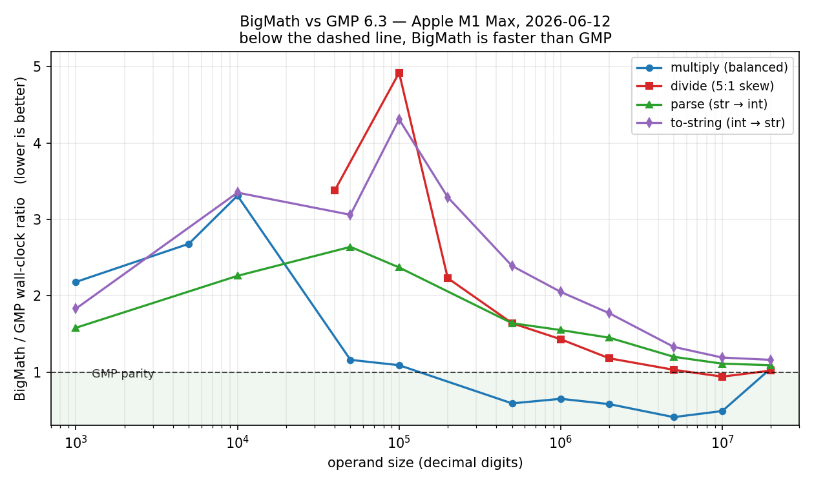
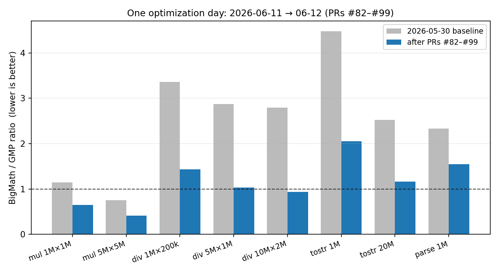

# BigMath

Arbitrary-precision integer library in C++20. Header-light with a thin static-library shell. 64-bit limbs, 3-prime CRT NTT multiplication (multithreaded by default), Newton–Raphson division with cached reciprocals, divide-and-conquer base conversion. Includes a REPL calculator built on top.

Target: portable C++ (with optional NEON intrinsics on aarch64, scalar fallbacks everywhere else) that reaches GMP parity or better across the large-operand bands — no hand-written assembly.

## Performance

BigMath vs GMP 6.3, Apple M1 Max, paired same-run measurements (2026-06-12). Below the dashed line BigMath is faster than GMP:



- **Multiplication beats GMP by 1.5–2.4× across 500k–10M digits** (5M×5M: 26.2 vs 63.4 ms) and at skewed shapes 500k×50k – 5M×500k.
- **Division reaches GMP parity from 5M digits** (10M×2M: 0.94× — BigMath faster).
- **Decimal I/O near parity at scale**: parse 20M digits 1.09×, to-string 20M digits 1.16×.
- Sub-NTT sizes (≲ 13k digits) remain 2–3× behind GMP's hand-tuned basecase.

The 2026-06-11/12 optimization run (PRs #82–#99: wraparound Newton division, dispatch band retunes, quotient-sized division, NEON Shoup NTT butterflies) produced most of the current margins:



Full tables, methodology, and per-PR history: [BENCHMARK.md](BENCHMARK.md).

---

## Features

- **64-bit limb representation** (`BIGMATH_LIMB_64=1`, default). `DataT` stores true 64-bit values; every carry/borrow chain uses `__uint128_t` accumulators. Halves loop iteration counts in scalar paths vs the legacy 32-bit-in-64-bit layout. Opt out via `-DBIGMATH_LIMB_64=0`.
- **Multiplication:** Classic schoolbook → Karatsuba (64-bit-hybrid leaf) → 3-prime CRT NTT (2013265921 / 469762049 / 1811939329, 32-bit coefficient splitting) from 1280 total limbs (~13k digits). Toom-3 and the single-prime Goldilocks NTT remain as cross-check alternates; the NEON-accelerated CRT path beats both at every measured size.
- **Radix-4 + radix-8 fused NTT butterflies** (PRs #59, #60): 3× fewer memory passes vs radix-2; ~1.6× wall-clock at ≥2M limbs.
- **NEON Shoup butterflies on aarch64** (PRs #96–#99, `BIGMATH_NEON=1` default on Apple Silicon): the radix-8/4/2 layers and 1/n scaling run 4 lanes wide using Shoup's precomputed-reciprocal multiplication — `(w·x) mod P` from one widening multiply, one low multiply, one conditional subtract, with interleaved `(twiddle, w′)` tables keeping the strided gathers at one cache line per pair. Bit-exact with the scalar path; ~4× per butterfly pass, −26…40% end-to-end on NTT-bound ops. Scalar fallback everywhere else.
- **MFA / Bailey 6-step CRT NTT** (`BIGMATH_NTT_MFA_THRESHOLD=2^24`, default). Very large CRT transforms switch to a cache-friendly matrix Fourier layout. The threshold was retuned upward from `2^21` to avoid regressions in the 300k-2M limb band while keeping wins at `2^24+` transform sizes.
- **Multithreaded NTT** (`BIGMATH_USE_THREADS=1`, default). Small thread pool (size `min(hw_concurrency, BIGMATH_MAX_THREADS=8)`) parallelizes the CRT path: 6 forwards + 3 inverses as batched work units, one `ParallelDo` dispatch per phase. 2.3-3.4× speedup on large mul / skewed div / parse. Opt out via `-DBIGMATH_USE_THREADS=0` to drop pthread linkage.
- **Division:** Classic short division → Knuth Algorithm D (`FastDivision`, Möller-Granlund qhat, bit-shift normalization) → Burnikel–Ziegler (small near-balanced) → Newton–Raphson with cached reciprocals and wrap-around cyclic products (half-length transforms for the remainder, quotient-estimate, and reciprocal-iteration steps — GMP `mu_div`/`invertappr` style) → quotient-sized division for short-quotient shapes (cost scales with the quotient, not the divisor). Dispatch bands use fractional ratios (5/2, 8/5, 4/3) to avoid one-limb knife-edge cliffs. Identity `q·b + r == a` is cross-checked in `tests/div_correctness.cpp`.
- **Squaring:** Specialized Classic / Karatsuba / NTT squarers (1.4–1.6× over `Multiply(a,a)`).
- **String I/O:** Linear chunked parser/formatter for small inputs, divide-and-conquer with cached Newton reciprocals at scale. Asymptotic `O(M(L) · log L)` both directions.
- **BigDecimal:** Java-style fixed-point decimal (unscaled BigInteger + int scale) with exact +, −, \*; rounded division taking 8 rounding modes; parse/format covering plain and scientific notation.
- **Calculator REPL:** Variables, hex/bin/dec output, multi-line continuation, comments, `:help :quit :vars :reset :base :digits :time :load :save` directives. Built as a separate executable.
- **Thread-safe by construction** for concurrent use of distinct objects from distinct threads. See [docs/THREAD_SAFETY.md](docs/THREAD_SAFETY.md).

## Layout

```
include/biginteger/  public BigInteger headers (algorithms, ops, common)
include/bigdecimal/  public BigDecimal headers
src/                 non-inline BigInteger implementations
bigdecimal/          BigDecimal implementation
tests/               correctness, performance, unit tests
calculator/          REPL frontend
docs/                technical references (see below)
```

## Requirements

- CMake ≥ 3.16
- C++20 compiler with `__uint128_t` + `__builtin_*_overflow` — GCC ≥ 10, Clang ≥ 11, or Apple Clang. MSVC is not supported.
- (Optional) `libgmp` for the GMP comparison benchmark.

## Build

```sh
cmake -S . -B build -DCMAKE_BUILD_TYPE=Release
cmake --build build -j
```

Outputs:
- `build/libbigmath.a` — static library
- `build/calculator` — REPL
- `build/{mult_correctness, div_correctness, unit_tests}` — test binaries
- `build/{multperf_simple, divperf_simple, bench_vs_gmp}` — performance harnesses

See [BUILDING.md](BUILDING.md) for shared-library mode, threshold overrides, and installation.

## Test

```sh
cd build && ctest --output-on-failure
```

`mult_correctness` is fast; `div_correctness` runs a broad matrix and takes a few minutes; `unit_tests` is sub-second.

The standalone perf harnesses `multperf_simple` and `divperf_simple` (BigMath-internal, no GMP) take an optional run-count `k` (default 3); each size is timed `k` times and the mean reported:

```sh
./build/multperf_simple 5   # average of 5 runs per size
./build/divperf_simple 5
```

See [BENCHMARK.md](BENCHMARK.md#in-tree-simple-harnesses-k-averaged-no-gmp) for the latest k=5 numbers.

## Use

```cpp
#include "biginteger/BigInteger.h"
#include "biginteger/common/Builder.h"
#include "biginteger/common/Parser.h"
#include "biginteger/ops/Operations.h"

using namespace BigMath;

BigInteger a = BigIntegerBuilder::From("123456789012345678901234567890");
BigInteger b = BigIntegerBuilder::From("987654321098765432109876543210");
BigInteger c = a * b;
std::cout << ToString(c) << '\n';
```

CMake consumers:

```cmake
find_package(bigmath REQUIRED)
target_link_libraries(my_app PRIVATE bigmath::bigmath)
```

## Calculator

```sh
./build/calculator
> x = 2^256 - 1
> x * x
> :base 16
> x
> :quit
```

Operators: `+ - * / % ^` (with `^` right-associative). Literals: decimal, `0x…` hex, `0b…` binary, underscore separators (`1_000_000`). `#` to end of line is a comment. Trailing `\` continues a line.

## Documentation

- [docs/BASE.md](docs/BASE.md) — number representation, 64-bit limbs, why little-endian
- [docs/MULTIPLICATION.md](docs/MULTIPLICATION.md) — Classic / Karatsuba / Toom-3 / NTT (Goldilocks + multi-prime CRT) and their tradeoffs
- [docs/DIVISION.md](docs/DIVISION.md) — Classic / Fast (Knuth D + Möller-Granlund qhat) / Burnikel–Ziegler / Newton / Reciprocal-cached
- [docs/STRING_CONVERSION.md](docs/STRING_CONVERSION.md) — chunked decimal I/O, D&C parse/format, Newton-divider chain
- [docs/BIGDECIMAL.md](docs/BIGDECIMAL.md) — fixed-point decimal model, rounding modes, performance
- [docs/THREAD_SAFETY.md](docs/THREAD_SAFETY.md) — concurrency model, opt-in internal parallelism
- [BUILDING.md](BUILDING.md) — CMake build, install, build flags, threshold tuning

Each doc covers algorithms, dispatch, benchmark numbers vs GMP, optimizations that landed, and approaches that were tried and rejected with reasons.

## Performance

Apple M1 Max, vs GMP 6.3.0, `-O3 -march=native`, full default stack (`BIGMATH_LIMB_64=1` + `BIGMATH_NTT_CRT=1` + `BIGMATH_USE_THREADS=1`, 8-thread pool). Min of 5 runs:

| operation | size | BigMath | GMP | ratio |
|---|---|---:|---:|---:|
| mul | 100 000 × 100 000 | 1.35 ms | 0.78 ms | 1.72× |
| mul | 1 000 000 × 1 000 000 | 10.5 ms | 9.06 ms | 1.16× |
| mul | 2 000 000 × 2 000 000 | 21.9 ms | 20.6 ms | 1.07× |
| mul | **5 000 000 × 5 000 000** | **46.5 ms** | **63.5 ms** | **0.73×** ← BigMath faster |
| mul | **10 000 000 × 10 000 000** | **105 ms** | **212 ms** | **0.50×** ← BigMath 2.01× faster |
| mul | 20 000 000 × 20 000 000 | 279 ms | 278 ms | 1.00× ← parity |
| mul | 50 000 000 × 50 000 000 | 1 231 ms | 660 ms | 1.86× ← GMP SSA recovers |
| mul | 100 000 000 × 100 000 000 | 2 832 ms | 1 391 ms | 2.04× |
| mul (skewed) | **1 000 000 / 100 000** | **4.47 ms** | **4.79 ms** | **0.93×** ← BigMath faster |
| mul (skewed) | 2 000 000 / 200 000 | 9.43 ms | 9.45 ms | 1.00× ← parity |
| mul (skewed) | 10 000 000 / 1 000 000 | 88.4 ms | 70.5 ms | 1.25× |
| mul (skewed) | 50 000 000 / 5 000 000 | 667 ms | 666 ms | 1.00× ← parity |
| div (skewed) | 500 000 / 100 000 | 18.0 ms | 4.63 ms | 3.89× |
| div (skewed) | 10 000 000 / 2 000 000 | 427 ms | 154 ms | 2.78× |
| div (skewed) | 50 000 000 / 10 000 000 | 2 500 ms | 1 299 ms | **1.92×** |
| parse | 1 000 000 digits | 48.7 ms | 20.3 ms | 2.40× |
| parse | 20 000 000 digits | 1 252 ms | 803 ms | **1.56×** |
| ToString | 100 000 digits | 19.5 ms | 2.33 ms | 8.35× |
| ToString | 1 000 000 digits | 224 ms | 49.8 ms | 4.50× |
| ToString | 20 000 000 digits | 5 437 ms | 2 116 ms | **2.57×** |

**BigMath beats GMP on balanced multiplication across the 5M–10M digit band** and is roughly parity at 20M. The current peak is **10M balanced at 2.01× faster than GMP** (105 ms vs 212 ms). The MFA threshold retune improved that row by avoiding early MFA; at ≥50M GMP's Schönhage-Strassen still recovers. Skewed multiplication is a BigMath win around 1M×100k and parity at 2M×200k and 50M×5M, with the dispatcher now avoiding Toom-3 on 2:1+ skewed inputs in the pre-NTT band. Skewed division at 50M×10M is **1.92×** as Newton inherits the large-multiplication speedups. ToString narrows from 8.35× at 100k to 2.57× at 20M; parse to 1.56× at 20M. See [BENCHMARK.md](BENCHMARK.md) for the full table or the per-doc ratio tables for the breakdown.

Opt-out flags (`-DBIGMATH_USE_THREADS=0` / `-DBIGMATH_NTT_CRT=0` / `-DBIGMATH_LIMB_64=0`) revert any subset of the defaults — useful for embedded targets, header-only-strict consumers, or A/B comparison.

## License

See [LICENSE](LICENSE).

## Author

S. M. Mahbub Murshed (murshed@gmail.com)
