# Division in BigMath

A technical reference for the division subsystem of this BigInteger library: implemented algorithms, dispatch policy, optimization history, benchmark results against GMP, and a catalogue of approaches that were considered and rejected (with their reasons).

---

## Table of contents

1. [Scope and audience](#scope-and-audience)
2. [Number representation](#number-representation)
3. [Top-level dispatch](#top-level-dispatch)
4. [Algorithms](#algorithms)
   - [Classic division](#classic-division)
   - [Fast division (Knuth Algorithm D)](#fast-division-knuth-algorithm-d)
   - [Knuth division (reference implementation)](#knuth-division-reference-implementation)
   - [Burnikel–Ziegler division](#burnikel-ziegler-division)
   - [Newton–Raphson division](#newton-raphson-division)
   - [Reciprocal-cached division](#reciprocal-cached-division)
5. [Benchmark results vs GMP](#benchmark-results-vs-gmp)
6. [Optimizations already implemented](#optimizations-already-implemented)
7. [Future opportunities](#future-opportunities)
8. [Explored but rejected](#explored-but-rejected)
9. [References](#references)

---

## Scope and audience

This document covers `Divide` and `DivideAndRemainder` only. Multiplication is the natural companion (see [MULTIPLICATION.md](MULTIPLICATION.md)); division algorithms in this codebase invoke multiplication heavily through Newton iteration and Burnikel–Ziegler recursion, so the analysis here cross-references multiplication when relevant.

Assumed reader: a working C++ engineer with light numerics background. Familiar with the textbook long-division algorithm. Knowledge of [Knuth Vol. 2 §4.3.1 Algorithm D](https://en.wikipedia.org/wiki/Division_algorithm#Integer_division_%28unsigned%29_with_remainder) helps but isn't required.

Code references use `path:line` where applicable.

---

## Number representation

Same as the multiplication subsystem (see [MULTIPLICATION.md §Number representation](MULTIPLICATION.md#number-representation)). Limbs are 32-bit values stored in `uint64_t` slots, little-endian, in base 2³². The upper 32 bits of each storage slot are headroom for carries.

Two type aliases dominate division code:

| symbol | type | role |
|---|---|---|
| `DataT` | `uint64_t` (32-bit value) | one limb |
| `ULong128` | `__uint128_t` | accumulator for normalize, qhat estimation, and 128/64 divmod |

The 32-bit limb size has a particularly heavy impact on division performance because the inner loop of every divider operates on `(top_two_limbs) / divisor_top_limb`, which is a 64/32 division producing a 32-bit quotient digit. GMP's 64-bit limbs do a 128/64 division producing a 64-bit quotient digit per step, halving the number of quotient digits and roughly halving the loop iterations.

---

## Top-level dispatch

`biginteger/algorithms/Division.h` exposes `DivideAndRemainder(a, b, base, computeRemainder)` returning a `{quotient, remainder}` pair. The dispatcher considers operand sizes and the dividend/divisor ratio.

```mermaid
flowchart TD
    A[DivideAndRemainder&#40;a, b, base&#41;] --> B{IsZero&#40;b&#41;?}
    B -- yes --> Err[throw invalid_argument]
    B -- no --> C{IsZero&#40;a&#41;?}
    C -- yes --> Z[return &#123;0,0&#125;]
    C -- no --> D{Compare&#40;a, b&#41;}
    D -- a == b --> Eq[return &#123;1, 0&#125;]
    D -- a &lt; b --> Less[return &#123;0, a&#125;]
    D -- a &gt; b --> E{b.size &gt;= NEWTON_MEDIUM_B<br/>AND<br/>a.size·DEN &gt;= b.size·NUM?}
    E -- yes --> N[NewtonDivision]
    E -- no --> F{Base2_32<br/>AND b.size &gt; BZ_THRESHOLD<br/>AND BZ band fits?}
    F -- yes --> BZ[BurnikelZieglerDivision]
    F -- no --> FD[FastDivision]
```



Single-limb divisor (`b.size() == 1`) is handled inside `FastDivision` itself, which short-circuits to `ClassicDivision::DivModTo`.

Default thresholds (overridable via `-D...`):

| macro | default | unit | meaning |
|---|---|---|---|
| `BIGMATH_NEWTON_MEDIUM_B` | `1024` | limbs | Newton lower bound for divisor size |
| `BIGMATH_NEWTON_SKEW_NUMERATOR` | `3` | — | Newton requires `a.size() ≥ 3·b.size() / 1` |
| `BIGMATH_NEWTON_SKEW_DENOMINATOR` | `1` | — | |
| `BIGMATH_NEWTON_LARGE_B` | `24576` | limbs | declared but **unused** in current dispatch — historical |
| `BIGMATH_BZ_DIVISOR_THRESHOLD` | `512` | limbs | BZ entry guard |
| `BIGMATH_BZ_RECURSION_THRESHOLD` | `512` | limbs | BZ base-case cutoff (inside `BurnikelZieglerDivision.h`) |

The current dispatch logic, paraphrased:

```
1. b.size ≥ 1024  AND  a.size ≥ 3·b.size                                  → Newton
2. Base2_32  AND  b.size > 512  AND
   ( (b.size ≥ 1024 AND a.size ≤ 3·b.size)
     OR (a.size > 2048 AND a.size > 3·b.size) )                           → Burnikel–Ziegler
3. else                                                                   → FastDivision
4. (b.size == 1 inside FastDivision)                                      → ClassicDivision
```

The ordering matters: Newton wins on **skewed** problems (large dividend over medium divisor) because the per-divisor reciprocal setup amortizes over multiple chunks. BZ wins on **near-balanced** large problems where its 2n/n recursion structure shines. FastDivision is the default workhorse for everything else.

`KnuthDivision` and `ReciprocalDivision` exist as alternate implementations used by correctness tests for cross-checking. They are not in the production dispatch path.

---

## Algorithms

### Classic division

**Location:** `algorithms/division/ClassicDivision.h`.

**Complexity:** O(n) limb operations when the divisor is a single limb. The implementation handles single-limb divisors (a / b where b fits in one limb) and provides primitive helpers used by all other dividers.

**Algorithm (single-limb divisor):** standard short division. Walk dividend limbs from high to low, maintaining a 64-bit accumulator:

```
   acc = 0
   for i = n-1 down to 0:
       acc       = acc · B + a[i]               (B = 2³² for Base2_32)
       q[i]      = acc / divisor
       acc       = acc % divisor
   remainder = acc
```

For `Base2_32`, the inner `(acc << 32 | a[i])` fits in a `ULong128`, and `__uint128_t / uint64_t` is one instruction on x86 (`DIV`) and a hardware-supported sequence on ARM64 (`UDIV` + multiply-subtract).

The `DivModTo` variant performs the division **in place** on the dividend vector (overwriting it with the quotient) and returns the remainder. This is the hot operation inside `ToStringLinearAppend`, where the dividend is repeatedly divided by `10¹⁸` to peel off 18 decimal digits at a time.

### Fast division (Knuth Algorithm D)

**Location:** `algorithms/division/FastDivision.h`.

**Complexity:** O((m − n + 1) · n) limb multiplies where `m = |a|`, `n = |b|`. This is Knuth's [Algorithm D](https://en.wikipedia.org/wiki/Division_algorithm#Integer_division_%28unsigned%29_with_remainder) as described in *TAOCP Vol. 2 §4.3.1*, tuned for Base2_32.

**Algorithm sketch:**

```
   1. Normalize: shift a and b left by k bits so that b's top limb has its MSB set.
                 The normalized b has a high limb b̂ ≥ 2³¹.
                 a may grow by one limb.

   2. For each output digit position j from high to low:
        a) Estimate qhat from the top two limbs of the current remainder
           divided by b̂. Knuth shows the estimate is at most 2 too high.
        b) Tentative q · b is subtracted from the current remainder window.
        c) If the result went negative, decrement qhat by 1 and add b back
           (this loop runs at most twice; in practice essentially never on
            normalized input).
        d) Record q[j] = qhat.

   3. Denormalize: shift remainder right by k bits to undo step 1.
```

The Base2_32 fast path uses `ULong128` arithmetic for `qhat` estimation (`acc / b̂` is `__uint128_t / uint64_t`, mapping to `DIV`/`UDIV`) and for the in-place subtract-tentative-product step. The non-Base2_32 path falls back to `% base` / `/ base` operations.

**Performance notes.** `FastDivision` is the dispatcher's default. For divisors below the Newton/BZ thresholds (typically `b.size() < 1024`), it is the algorithm that actually runs. The qhat estimation is the inner-loop bottleneck. The implementation also specializes the normalize and unnormalize steps for `Base2_32` with scalar `ClassicMultiplication` calls (rather than going through the generic shift-by-bits path), giving roughly a 1.04–1.3× win on those steps for medium-size inputs.

### Knuth division (reference implementation)

**Location:** `algorithms/division/KnuthDivision.h`.

A more textbook-faithful implementation of Algorithm D, kept primarily as a cross-check reference for `tests/div_correctness.cpp`. The production dispatch never invokes it. If a regression is suspected in `FastDivision`, comparing limb-for-limb against `KnuthDivision` is a fast way to bisect the bug.

### Burnikel–Ziegler division

**Location:** `algorithms/division/BurnikelZieglerDivision.h`.

**Complexity:** O(M(n) · log n) where M(n) is the cost of multiplying n-limb numbers. With NTT multiplication this is `O(n · log² n · log log n)` effectively, dominated by the recursive sub-multiplications. The recursion structure is from [Burnikel and Ziegler (1998), "Fast Recursive Division"](https://pure.mpg.de/rest/items/item_1819444_4/component/file_2599480/content).

**The key insight.** Knuth's Algorithm D pays a multi-precision `qhat · b` subtraction at every quotient digit. Burnikel–Ziegler observes that you can group `n` quotient digits at a time, compute that whole block of `q` via a recursive 2n/n division, and pay one multi-precision `q_block · b` subtraction per block — turning the inner cost from quadratic into the cost of the multiplication.

**The recursive structure: 2n/n and 3n/2n.**

The algorithm operates with two recursive primitives:

- **`Div2n1n(a, b)`** — given `a` with 2n limbs and `b` with n limbs (top half), produce a 1-limb-wide quotient block of size n. It does this by calling `Div3n2n` twice in sequence.

- **`Div3n2n(a, b)`** — given `a` with 3n limbs and `b` with 2n limbs, produce an n-limb quotient. Internally calls `Div2n1n` once on the top 2n limbs of `a` against the top n of `b`, then performs the multi-precision subtraction `q · b_low` and a fixup loop.

The mutual recursion bottoms out (at `BIGMATH_BZ_RECURSION_THRESHOLD = 512` limbs) by calling `FastDivision` on the base case.

```
                                                          
   Div2n1n(a₂ₙ, bₙ)     ←   the public entry for 2n / n  
       │                                                  
       │  splits a into a_high (n limbs) and a_low (n)    
       ▼                                                  
   q_high = Div3n2n(a_high ++ a_low[high half], b)        
       │                                                  
       ▼                                                  
   q_low  = Div3n2n(intermediate_R ++ a_low[low half], b) 
       │                                                  
       ▼                                                  
   quotient = q_high ++ q_low                             
                                                          
                                                          
   Div3n2n(a₃ₙ, b₂ₙ)                                      
       │                                                  
       │  split b into b₁ (high n) and b₀ (low n)         
       │  split a into a top 2n and bottom n              
       ▼                                                  
   q = Div2n1n(top_2n, b₁)            ← recursive 2n/n    
       │                                                  
       ▼                                                  
   r = top_2n − q · b₁                                    
   adjust: r ← (r << n·32) + bottom_n − q · b₀            
       │                                                  
       ▼                                                  
   while r < 0:                                           
       q ← q − 1                                          
       r ← r + b                                          
       (this loop runs at most twice)                     
```

The shape of the recursion makes BZ a near-perfect match for **balanced** division (dividend ≈ 2× divisor). The dispatcher in `Division.h` reflects this: BZ runs when `b.size() ≥ 1024 AND a.size() ≤ 3·b.size()`.

**Handling odd divisor size.** BZ's 2n/n recursion requires an even-sized divisor. Earlier versions rejected odd `b.size()` at the entry and fell back to `FastDivision`, which was quadratic and slow. The current implementation **shift-normalizes** odd inputs at the entry: it bit-shifts both `a` and `b` left by enough bits to push `b`'s MSB into a fresh high limb (making `b.size()` even), runs the recursive algorithm on the shifted inputs, then shifts the remainder right by the same amount at the end. The shift cost is O(n + m), negligible compared to the BZ work itself, and the dispatcher no longer has to route odd-divisor cases through `FastDivision`.

The `BIGMATH_BZ_DIVISOR_THRESHOLD = 512` guard prevents BZ from being chosen for divisors so small that `FastDivision` would beat it.

### Newton–Raphson division

**Location:** `algorithms/division/NewtonDivision.h`.

**Complexity:** O(M(n)) per divide, where M(n) is multiplication cost. The reciprocal computation is also O(M(n)) but is amortized over multiple divisions when the same divisor is reused (see [`Divider` class](#reciprocal-cached-division)).

**The Newton iteration.** Given a normalized divisor `D` (top bit of `D[n-1]` set), the algorithm computes an approximate reciprocal `R` of `D` to ~2n limbs of precision. The iteration is the classical [Newton's method for 1/D](https://en.wikipedia.org/wiki/Division_algorithm#Newton%E2%80%93Raphson_division):

```
   R_{i+1} = R_i · (2 − D · R_i)        (in fixed-point representation)
```

This **doubles the precision per iteration** quadratic convergence. Starting from a low-precision seed (computed from a 32×32 division on the top limbs of `D`), it reaches n-limb precision in `O(log n)` iterations, each iteration costing M(2^i). The total cost telescopes to `O(M(n))`.

Once `R` is computed, a single division `a / D` becomes:

```
   Q_estimate = (a · R) >> 2n        (high-half multiplication)
   R_final    = a − Q_estimate · D
   fixup:     if R_final ≥ D, increment Q_estimate, subtract D from R_final
              (loop bounded by FIXUP_LIMIT = 8; in practice 0–2 iterations)
```

The implementation calls this `DivideChunk`.

**Blockwise mode for large dividends.** When `na > 2n + 1` (where `n = |b|`), the algorithm processes the dividend in chunks:

```
                                                                 
    a  =  [    top chunk    ][  block₁  ][  block₂  ] ... [ block_k ] 
          ←─── n+1 to 2n ───→←─── n ────→←─── n ────→     ←── n ──→ 
                                                                 
    Step 1: q_top, r = DivideChunk(top_chunk, b, R)               
    Step 2: q_block₁, r = DivideChunk(r ++ block₁, b, R)          ← thread r as high part
    Step 3: q_block₂, r = DivideChunk(r ++ block₂, b, R)          
    ...                                                           
    Final quotient = q_top ++ q_block₁ ++ q_block₂ ++ ... ++ q_block_k 
    Final remainder = r                                           
```

Each chunk costs O(M(n)) and there are O(na / n) chunks, so total cost is O((na / n) · M(n)). For balanced division this is comparable to BZ; for skewed division where `na ≫ n`, the chunk loop is the bulk of the work and Newton wins decisively because:

1. The reciprocal `R` is computed once and reused across all chunks.
2. Each chunk's `DivideChunk` is O(M(n)) thanks to NTT/Karatsuba in the high-half multiplication, not O(n · chunk_size).

**High-precision reciprocal flag.** When `na ≥ 2n`, the implementation runs one **extra Newton iteration at full precision** after the main loop (`EXTRA_REFINE_ITERS = 1`). This is necessary because integer rounding in the standard iteration leaves `R` accurate to only ~half-bits at large `n`, which combined with a dividend window of size ≥ 2n produces a `Q_estimate` error of `O(n)` — too large for the `FIXUP_LIMIT = 8` correction loop to absorb. The extra refinement iteration drops the error to ≤ 1 quotient digit, which the fixup loop handles trivially.

Without this flag, the fixup loop diverged at `n = 32768` in early testing, leading to a fallback path that hands off to `FastDivision` if iterations exhaust.

**Why Newton, why bands.** The structural win of Newton over FastDivision is the O(M(n)) per-chunk cost versus FastDivision's O((m−n+1)·n) quadratic-in-quotient-size cost. The win materializes once the divisor is large enough that NTT/Karatsuba is faster than scalar multi-precision arithmetic, and once the ratio is skewed enough that reciprocal setup amortizes. The 2026-05 tuning lowered the dispatcher band from `b.size ≥ 8192` to `b.size ≥ 1024` with skew threshold `a ≥ 3b`, after a GMP-bench regression at `(a=200k, b=50k digits)` showed Newton was missing the band by 1–3 limbs at boundary cases.

### Reciprocal-cached division

**Location:** `algorithms/division/ReciprocalDivision.h` (the wrapper) and `algorithms/division/NewtonDivision.h::Divider` (the implementation).

For repeated division by the same divisor — the canonical use case in `ToStringDivConquer` where every level of the divide-and-conquer formatter divmods by a fixed `10^k` constant — building the reciprocal once and reusing it amortizes the setup cost over every division.

The API:

```cpp
class NewtonDivision::Divider {
public:
    Divider(vector<DataT> const &b, BaseT radix);
    pair<vector<DataT>, vector<DataT>> DivideAndRemainder(
        vector<DataT> const &a, bool computeRemainder = true) const;
};
```

`Divider` stores the normalized `b`, the normalization shift, and the pre-computed reciprocal `R`. Each `DivideAndRemainder` call skips straight to `DivideNormalizedWithReciprocal`.

**Measured win:** for 5 divisions by the same large divisor, the cached form is 27–31× faster than calling `NewtonDivision::DivideAndRemainder` five times. Even including the one-time `Divider` setup cost, it remains 12–25× faster.

This is the foundation of the divide-and-conquer ToString optimization. `Parser.h::BuildDecimalDcChain` constructs a chain of `Divider` instances — one per level of the D&C recursion, each holding `10^(N/2^i)` and its reciprocal — so the recursion's repeated divmods by these constants run at O(M(n)) per divide instead of incurring per-divide reciprocal setup.

---

## Benchmark results vs GMP

Benchmark harness: `tests/performance/bench_vs_gmp.cpp`. Build:

```
c++ -std=c++20 -O3 -march=native -I/opt/homebrew/include -L/opt/homebrew/lib \
    tests/performance/bench_vs_gmp.cpp -o bench_vs_gmp -lgmp
```

Hardware: Apple M1 Max. Reference: GMP 6.3.0 (Homebrew). `min` over a small iteration count.

### Balanced division

For `a.size() == b.size()` the quotient is 1–2 limbs and both libraries short-circuit. The benchmark numbers are noise — ratios reflect timer resolution, not algorithmic cost — so they are omitted here. To benchmark balanced division meaningfully, use `(a, b)` where `a.size() ≈ 2·b.size()`, which routes through BZ.

### Skewed division (dispatcher routes to Newton)

Numbers below are with `BIGMATH_LIMB_64=1` (the default since 2026-05).

| sizes (digits) | BigMath ms | GMP ms | BM / GMP |
|---|---:|---:|---:|
| `a=40 000, b=10 000` | 1.04 | 0.22 | **4.8 ×** |
| `a=100 000, b=10 000` | 3.12 | 0.45 | **6.9 ×** |
| `a=200 000, b=50 000` | 20.9 | 1.69 | **12.4 ×** |
| `a=500 000, b=100 000` | 53.7 | 4.63 | **11.6 ×** |

All four cases route to Newton. The dominant cost is NTT multiplication inside the Newton reciprocal iteration and inside each `DivideChunk`'s high-half mult.

**Historical view** of the same skewed sizes:

| sizes (digits) | early 2026 | Base2_32 tuned | Base2_64 default | improvement |
|---|---|---|---|---|
| 40 000 / 10 000 | 23 × | 21 × | **4.8 ×** | **4.8 ×** |
| 100 000 / 10 000 | 34 × | 20 × | **6.9 ×** | **4.9 ×** |
| 200 000 / 50 000 | 72 × | 14 × | **12.4 ×** | **5.8 ×** |
| 500 000 / 100 000 | 12 × | 12 × | **11.6 ×** | ≈ same (NTT-bound) |

The 40k/10k and 100k/10k cases dropped 4–5× from the Base2_32-tuned numbers via the 64-bit limb refactor — Newton's outer loop (scalar shifts, carry chains, FastDivision base case) halved its operation count. The 500k/100k case is at the NTT floor: nearly all time is inside Goldilocks NTT mults, which see no benefit from wider limbs since the 16-bit coefficient capacity is fixed by the prime.

**Where the time actually goes.** Profile of `div 100k/10k` (a = 100 000 decimal digits, b = 10 000):

| function | % of div time |
|---|---:|
| `NewtonDivision::DivideNormalizedWithReciprocal` (chunked Q estimation) | ~72% |
| `NewtonDivision::ApproxReciprocal` (Newton iteration) | ~28% |

Both are essentially **NTT multiplications**: the reciprocal iteration is `R · (2 − D · R)` with two large mults per iter, and `DivideChunk` is one high-half mult `a · R` per chunk. At `b = 10 000 digits` (520 64-bit limbs / 1040 32-bit limbs), every internal multiplication crosses the NTT threshold. Division at this size is effectively "multiplication, repeated several times."

Detailed breakdown at 500k/100k digits (the floor case) sampled with `sample(1)` on macOS:

| function group | % |
|---|---:|
| `NTTCore::Forward` / `NTTCore::Inverse` (DIF + DIT passes) | ~60% |
| `ModularField::Mul` (pointwise multiply inside NTT) | ~12% |
| `NTTMultiplication::FinalizeBase2_64` (coefficient reassembly into 64-bit limbs) | ~8% |
| `NewtonDivision::ApproxReciprocal` overhead (vector allocation, shifts, carry chains) | ~10% |
| `NewtonDivision::DivideNormalizedWithReciprocal` blockwise loop bookkeeping | ~7% |
| Everything else (Compare, Shift, TrimZeros, dispatch) | ~3% |

**Two-thirds of the wall time is inside `NTTCore`.** Any further improvement to skewed division must either (a) reduce the number of NTT calls, (b) reduce the work per NTT call, or (c) parallelize the NTT itself. See [Improving skewed division beyond the current floor](#improving-skewed-division-beyond-the-current-floor).

---

## Optimizations already implemented

A loosely chronological summary of optimizations that landed and stuck.

### Build flags

`-O3 -march=native`. Same impact as for multiplication: NEON autovectorization for helpers, ARM64 instruction scheduling, several percent across the board.

### `FastDivision` Base2_32 specializations

The Knuth Algorithm D implementation has Base2_32 fast paths for:

- **Normalize.** Scalar shift via `ClassicMultiplication` instead of bit-shift loops. ~1.04–1.3× win on the normalize step.
- **Scalar divisor.** When `b.size() == 1`, short-circuit to `ClassicDivision::DivModTo` with a `ULong128 / ULong` inner loop. ~2× win for 1024 / 8192 limb dividends.
- **Remainder unnormalize.** Same scalar specialization.

### `BurnikelZiegler` rewritten as balanced 2n/n with 3n/2n internal steps

The current implementation matches the textbook Burnikel–Ziegler structure rather than the earlier ad-hoc recursion. Block writes are done directly to a preallocated quotient buffer instead of accumulating through `vector<vector<DataT>>`, eliminating per-block heap allocation. Measured: `4096 × 2048` balanced division dropped from 4.19 ms to 2.68 ms.

### `BurnikelZiegler` shift-normalize for odd divisor

Earlier versions of the dispatcher rejected odd `b.size()` at entry, sending odd cases through quadratic FastDivision. The current BZ entry shift-normalizes by bit-shifting both `a` and `b` left enough to push `b`'s MSB into a fresh high limb (making the new divisor size even), runs the recursive algorithm, and shifts the remainder right at the end. This eliminated a class of latent performance cliffs at random divisor sizes.

### Newton–Raphson with `Divider` cached-reciprocal API

`NewtonDivision::Divider` precomputes the normalized divisor + reciprocal once. For repeated divisions by the same divisor, the per-divide cost drops 27–31× (5 divisions on a large divisor) versus the non-cached form. This API is wired into `ReciprocalDivision::Divider` (public-facing wrapper) and is the foundation of the D&C ToString chain.

### Newton blockwise mode

For `na > 2n + 1`, divides the dividend in chunks of size in `[n+1, 2n]`, threading the remainder as the high part of the next chunk. Each chunk's `DivideChunk` is O(M(n)) thanks to the reciprocal being precomputed. Total cost is `O((na / n) · M(n))`, which is optimal up to constants for arbitrarily skewed division.

### High-precision reciprocal for `na ≥ 2n`

One extra Newton refinement iteration at full precision when the dividend window will pit the reciprocal against a chunk size ≥ 2n. Without it, the fixup loop diverges at `n = 32768`. Bounded by `FIXUP_LIMIT = 8`; falls back to `FastDivision` on the divergence path (in practice never triggered post-flag).

### Dispatcher band tuning (2026-05)

The GMP bench surfaced a 72× regression on `200k / 50k` digits. Tracing showed the dispatcher predicate `a.size() ≥ 4·b.size()` was missing the case by 1–3 limbs at random sizes (`a = 20763, b = 5191` vs `4·5191 = 20764`). Lowering `NEWTON_SKEW_NUMERATOR` from 4 to 3 admitted these boundary cases to Newton. `NEWTON_MEDIUM_B` lowered from 8192 to 1024 after observing Newton beats FastDivision at much smaller divisors than the old guess. Result: that case dropped to 14×, a 5.3× improvement.

### Newton reciprocal allocation cleanup

Earlier `ApproxReciprocal` and `DivideChunk` allocated more temporary vectors than necessary in their inner loops, hitting the allocator at every Newton iteration level. Cleanup removed several intermediate copies; the impact is hard to measure in isolation but contributed to overall Newton throughput.

### Möller–Granlund 3/2 reciprocal in `FastDivision` qhat (2026-05, PR #17)

Replaced the per-iteration `__uint128 / uint64` divide in Knuth Algorithm D's qhat estimation with the [Möller–Granlund 3-by-2 preinverted reciprocal](https://gmplib.org/~tege/division-paper.pdf) (Algorithms 2 + 4). One mul-add + ≤ 2 correction branches instead of a hardware DIV. Gated by `BIGMATH_FASTDIV_USE_MG_QHAT` (default on, set to `0` for emergency rollback).

Measured win on `FastDivision` band (Base2_32, M1 Max, `divperf_simple`):

| case | master | M-G | delta |
|---|---:|---:|---:|
| 1024×512 | 0.464 ms | 0.443 ms | −4.5% |
| 4096×2048 | 11.48 ms | 7.44 ms | **−35%** |
| 8192×512 | 9.64 ms | 7.78 ms | −19% |
| 16384×512 | 15.92 ms | 14.15 ms | −11% |

The M-G qhat is currently gated on `base == Base2_32 && n >= 2` in the j-loop. Under `BIGMATH_LIMB_64=1` it's skipped (the 3-by-2 reciprocal precompute would need a 192/128 software division), and Knuth qhat with a 128/64 hardware divide is used instead. Re-enabling M-G for Base2_64 is a [future opportunity](#future-opportunities).

### 64-bit limb refactor (2026-05, PRs #18–#30)

`DataT` now stores true 64-bit values and `Base() == Base2_64` by default. All division paths (Classic, Fast w/ Knuth qhat, BZ, Newton) have native Base2_64 code: `ULong128` carries, shift-by-64 in `ShiftLeftBits`/`ShiftRightBits`, `__builtin_clzll` in BZ's bit-bump-count, two-step unsigned borrow in `SubFromPtr`. Newton's `ApproxReciprocal` seed bootstraps from a single 64-bit top limb (`R_seed = (2^128 - 1) / D[n-1]` at `cur_n = 1`) and lets Newton's quadratic doubling reach full precision — no 256-bit intermediate needed.

Wins on the skewed-div benchmarks:

| case | Base2_32 | Base2_64 | delta |
|---|---:|---:|---:|
| 40 000 / 10 000 | 2.51 ms | 1.04 ms | **−59%** |
| 100 000 / 10 000 | 4.90 ms | 3.12 ms | **−36%** |
| 200 000 / 50 000 | 21.4 ms | 20.9 ms | −2% (NTT-bound) |
| 500 000 / 100 000 | 54.3 ms | 53.7 ms | ≈ 0 (NTT-bound) |

The smaller cases benefit most: Newton's outer loop (scalar carry chains, FastDivision base case, BZ helpers) halves its limb count. The largest cases are NTT-bound and gain little from wider limbs (Goldilocks coefficient capacity is fixed at 16 bits, so the same problem produces the same coefficient count regardless of limb width).

Opt-out: `-DBIGMATH_LIMB_64=0` reverts to 32-bit limbs.

---

## Improving skewed division beyond the current floor

The remaining gap is concentrated in two cases — `200k/50k` at 12.4× GMP and `500k/100k` at 11.6×. Both are NTT-mult-dominated per the profile above (~70% inside `NTTCore`). Improvements fall into four categories.

### Reduce NTT calls — Mulders' short multiplication (high effort, 10–20%)

Newton's `R_new = R · (2 − D · R) / B^k` only needs the high half of `D · R`. [Mulders (2000), "On Short Multiplications and Divisions"](https://citeseerx.ist.psu.edu/document?repid=rep1&type=pdf&doi=10.1.1.20.1948) shows the high half can be computed in ~60–75% of full-multiplication cost via a recursive split that drops the contribution from the low-low product. Similarly, `DivideChunk`'s `Q ≈ (chunk · R) >> 2n` only needs the high half of `chunk · R`.

Estimated impact on the skewed-div benchmarks (most mults in the Newton path are full mults; replacing with Mulders mulhi would cut per-mult cost):

| case | now | est after Mulders | delta |
|---|---:|---:|---:|
| 200 000 / 50 000 | 20.9 ms | ~15–17 ms | −15 to −25% |
| 500 000 / 100 000 | 53.7 ms | ~40–45 ms | −15 to −25% |

Cost: ~400–600 lines for `MulHigh` (recursive split with lost-low-bits handling), separate Karatsuba-style and NTT-style implementations, careful precision analysis to bound the lost contribution. Risk: medium — Newton's fixup loop has a tight `FIXUP_LIMIT=8`, and Mulders' approximation could push some inputs over that bound.

### Parallelize NTT — multithreading (medium effort, 1.5–3× best case)

The 60% of wall time inside `NTTCore::Forward`/`Inverse` is structurally parallelizable:

1. **Forward + Forward in parallel.** A full `Multiply(a, b)` does two `Forward()` calls (one for `fa`, one for `fb`). Independent — can run on two threads. Win bounded by `min(forward_a, forward_b)` overlap.
2. **Butterfly layers within a single `Forward()`.** Each layer of an `n`-point NTT is `n/2` independent butterflies. Parallelizing across cores via `for` chunking. With 8 perf cores on an M1 Max, the theoretical speedup per layer is 8×, but synchronization at each layer barrier eats most of it at the sizes we hit (~32k coefficients).
3. **Pointwise multiply.** Trivially parallel.
4. **Inverse `Inverse()` symmetric to Forward.**

**Critical caveat: `DivideChunk` blockwise is inherently sequential.** Each block consumes the previous block's remainder as its high half — the dependency chain blocks coarse-grained parallelism across blocks. Only **within** a single `DivideChunk`'s `Multiply` call can we parallelize. The 500k/100k case has ~5 blocks, each with two ~5000-limb NTT mults. Each mult is ~3 ms wall time on a single core; parallelizing across 4 cores could bring per-mult to ~1.2 ms (4× peak speedup minus barrier overhead and L2 contention → realistic 2.5×).

Predicted end-to-end:

| case | now (1 thread) | est 2 threads | est 4 threads | est 8 threads |
|---|---:|---:|---:|---:|
| 200 000 / 50 000 | 20.9 ms | ~13 ms | ~9 ms | ~7 ms |
| 500 000 / 100 000 | 53.7 ms | ~33 ms | ~22 ms | ~17 ms |
| 1M / 1M (mul, for ref) | 36.5 ms | ~22 ms | ~14 ms | ~11 ms |

These are upper bounds assuming Amdahl on the 60–70% parallelizable portion and ~70% efficiency per thread. The 30% serial portion (allocation, `ApproxReciprocal` data dependencies, `Finalize` accumulation, `DivideChunk` block dependencies) caps the speedup well below thread count.

**Implementation cost:** the library is intentionally header-only with no external dependencies. Adding threading needs careful design:

- **Don't** add `#include <thread>` to public headers — pulls in pthread linkage for every consumer.
- **Do** add an opt-in `BIGMATH_USE_THREADS` macro that, when set, links a thread pool defined in `src/`. Public headers stay unchanged.
- Use `std::jthread` (C++20, already in use) or [Apple GCD](https://developer.apple.com/documentation/dispatch) on Apple Silicon. Avoid OpenMP (compiler-pragma sensitivity, and the parallel regions here are too fine-grained for OpenMP's overhead model).
- Thread pool size = `min(hardware_concurrency(), 8)`. Beyond 8 threads the L2 cache pressure on NTT working sets (~512KB at 32k-coefficient transforms) dominates over compute parallelism on M1 Max's shared-L2 architecture.
- Avoid thread creation per mult — pool with persistent workers, dispatch via condition variables. Thread creation on macOS is ~50µs (one shot), well above the ~1ms per-mult budget at these sizes.
- Stub out for `BIGMATH_USE_THREADS=0` (default for now) so single-threaded users see zero overhead.

**Risk:** medium-high. The library is currently free of thread-safety concerns because everything is local. Introducing a pool requires auditing every `static thread_local` cache (NTT twiddles, `Pow10`) for correctness under parallel section invocation. The NTT twiddle cache is already `thread_local` per-thread, which is *good* for thread safety but means each worker thread pays its own first-call cost. Solution: warm pool threads at startup (call `NTTCore::GetPlan` from each worker once).

**Recommendation:** worth doing once a concrete user case demands sub-50ms `500k/100k` div. The 2–3× wall-time win is real, but adding a thread pool to a header-only library is a non-trivial architectural step and only narrow workloads care about this size band.

### Faster NTT kernel — multi-prime CRT with 32-bit coefficients (high effort, 1.5–2× on the NTT itself)

The current Goldilocks NTT splits each input limb into 16-bit coefficients (4 per 64-bit limb). Coefficient × coefficient = 32 bits, accumulated over `n` positions = up to ~`n · 2^32`. Goldilocks' ~2^64 modulus tolerates `n` up to ~2^32, which is way past anything we care about — there's headroom.

Switching to a single 64-bit prime with 32-bit coefficients **doesn't fit** (32 × 32 = 64 bits, no headroom for accumulation). The path is **multi-prime CRT**: use two ~64-bit primes (e.g. two of the Solinas primes near 2^62), do two parallel NTTs at 32-bit coefficient width, CRT the results. Halves the coefficient count → ~2× NTT speed, at the cost of doing two NTTs (~2× the work) — net break-even at first glance, **but** the per-coefficient `ModularField::Mul` work shrinks too (operations on 32-bit inputs in 64-bit modulus are cheaper than on 16-bit inputs in 64-bit modulus), so net ~1.3–1.5× speedup expected.

Cost: rewrite of `NTTCore.h` (~400–800 lines), addition of CRT reconstruction, new prime selection. Risk: high — touches every NTT caller, accumulation bounds for 32-bit coefficients need re-derivation for the new primes.

Previously rejected in `project-rejected-algorithms` memory under "Different NTT prime / multi-prime CRT" with the reasoning "triples transform cost without enabling a larger range anyone uses." That argument was about extending the operand-size range (Goldilocks at 16-bit coefficients already covers ~2^31 limbs ≈ 16 GB). The current motivation is different — **same operand range, fewer coefficients, faster transform** — and deserves a fresh analysis if the multithreading path doesn't deliver enough.

### Algorithmic alternatives (out of scope without a concrete trigger)

- **Schönhage–Strassen** for the division-internal mults: same rejection as for multiplication (`MULTIPLICATION.md`). NTT covers our range.
- **Block-recursive Mulders division**: redundant with Newton blockwise per the prior rejection.
- **GPU-offload NTT**: hardware-specific, transport overhead dominates at our sizes.

---

## Future opportunities

Ranked by expected ROI per unit of effort.

### Möller–Granlund 3/2 reciprocal for `FastDivision` under Base2_64 (medium, ~10% on FastDivision band)

PR #17 landed M-G for Base2_32 with strong wins. Base2_64 currently uses Knuth qhat because the M-G 3-by-2 reciprocal precompute requires `floor((2^192 - 1) / d)` where `d` is a 128-bit divisor — a 192/128 software division that doesn't exist in the standard library. Implementing it (~40–80 lines of long division, runs once per `FastDivision::DivideAndRemainder` call) would unlock the same proportional wins seen for Base2_32 in the dispatcher band `b.size() ∈ (1, NEWTON_MEDIUM_B / 2)` ≈ `(1, 512)` for 64-bit limbs.

Effort: ~150 lines. Risk: low (M-G algorithm already validated at Base2_32; the new piece is just the 192/128 divide).

### Mulders' short multiplication in Newton iteration

Detailed in the [Improving skewed division](#improving-skewed-division-beyond-the-current-floor) section above. The highest-impact algorithmic improvement available without threading.

### Multithreaded NTT

Detailed above. Requires architectural change to add a thread pool. Probably the path with the best wall-clock-per-effort ratio at the 500k/100k case, but adds a non-trivial dependency surface.

---

## Explored but rejected

Each rejection has a concrete reason. Don't re-propose without new evidence overturning the reason.

### Subquadratic GCD (Schönhage HGCD / Lehmer recursive)

[Schönhage's half-GCD algorithm](https://en.wikipedia.org/wiki/Half-GCD_algorithm) and [Lehmer's recursive GCD](https://en.wikipedia.org/wiki/Lehmer%27s_GCD_algorithm) compute `gcd(a, b)` in `O(M(n) · log n)`, asymptotically better than the Euclidean algorithm's `O(n²)`.

Rejected because **no big-integer GCD exists in this codebase**. Only single-limb `gcd(DataT, DataT)` in `biginteger/common/Util.h`. No callers (no modular inverse, no `Rational` class, no RSA, no continued fractions). HGCD is ~600–1000 lines of dead code if implemented today. If big-integer GCD is ever needed, start with naïve Euclidean (~50 lines) and escalate only when measured as a bottleneck.

### Möller–Granlund 3/2 reciprocal for qhat (round 1)

Initially considered, then pivoted to full Newton-Raphson reciprocal division — a bigger structural win at the sizes that actually hurt (skewed division with large divisors). Möller–Granlund remains worth doing for the FastDivision fallback path (see [Future opportunities](#future-opportunities)) but is no longer the primary attack vector.

### Block-recursive Mulders division

Pivoted to blockwise Newton, which captures the same recurrence behavior at the operand sizes this library actually hits, with simpler implementation. Mulders' multi-quotient-block recursive division is theoretically nicer but in practice Newton's blockwise mode plus reciprocal caching delivers the same asymptotic win with less code.

### Mulders' short multiplication — round 1 (now promoted to future-opportunity)

Newton's iteration `R · (2 − D · R)` only needs the high half of `D · R`. Originally rejected on the basis that other optimization paths had higher ROI. After the 64-bit limb refactor (2026-05) closed those other paths, Mulders is now the highest-impact remaining algorithmic optimization — see [Improving skewed division beyond the current floor](#improving-skewed-division-beyond-the-current-floor).

### Lowering `BIGMATH_BZ_RECURSION_THRESHOLD` below 512

Below 512 limbs the BZ recursion overhead (multiple `Div3n2n` / `Div2n1n` levels, internal mult dispatching) exceeds the work of just calling `FastDivision` on the base case. The 512 threshold matches the BZ "balanced" win band and matches `BZ_DIVISOR_THRESHOLD` at the dispatcher level.

### Removing the `high_precision` reciprocal refinement

Tested early; without the extra iteration the fixup loop diverges at `n = 32768`. The cost of the extra iteration is one full-precision `D · R` multiplication per `ApproxReciprocal` call (small compared to the rest of the iteration chain). The protection is worth the cost.

### Dispatcher: tighter Newton skew threshold (`a ≥ 4·b`)

Initially the Newton skew predicate was `a.size() ≥ 4 · b.size()`. GMP bench surfaced random-size cases failing the predicate by 1–3 limbs, causing them to fall through to FastDivision (quadratic) and producing 70+× regressions vs GMP. Lowered to `3·b`; predicate matches Newton's actual win band better. Don't tighten back without re-running the GMP bench across boundary sizes.

### Removing the cached reciprocal `Divider` class

Without `Divider`, the D&C `ToString` chain rebuilds the reciprocal at every divmod level, restoring O(n²) behavior for the chain. The 8.4× ToString win at 100k digits hinges on the cache. The class stays.

### Schönhage-Strassen / multi-prime NTT for division-internal mults

Same reasons as for multiplication ([MULTIPLICATION.md §Explored but rejected](MULTIPLICATION.md#explored-but-rejected)). Division's NTT mults are the same NTT used by `Multiply`; division benefits or suffers in lockstep.

---

## References

### Algorithms

- Knuth, D. E. *The Art of Computer Programming, Vol. 2: Seminumerical Algorithms*, §4.3.1 — the canonical treatment of Algorithm D (long division).
- [Division algorithm — Wikipedia](https://en.wikipedia.org/wiki/Division_algorithm) — overview including Algorithm D, Newton–Raphson, and related schemes.
- [Burnikel, C. and Ziegler, J. — "Fast Recursive Division" (MPI-I-98-1-022, 1998)](https://pure.mpg.de/rest/items/item_1819444_4/component/file_2599480/content) — the original 2n/n and 3n/2n recursion paper.
- [Newton's method for division — Wikipedia](https://en.wikipedia.org/wiki/Division_algorithm#Newton%E2%80%93Raphson_division) — the iteration `R · (2 − D · R)`.
- [Möller, N. and Granlund, T. — "Improved Division by Invariant Integers" (IEEE Trans. Comput., 2010)](https://gmplib.org/~tege/division-paper.pdf) — 2/1 and 3/2 single-limb reciprocal schemes used in qhat estimation.
- [Mulders, T. — "On Short Multiplications and Divisions" (AAECC 11, 2000)](https://citeseerx.ist.psu.edu/document?repid=rep1&type=pdf&doi=10.1.1.20.1948) — high-half multiplication and its use in Newton iteration.
- [Brent, R. P. and Zimmermann, P. — *Modern Computer Arithmetic* (Cambridge, 2010)](https://members.loria.fr/PZimmermann/mca/pub226.html) — Chapter 1 covers integer division and the relationship between Newton, BZ, and short multiplication. The canonical modern textbook on big-number algorithms.

### Subquadratic GCD (not implemented)

- [Half-GCD algorithm — Wikipedia](https://en.wikipedia.org/wiki/Half-GCD_algorithm)
- [Lehmer's GCD algorithm — Wikipedia](https://en.wikipedia.org/wiki/Lehmer%27s_GCD_algorithm)
- [Stehlé, D. and Zimmermann, P. — "A Binary Recursive Gcd Algorithm" (ANTS-VI, 2004)](https://link.springer.com/chapter/10.1007/978-3-540-24847-7_31) — modern asymptotically-fast GCD.

### Reference implementations

- [GMP — The GNU Multiple Precision Arithmetic Library](https://gmplib.org/) — canonical reference for high-performance big-number arithmetic.
- [GMP manual: "Division Algorithms"](https://gmplib.org/manual/Division-Algorithms) — overview of `mpn_divrem`, `mpn_dc_divappr`, `mpn_dcpi1_div_q`, and the Mulders-style high-half routines GMP uses internally.
- [MPIR (Multiple Precision Integers and Rationals)](http://mpir.org/) — GMP fork with alternative algorithms.

### This codebase

- `biginteger/algorithms/Division.h` — top-level dispatcher.
- `biginteger/algorithms/division/ClassicDivision.h` — single-limb division and `DivModTo` helper.
- `biginteger/algorithms/division/FastDivision.h` — Knuth Algorithm D with Base2_32 fast paths.
- `biginteger/algorithms/division/KnuthDivision.h` — textbook reference, cross-check only.
- `biginteger/algorithms/division/BurnikelZieglerDivision.h` — balanced 2n/n recursive, with odd-divisor shift-normalize.
- `biginteger/algorithms/division/NewtonDivision.h` — Newton–Raphson reciprocal, blockwise mode, `Divider` cached-reciprocal class.
- `biginteger/algorithms/division/ReciprocalDivision.h` — public-facing wrapper around `NewtonDivision::Divider`.
- `tests/div_correctness.cpp` — cross-algorithm correctness harness; verifies `q · b + r == a` and `r < b` for every algorithm.
- `tests/performance/bench_vs_gmp.cpp` — GMP comparison.
- `tests/performance/dispatch_tuner.cpp` — reports recommended dispatch constants for the current machine.

### Companion document

- [MULTIPLICATION.md](MULTIPLICATION.md) — multiplication subsystem reference. Division calls into multiplication heavily through Newton and BZ recursion; understanding the multiplication dispatch and NTT internals is helpful for reasoning about division performance.
