# Multiplication in BigMath

A technical reference for the multiplication subsystem of this BigInteger library: implemented algorithms, dispatch policy, optimization history, benchmark results against GMP, and a catalogue of approaches that were considered and rejected (with their reasons).

---

## Table of contents

1. [Scope and audience](#scope-and-audience)
2. [Number representation](#number-representation)
3. [Top-level dispatch](#top-level-dispatch)
4. [Algorithms](#algorithms)
   - [Classic schoolbook](#classic-schoolbook)
   - [Karatsuba](#karatsuba)
   - [Toom-Cook 3](#toom-cook-3)
   - [NTT (Goldilocks prime)](#ntt-goldilocks-prime)
   - [Squaring](#squaring)
5. [Benchmark results vs GMP](#benchmark-results-vs-gmp)
6. [Optimizations already implemented](#optimizations-already-implemented)
7. [Future opportunities](#future-opportunities)
8. [Explored but rejected](#explored-but-rejected)
9. [References](#references)

---

## Scope and audience

This document covers `Multiply` and `Square` only. Division, addition, subtraction, parsing, and formatting are out of scope, except where they appear as callers in the benchmarks.

Assumed reader: a working C++ engineer with light numerics background. Familiar with big-integer arithmetic at the level of [Knuth Vol. 2 §4.3](https://en.wikipedia.org/wiki/The_Art_of_Computer_Programming) but not necessarily with FFT-based multiplication internals.

Code references use `path:line` where applicable.

---

## Number representation

The library uses **base 2³² limbs**, stored little-endian:

```
                    most significant ──→
        ┌────────┬────────┬────────┬────────┐
   a =  │  a[3]  │  a[2]  │  a[1]  │  a[0]  │
        └────────┴────────┴────────┴────────┘
            ↑                         ↑
         high                       low
```

A `BigInteger` (`biginteger/BigInteger.h`) wraps a `std::vector<DataT>` where `DataT = uint64_t` but each limb only holds a 32-bit value (`Base2_32 = 2³²`). The upper 32 bits are kept as headroom for carries during arithmetic — this avoids spilling into a separate carry variable in many inner loops.

| symbol | type | width | role |
|---|---|---|---|
| `DataT` | `uint64_t` | 64-bit storage, 32-bit value | one limb |
| `BaseT` | `uint64_t` | constant `2³²` | the base |
| `ULong` | `uint64_t` | 64-bit | accumulator (one product fits) |
| `ULong128` | `__uint128_t` | 128-bit | accumulator for 64-bit limb paths (NTT, hybrid basecase) |

The choice of 32-bit limbs (rather than GMP's 64-bit) is a structural decision discussed under [future opportunities](#future-opportunities) and [explored but rejected](#explored-but-rejected). It costs roughly a 2× factor in scalar arithmetic versus GMP, recovered only partially via the hybrid basecase.

Number-theoretic transform (NTT) input is always split into 16-bit chunks regardless of limb size — this is fixed by the Goldilocks prime's coefficient capacity (see [NTT section](#ntt-goldilocks-prime)).

---

## Top-level dispatch

`biginteger/algorithms/Multiplication.h` exposes `Multiply(a, b, base)` returning a fresh limb vector. The dispatcher inspects operand sizes and picks one of three implementations.

```mermaid
flowchart TD
    A[Multiply&#40;a, b, base&#41;] --> B{IsZero?}
    B -- yes --> Z[return &#123;0&#125;]
    B -- no --> C{a or b<br/>single limb?}
    C -- yes --> Sc[ClassicMultiplication::Multiply&#40;scalar&#41;]
    C -- no --> D{size ≤ CLASSIC_THRESHOLD<br/>OR<br/>minSize ≤ CLASSIC_MIN_LIMB?}
    D -- yes --> Cl[ClassicMultiplication::Multiply]
    D -- no --> E{size &lt; NTT_THRESHOLD?}
    E -- yes --> K[KaratsubaMultiplication::Multiply]
    E -- no --> N[NTTMultiplication::Multiply]
```



`size = a.size() + b.size()`, `minSize = min(a.size(), b.size())`.

Default thresholds (overridable via `-D...`):

| macro | default | unit | meaning |
|---|---|---|---|
| `BIGMATH_CLASSIC_MULTIPLICATION_THRESHOLD` | `0` | sum of limbs | Classic only for 1-limb operand |
| `BIGMATH_CLASSIC_MIN_LIMB_THRESHOLD` | `0` | min of limbs | Same, secondary guard |
| `BIGMATH_NTT_MULTIPLICATION_THRESHOLD` | `4096` | sum of limbs | Karatsuba below, NTT above |
| `BIGMATH_KARATSUBA_THRESHOLD` | `48` | max of operands | Inside Karatsuba: base-case cutoff |

`Toom-Cook 3` and `Toom-5` are implemented and correctness-tested but **not in the default dispatch** — see [Toom-Cook 3](#toom-cook-3) and [Toom-5](#toom-5) for why.

`Square(a, base)` lives in `algorithms/Squaring.h` and has its own parallel dispatcher:

```mermaid
flowchart TD
    A[Square&#40;a, base&#41;] --> B{IsZero?}
    B -- yes --> Z[return &#123;0&#125;]
    B -- no --> C{a.size&#40;&#41; == 1?}
    C -- yes --> Sc[ClassicSquare]
    C -- no --> D{a.size&#40;&#41; &lt; NTT_SQUARE_THRESHOLD?}
    D -- yes --> K[KaratsubaSquare]
    D -- no --> N[NTTSquare]
```



`NTT_SQUARE_THRESHOLD` defaults to `512` limbs, tuned separately from multiplication because NTT squaring needs only one forward transform (the threshold uses operand size directly, not the sum).

---

## Algorithms

### Classic schoolbook

**Location:** `algorithms/multiplication/ClassicMultiplication.h`, plus an inlined hybrid leaf in `algorithms/multiplication/KaratsubaMultiplication.h::MultiplyClassicPtr`.

**Complexity:** O(n²) limb multiplies, O(n + m) space.

**Algorithm:** for each `b[i]`, compute `b[i] · a` and add at offset `i` of the result. The standard form is:

```
for i in 0..nb-1:
    carry = 0
    for j in 0..na-1:
        prod = a[j] * b[i] + r[i+j] + carry
        r[i+j] = prod mod 2³²
        carry  = prod div 2³²
    r[i+na] = carry
```

The Karatsuba leaf implementation (`KaratsubaMultiplication.h::MultiplyClassicPtr`) uses a **64-bit hybrid** Base2_32 path landed during the 2026-05 optimization pass. Conceptually:

```
┌────────────────────────────────────────────────────────────────┐
│ Pack adjacent 32-bit limbs into 64-bit values:                 │
│                                                                │
│     a[2k+1] : a[2k]    →    a64[k] = a[2k] | (a[2k+1] << 32)   │
│                                                                │
│ Run schoolbook in 64-bit limb space:                           │
│                                                                │
│     prod = (__uint128_t)a64[j] * b64[i] + r64[i+j] + carry     │
│     r64[i+j] = (uint64_t)prod                                  │
│     carry    = (uint64_t)(prod >> 64)                          │
│                                                                │
│ Unpack r64 back to 32-bit limbs at the end.                    │
└────────────────────────────────────────────────────────────────┘
```

On ARM64 each 64×64→128 multiply is `MUL` + `UMULH` (≈ 2 cycles), versus one 32×32→64 `UMULL` (1 cycle). With ¼ as many multiplies the net is ~2× over the scalar 32-bit form.

Stack buffers cover up to 64 packed limbs (i.e. 128 32-bit limbs of input) without heap allocation, which is comfortably above the Karatsuba leaf threshold of 48.

### Karatsuba

**Location:** `algorithms/multiplication/KaratsubaMultiplication.h`.

**Complexity:** O(n^{log₂3}) ≈ O(n^1.585) multiplies, O(n) extra space.

**Algorithm:** split each operand into low/high halves at limb position m:

```
   a = a_lo + a_hi · B^m
   b = b_lo + b_hi · B^m

   a · b = a_lo · b_lo                                   ← T1
         + ((a_lo + a_hi)(b_lo + b_hi) − T1 − T2) · B^m  ← T3 trick
         + a_hi · b_hi · B^(2m)                          ← T2
```

The "T3 trick" replaces the four multiplications of the naive split with **three** sub-multiplications. Recursively applied, the multiplication count drops from n² to n^{log₂3}.

The implementation uses pointer-based recursion with a shared workspace (`unique_ptr<DataT[]>` of size ~8n) to avoid per-recursion `vector` allocations. Output `c` and workspace region `t3` are NOT pre-zeroed — recursive sub-calls (which eventually leaf to `MultiplyClassicPtr`, which does zero its own output region) cover every position written.

**Diagram of one recursion level:**

```
         a = [ a_lo | a_hi ]            b = [ b_lo | b_hi ]
                                                                 
   step 1:  c[0..2m-1]      = MulRec(a_lo,  b_lo)     ← T1
   step 2:  c[2m..2n-1]     = MulRec(a_hi,  b_hi)     ← T2
   step 3:  sum_a = a_lo + a_hi
            sum_b = b_lo + b_hi
            t3 = MulRec(sum_a, sum_b)                  ← (a_lo+a_hi)(b_lo+b_hi)
   step 4:  t3 -= T1
            t3 -= T2                                   ← middle term = 2·a_lo·a_hi
   step 5:  c[m..] += t3
```

Base case (`max(la, lb) ≤ KARATSUBA_THRESHOLD = 48`) hands off to `MultiplyClassicPtr` (the hybrid 64-bit basecase above).

Helpers `AddPtr`, `AddToPtr`, `SubtractFromPtr` were rewritten in the same optimization pass with:

- the `Base2_32` branch hoisted out of the inner loop
- three loop phases: both-contribute, longer-only, carry-propagate

These eliminate per-iteration branches that the compiler was not consistently hoisting on its own.

### Toom-Cook 3

**Location:** `algorithms/multiplication/ToomCookMultiplication.h`.

**Complexity:** O(n^{log₃5}) ≈ O(n^1.465) multiplies. Faster asymptotic exponent than Karatsuba, but larger constant factor due to evaluation/interpolation overhead.

**Status:** *implemented and validated against `mult_correctness.cpp`, but **not** in the dispatch chain.*

**Algorithm:** split each operand into three parts, evaluate the resulting polynomials at five points {0, 1, −1, 2, ∞}, perform five sub-multiplications, and interpolate. Concretely:

```
   a = a₀ + a₁·B^k + a₂·B^(2k)  (k = ⌈n/3⌉)
   b = b₀ + b₁·B^k + b₂·B^(2k)

   Evaluations:
       p(0)  = a₀                    q(0)  = b₀
       p(1)  = a₀ + a₁ + a₂          q(1)  = b₀ + b₁ + b₂
       p(−1) = a₀ − a₁ + a₂          q(−1) = b₀ − b₁ + b₂
       p(2)  = a₀ + 2a₁ + 4a₂        q(2)  = b₀ + 2b₁ + 4b₂
       p(∞)  = a₂                    q(∞)  = b₂

   Five pointwise products:  rᵢ = p(xᵢ) · q(xᵢ)

   Interpolate c₀..c₄ from r values, then assemble:
       a·b = c₀ + c₁·B^k + c₂·B^(2k) + c₃·B^(3k) + c₄·B^(4k)
```

**Why it isn't in dispatch.** Toom-3's best historical case was only a small win over Karatsuba, while the NTT path dominates once operands are large enough for Toom's lower exponent to matter. Current dispatcher sweeps keep Karatsuba until roughly 2048×2048 limbs and switch to NTT from total size ~4096. There is still no measured operand-size band where Toom-3 is the production winner.

Toom-3 is kept callable for cross-checking in `tests/mult_correctness.cpp` and as a reference implementation. See [Bodrato 2007](https://www.bodrato.it/papers/#WAIFI2007) for the optimal interpolation sequence (the implementation here uses the textbook +2 evaluation point rather than Bodrato's −2 variant, deliberately, since 2026's correctness rewrite chose clarity over the 1-mul-cheaper interpolation).

### Toom-5

**Location:** `algorithms/multiplication/Toom5Multiplication.h`.

**Status:** implemented and validated, but **not in dispatch**.

Toom-5 splits operands into five chunks, evaluates at `{0, ±1, ±2, ±3, 4, ∞}`, performs nine pointwise products, and interpolates coefficients `c0..c8`. The implementation uses exact small-rational interpolation over the fixed seven nontrivial points after removing `c0` and `c8`.

Benchmarks show no useful production band. Below the Toom-5 threshold the function falls back to Karatsuba. At the first active point, 512×512 limbs, Toom-5 is already about 3× slower than Karatsuba (`0.1507 ms` vs `0.0488 ms` in the full dispatch tuner run). It remains slower through the pre-NTT band, so it is kept only as an experimental cross-check/benchmark candidate.

### NTT (Goldilocks prime)

**Location:** `algorithms/multiplication/NTTMultiplication.h`.

**Complexity:** O(n log n) limb multiplies. Constant factor is large (three FFT-sized transforms plus pointwise multiply), so the dispatcher keeps Karatsuba until the equal-size product reaches roughly 4096 total limbs.

**Setup.** Multiplication via NTT computes a cyclic convolution of the digit sequences in a finite field, then propagates carries. The choice of field is critical: it must support a root of unity of sufficient order, fast reduction, and a coefficient capacity large enough that the unreduced convolution sum cannot overflow the field.

**Goldilocks prime: `P = 2⁶⁴ − 2³² + 1`.**

This prime has three properties that make it ideal for NTT on 64-bit hardware:

1. It fits in a 64-bit machine word, so all field elements are `uint64_t`.
2. It supports a `2³²`-th root of unity, which covers any practical transform size.
3. It admits a closed-form fast reduction exploiting the identities

   ```
   2⁶⁴ ≡ 2³² − 1   (mod P)
   2⁹⁶ ≡ −1        (mod P)
   ```

   so a 128-bit value `x = x_lo + 2⁶⁴·x_hi_lo + 2⁹⁶·x_hi_hi` reduces to `x_lo + (2³²−1)·x_hi_lo − x_hi_hi` modulo P, computable with a few add/sub instructions and no division.

The `ModularField::Reduce` implementation uses branchless overflow detection via `__builtin_sub_overflow` / `__builtin_add_overflow`, where the overflow flag becomes a mask (`-overflow`) used to conditionally adjust the result. On ARM64 this compiles to `CSEL`; on x86 to `CMOV`. Avoiding mispredicted branches in the inner butterfly hot loop matters because the NTT pass touches O(n log n) coefficients with no spatial locality.

**Input split.** Each 32-bit limb is split into two 16-bit chunks before transform. Coefficients are then 16-bit values, so a convolution sum of `m` products of such coefficients has magnitude at most `m · 2³²`. For the Goldilocks field `P ≈ 2⁶⁴` to safely contain this sum, `m ≤ 2³²`. That bounds the transform length at `2³²` coefficients ≈ 2³¹ source limbs ≈ 8 GB operands — well beyond any practical input.

**Transform pair.** The library uses a **forward DIF + inverse DIT** pair:

```
     forward DIF (decimation-in-frequency):
         input:  natural-order coefficients
         output: bit-reversed-order spectrum
                                                  
     inverse DIT (decimation-in-time):
         input:  bit-reversed-order spectrum
         output: natural-order coefficients
```

The two orderings cancel: both transformed operands land in bit-reversed order, so pointwise multiplication is index-aligned regardless. The explicit bit-reversal permutation pass that ordinary Cooley-Tukey requires is eliminated. Measured: ~14% win at 100k digits, ~15% at 500k vs the explicit-permutation form.

**Butterfly inner loop (forward DIF):**

```
for len in (n, n/2, n/4, ..., 2):
    halflen = len / 2
    stride  = n / len
    for each block of `len` starting at i:
        for j in 0..halflen-1:
            u = a[i + j]
            v = a[i + j + halflen]
            a[i + j]           = (u + v) mod P                   ← branchless Add
            a[i + j + halflen] = ((u − v) mod P) · roots[j·stride]   ← branchless Sub, then Mul
```

`ModularField::Mul` is `Reduce((ULong128)a * b)`. On ARM64 that's one `MUL` + one `UMULH` for the 64×64→128 product, then the closed-form reduce. On x86, `MULX` plus reduce. This is the single most heavily executed instruction sequence in the library and dominates the cost of any operation routed to NTT.

**Twiddle factor cache.** Roots are precomputed once per transform size and cached in a `thread_local unordered_map<Int, vector<ULong>>` keyed by `n`. Subsequent transforms at the same size pay only a hash lookup. Newton iterations and Karatsuba-leaf NTT calls (when they occur) thus amortize root construction.

**End-to-end flow:**

```
                                         
    A (32-bit limbs)           B (32-bit limbs)              
         │                          │                       
         ▼                          ▼                       
    [split → 16-bit              [split → 16-bit         ← input packing
     coefficients]                coefficients]             
         │                          │                       
         ▼                          ▼                       
    [forward DIF                  [forward DIF           ← FFT 1, FFT 2
     transform]                    transform]              
         │                          │                       
         └──────────┬───────────────┘                       
                    ▼                                       
              [pointwise                                 ← O(n) mod-Mul
               multiply mod P]                              
                    │                                       
                    ▼                                       
              [inverse DIT                               ← FFT 3
               transform]                                   
                    │                                       
                    ▼                                       
              [carry propagation                         ← serial fixup
               in base 2¹⁶]                                 
                    │                                       
                    ▼                                       
              [reassemble pairs                          ← output unpacking
               into 32-bit limbs]                          
                    │                                       
                    ▼                                       
                  A · B                                     
```

References for further reading: [Cooley-Tukey FFT algorithm (Wikipedia)](https://en.wikipedia.org/wiki/Cooley%E2%80%93Tukey_FFT_algorithm), [Discrete Fourier transform over a ring (Wikipedia)](https://en.wikipedia.org/wiki/Discrete_Fourier_transform_over_a_ring), and [Plonky2's Goldilocks documentation](https://github.com/0xPolygonZero/plonky2) for an introduction to the prime in the SNARK context.

### Squaring

**Locations:** `algorithms/multiplication/ClassicSquare.h`, `KaratsubaSquare.h`, `NTTSquare.h`; dispatcher in `algorithms/Squaring.h`.

`Square(a, base)` computes `a²` faster than the equivalent `Multiply(a, a, base)`. Three implementations, parallel to the multiplication stack:

| size | algorithm | speedup vs `Multiply(a, a)` |
|---|---|---|
| ≤ 48 limbs | `ClassicSquare` | ~1.5× |
| 48 – 512 limbs | `KaratsubaSquare` (pointer-based) | 1.38–1.59× |
| ≥ 512 limbs | `NTTSquare` (single forward FFT) | 1.4–1.45× |

**Classic schoolbook square.** Half the partial products of full multiplication:

```
   ┌─────────────────┐
   │                 │
   │   a[i] · a[j]   │  ← for j > i, this product appears TWICE in a²
   │                 │
   └─────────────────┘
   
   Step 1: compute Σ_{i<j} a[i]·a[j]  (upper triangle, once)
   Step 2: multiply that sum by 2     (left-shift by 1 bit)
   Step 3: add the diagonal Σ a[i]²
```

Performs about n²/2 partial products versus n² for full multiplication.

**Karatsuba square.** Same recursion structure as Karatsuba multiplication, but uses three *squarings* instead of three multiplications:

```
   a² = a_lo² + ((a_lo + a_hi)² − a_lo² − a_hi²) · B^m + a_hi² · B^(2m)
```

Pointer-based recursion with shared workspace (≈ 8n limbs) mirrors `KaratsubaMultiplication`. An earlier vector-based version regressed at 128 limbs (0.55× — slower than `Multiply(a,a)`) due to per-recursion `vector` allocations. The pointer rewrite fixed it and gives uniform ≥1.38× across all Karatsuba-band sizes.

**NTT square.** Single forward transform on `a`, pointwise self-multiply, single inverse transform — that's *one* forward FFT instead of two, the structural source of the ~1.4× win.

**Why this exists.** `Pow10(d)` in `common/Parser.h` recursively constructs powers of 10 used by `ToString`'s divide-and-conquer formatter. For even `d`, `Pow10(d) = Pow10(d/2)²` — a genuine squaring call. The chain build during a cold `ToString` invocation benefits proportionally to the fraction of total time spent in `Pow10` construction. In warm-cache benchmarks the `Pow10` cache is hit on the second iteration and beyond, so the steady-state benefit is small (~2–3% as predicted). The infrastructure also exists for a future `BigInteger::Pow` operator (modular exponentiation, RSA-style use cases), where squaring becomes the hot path.

---

## Benchmark results vs GMP

Benchmark harness: `tests/performance/bench_vs_gmp.cpp`. Build:

```
c++ -std=c++20 -O3 -march=native -I/opt/homebrew/include -L/opt/homebrew/lib \
    tests/performance/bench_vs_gmp.cpp -o bench_vs_gmp -lgmp
```

Hardware: Apple M1 Max. Reference library: GMP 6.3.0 (Homebrew). Reported numbers are `min` over 5 runs to suppress scheduling jitter. Build config: full defaults (`BIGMATH_LIMB_64=1` + `BIGMATH_NTT_CRT=1` + `BIGMATH_USE_THREADS=1`, 8-thread pool).

| operation | size | BigMath ms | GMP ms | BM / GMP |
|---|---|---:|---:|---:|
| `mul` | 1 000 × 1 000 digits | 0.002 | 0.001 | **2.00 ×** |
| `mul` | 5 000 × 5 000 | 0.030 | 0.011 | 2.73 × |
| `mul` | 10 000 × 10 000 | 0.093 | 0.028 | 3.32 × |
| `mul` | 50 000 × 50 000 | 0.531 | 0.273 | **1.95 ×** |
| `mul` | 100 000 × 100 000 | 1.06 | 0.61 | **1.74 ×** |
| `mul` | 500 000 × 500 000 | 6.06 | 4.22 | **1.44 ×** |
| `mul` | 1 000 000 × 1 000 000 | 9.57 | 8.63 | **1.11 ×** |
| `mul` | 2 000 000 × 2 000 000 | 26.25 | 20.59 | **1.27 ×** |
| `mul` | **5 000 000 × 5 000 000** | **60.52** | **65.80** | **0.92 ×** ← BigMath faster |
| `mul` | **10 000 000 × 10 000 000** | **158.24** | **216.91** | **0.73 ×** ← BigMath faster |
| `mul` (skewed) | 100 000 × 10 000 | 0.52 | 0.30 | 1.73 × |
| `mul` (skewed) | 500 000 × 50 000 | 2.17 | 2.09 | **1.04 ×** |
| `mul` (skewed) | 1 000 000 × 100 000 | 4.62 | 4.52 | **1.02 ×** |
| `mul` (skewed) | 2 000 000 × 200 000 | 9.88 | 9.40 | **1.05 ×** |
| `mul` (skewed) | 5 000 000 × 500 000 | 41.11 | 30.36 | 1.35 × |
| `mul` (skewed) | 10 000 000 × 1 000 000 | 107.05 | 69.88 | 1.53 × |

(Division, parse, and ToString benchmarks are in the same harness but covered in other documents.)

**Reading these numbers.**

- **Balanced multiplication crosses GMP between 2M and 5M digits.** At 5M and 10M BigMath wins by 8% and 27% respectively — the NTT's asymptotic edge over GMP's hand-tuned Karatsuba/Toom assembly takes over once the operand is large enough. Below 2M GMP's basecase tuning keeps the lead.
- **Skewed mults stay in a narrow 1.0–1.5× band** across all sizes. The threaded CRT NTT closes most of the original 3–5× gap.
- **At 10M skewed (10M × 1M) the gap widens to 1.53×** — the smaller operand fits in GMP's well-tuned mid-band, while the larger operand drags BigMath into the NTT-bound regime asymmetrically. This is the residual structural gap to GMP's asm-level scheduling on skewed mid-band ops.

A historical view of the same benchmark (early 2026 vs current default stack):

| op | early 2026 | mid-session | now (CRT + threads default) | improvement |
|---|---|---|---|---|
| mul 1 000 × 1 000 | 10.5 × | 3.5 × | **2.0 ×** | **5.3 ×** |
| mul 5 000 × 5 000 | 14.4 × | 3.5 × | **2.7 ×** | **5.3 ×** |
| mul 100 000 × 100 000 | 6.2 × | 5.9 × | **1.74 ×** | **3.6 ×** |
| mul 500 000 × 500 000 | 5.0 × | 4.2 × | **1.44 ×** | **3.5 ×** |
| mul 1 000 000 × 1 000 000 | 4.2 × | 4.2 × | **1.41 ×** | **3.0 ×** |
| mul (skewed) 1M / 100k | 3.5 × | 3.5 × | **1.02 ×** | **3.4 ×** |

The 2026-05 optimization stack — 64-bit limb refactor (PRs #18-#30), multi-prime CRT NTT (PRs #34-#37), and cross-prime threading (PR #38-#39) — closed the GMP gap by **3-5× across every band**. Skewed multiplications now run at parity with GMP.

---

## Optimizations already implemented

A loosely chronological summary of optimizations that landed and stuck.

### Build flags

`-O3 -march=native` is the canonical build flag. On Apple Silicon this enables NEON autovectorization for the helpers and unlocks ARM64-specific instruction scheduling for the schoolbook leaf. The `mul 5 000 × 5 000` case improved from ~9× to ~3.5× when switching from `-O2` to `-O3 -march=native`.

### NTT branchless reduction

`ModularField::Add`, `Sub`, and `Reduce` use `__builtin_*_overflow` returning a flag, then `mask = -flag` for conditional subtraction. The compiler turns this into `CSEL` on ARM64 / `CMOV` on x86. Earlier versions used `if (sum >= P) sum -= P;` which mispredicted ~50% of the time in the butterfly hot loop.

### NTT DIF + DIT pair

Forward decimation-in-frequency leaves the output in bit-reversed order; inverse decimation-in-time accepts bit-reversed input and emits natural order. Both transformed operands have the same ordering, so pointwise multiplication is still index-aligned without an explicit permutation pass. Measured 14–15% improvement at 100k–500k digits.

### NTT twiddle cache

Thread-local `unordered_map<Int, vector<ULong>>` per (size, direction). The second multiplication at the same NTT size pays only a hash lookup rather than rebuilding roots — important when Newton division iterates at a fixed size.

### Karatsuba pointer-based workspace

`KaratsubaMultiplication::MultiplyRecursive` uses `unique_ptr<DataT[]>` of size 8n for workspace, skipping the per-recursion `vector` zero-initialization that a naive implementation incurs.

### Karatsuba 48-limb base case

The Karatsuba-to-classic crossover (`BIGMATH_KARATSUBA_THRESHOLD`) is 48 limbs. A sweep showed this beats both 32 and 64 — at 32 the Karatsuba dispatch overhead is too high; at 64 the schoolbook leaf grows quadratically.

### Karatsuba helper rewrite (2026-05)

`AddPtr`, `AddToPtr`, `SubtractFromPtr` had the `base == Base2_32` check hoisted out of the inner loop, and were split into three phases (both-contribute / longer-only / carry-propagate) to eliminate per-iteration boundary branches. Modest 0–4% net wins; compiler had already done most of this.

### Karatsuba memset removal

Two redundant `memset`s — the output buffer `c` and workspace region `t3` — were removed from `MultiplyRecursive`. The recursive sub-calls fully cover both regions (the leaf `MultiplyClassicPtr` zero-initializes its own output), so the upfront wipes were duplicate work.

### 64-bit hybrid Karatsuba leaf (2026-05, biggest single win)

`MultiplyClassicPtr` Base2_32 path packs pairs of 32-bit limbs into 64-bit values, runs schoolbook in 64-bit limb space (one `MUL`+`UMULH` per partial product, `__uint128_t` accumulator), and unpacks back to 32-bit. Stack buffers for up to 64 packed limbs avoid heap allocation in the common case.

The mathematical change is just a base swap: a × b at base 2³² with `n` limbs is the same as a × b at base 2⁶⁴ with `⌈n/2⌉` limbs. The 64-bit form does ¼ the partial-product multiplies; each multiply costs ~2 cycles instead of 1; net ≈ 2× over scalar 32-bit schoolbook.

Benchmark impact (Karatsuba-band ops):

| op | before hybrid | after | improvement |
|---|---|---|---|
| mul 1 000 × 1 000 | 9.78 × vs GMP | 3.68 × | **2.7 × faster** |
| mul 5 000 × 5 000 | 9.31 × | 3.81 × | **2.4 × faster** |
| ToString 100 000 digits (Pow10 + Newton chain) | 19.6 × | 17.8 × | −10 % |

The profile that motivated this change showed `MultiplyClassicPtr` at 39% of `ToString 100k` time; after the change it dropped to 2.7%.

### Squaring family (2026-05)

`ClassicSquare`, `KaratsubaSquare` (pointer-based with 8n workspace), `NTTSquare` (single forward FFT instead of two), and `Square` dispatcher. Wired into `Pow10` even-d branch. Microbenchmark shows uniform 1.4–1.6× over `Multiply(a, a)` across all sizes. Real-world steady-state benefit on `Pow10`-driven ToString/Parse is ~2–3% (limited by `Pow10`'s thread-local cache being warm after the first iteration).

### Toom-Cook 3 rewrite (correct but not dispatched)

Pre-2026 the `ToomCookMultiplication` class had an early `return KaratsubaMultiplication::Multiply(...)` in its recursive entry, making the Toom-3 evaluation/interpolation code unreachable. The dispatcher cross-checked against this dead implementation in `mult_correctness.cpp` and saw apparent correctness, but Toom-3 had never actually run.

The 2026-05 rewrite implements correct Toom-3 with eval points {0, 1, −1, 2, ∞}, signed interpolation, and recursion bottoming to Karatsuba below `BIGMATH_TOOM3_THRESHOLD = 256`. Validated against `mult_correctness`. Not in dispatch — see [explored but rejected](#explored-but-rejected).

### 64-bit limb refactor (2026-05, PRs #18–#30)

`DataT` now stores true 64-bit values and `Base() == Base2_64` by default. Every multiplication algorithm has a native Base2_64 path:

- `ClassicMultiplication`: `ULong128` accumulator, 64×64 → 128 per cell.
- `KaratsubaMultiplication`: `ULong128` add/sub helpers; the leaf `MultiplyClassicPtr` Base2_64 path is plain 64-bit schoolbook (no further pack trick — would need 256-bit primitives).
- `NTTMultiplication` + `NTTSquare`: each 64-bit limb splits into **four** 16-bit Goldilocks coefficients (vs two for Base2_32); `FinalizeBase2_64` reassembles 4-into-1 with carry propagation. Same prime, same `NTTCore`.
- `ToomCookMultiplication` + `Toom5Multiplication`: 64-bit `HalveInPlace` / `DivBy3InPlace` / `DivSmallInPlace` using `ULong128` for the rolling remainder.

Dispatch thresholds re-tuned for 64-bit limbs (`-DBIGMATH_LIMB_64`-gated defaults in `Multiplication.h` / `Squaring.h`):

- `BIGMATH_CLASSIC_MULTIPLICATION_THRESHOLD`: 0 → 96 (Classic schoolbook wins through 96 total limbs at 64-bit width)
- `BIGMATH_NTT_SQUARE_THRESHOLD`: 512 → 2048 (KaratsubaSquare wins through ~1536 limbs)

Wins on `bench_vs_gmp` (vs Base2_32 baseline, M1 Max, `-O3 -march=native`):

| op | Base2_32 | Base2_64 | delta |
|---|---:|---:|---:|
| mul 1k×1k | 0.005 ms | 0.002 ms | **−60%** |
| mul 5k×5k | 0.040 ms | 0.033 ms | −18% |
| mul 10k×10k | 0.127 ms | 0.093 ms | −27% |
| mul 50k×50k | 2.387 ms | 1.779 ms | −25% |
| mul 100k×100k | 3.824 ms | 3.482 ms | −9% |
| **mul 1M×1M** | **37.5 ms** | **36.5 ms** | **≈ 0** (NTT-bound, expected) |
| mul 100k/10k skewed | 1.614 ms | 1.669 ms | ≈ 0 |

The largest case is unchanged because the Goldilocks NTT coefficient capacity is fixed at 16 bits regardless of source limb width — same problem produces the same NTT coefficient count. The mid-range cases (1k–50k) benefit from halving the scalar limb count in the Karatsuba leaf and the Newton-driven `Pow10` chain.

Opt-out: `-DBIGMATH_LIMB_64=0` reverts to 32-bit limbs.

### Shape-aware skew dispatch and NTT finalization pass (2026-05)

`tests/performance/multiplication_shape_bench.cpp` measures balanced and skewed limb shapes directly against Classic, Karatsuba, NTT, dispatcher, and an experimental blockwise-skew prototype. This exposed one real dispatch miss: very small high-skew operands were entering Karatsuba even when Classic was faster.

The production dispatcher now keeps `minSize <= 64` and `maxSize >= 10 * minSize` on Classic. Representative M1 Max timings:

| shape | before dispatch | after dispatch | reason |
|---|---:|---:|---|
| `1280x64` limbs (`20n/n`) | 0.1522 ms | 0.0848 ms | avoid Karatsuba skew overhead |
| `3200x64` limbs (`50n/n`) | 0.4469 ms | ~0.21-0.25 ms | avoid Karatsuba skew overhead |

The same pass simplified Base2_64 finalization in `NTTMultiplication` and CRT NTT by packing fixed groups of coefficients directly into output limbs. End-to-end gains are small and noisy, but the implementation removes slot/flush lambda overhead from a hot path and passed the multiplication correctness suite.

---

## Future opportunities

Ranked by expected ROI per unit of effort.

### Multithreaded NTT (architectural, 1.5–3× on large NTT-bound ops)

Detailed in [DIVISION.md §Improving skewed division](DIVISION.md#improving-skewed-division-beyond-the-current-floor). Applies symmetrically to multiplication — `Multiply` at ≥ 100k digits is NTT-bound and would benefit identically. The architectural lift is the same (header-only library + thread pool design), so the cost amortizes across both subsystems.

Predicted end-to-end multiplication wins:

| size | now (1 thread) | est 2 threads | est 4 threads |
|---|---:|---:|---:|
| mul 100k×100k | 3.48 ms | ~2.2 ms | ~1.4 ms |
| mul 1M×1M | 36.5 ms | ~22 ms | ~14 ms |

### Multi-prime CRT NTT with 32-bit coefficients (high effort, 1.3–1.5× on NTT)

Also covered in [DIVISION.md §Improving skewed division](DIVISION.md#improving-skewed-division-beyond-the-current-floor) under "Faster NTT kernel". The original rejection (see below) was about extending the operand-size range; the current motivation is fewer coefficients at the same range. Worth a fresh look if multithreading isn't enough.

### Prepared/reusable NTT operands

Repeated multiplication by the same large operand could cache coefficient splitting, transform size, and forward spectra. This does not help one-off `Multiply(a, b)` because the legal transform size depends on both operands. A useful implementation needs an explicit prepared-operand API and invalidation rules for Goldilocks vs CRT modes.

### NTT butterfly assembly

The NTT butterfly is 95–97% of cost for large mults. Replacing the inner loop with hand-tuned ARM64 assembly using paired loads, optimal `MUL`/`UMULH` scheduling, and explicit `CSEL` for the branchless reduce could plausibly recover 30–50% of the ~1.5–2× gap to GMP at large sizes. Cost: significant — needs a per-platform asm file with care taken for register allocation, plus a fallback C++ path for non-ARM64 targets. Maintenance burden high.

---

## Explored but rejected

Each rejection has a concrete reason. Don't re-propose without new evidence overturning the reason.

### Schönhage–Strassen (SSA)

[Schönhage–Strassen](https://en.wikipedia.org/wiki/Sch%C3%B6nhage%E2%80%93Strassen_algorithm) multiplies in O(n · log n · log log n) using nested FFTs over a Fermat number ring `Z / (2^N + 1) Z`. The `log log n` factor is asymptotically better than NTT's effective `log n`, but the constant factors are dominated by the inner mod-2^N+1 arithmetic.

In this codebase: Goldilocks NTT with 16-bit input split handles up to ~2³¹ source limbs (≈ 8 GB operands). SSA's asymptotic edge requires `n` past the point where this matters, and the implementation cost (~700–1000 lines of nested-FFT machinery, recursive ring arithmetic, careful precision management) is not justified for any input size a user will plausibly hit. See also [Fürer's algorithm](https://en.wikipedia.org/wiki/F%C3%BCrer%27s_algorithm) which improves SSA's outer factor further but has the same constant-factor problem.

### Different NTT prime / multi-prime CRT — round 1 (range-extension framing)

Replacing Goldilocks with a different prime (Solinas, generalized Mersenne, etc.) or running multiple smaller primes in parallel and combining via CRT to **extend the usable operand-size range**.

Goldilocks is uniquely suited to this codebase: closed-form reduction, fits 64 bits, supports 16-bit input coefficients with full safety margin out to ~2³¹ source limbs (≈ 16 GB operands). A multi-prime scheme triples the transform cost without enabling a larger range anyone uses.

**This rejection is now narrowly scoped to the range-extension motivation.** A separate motivation — **same range, fewer coefficients at wider per-coefficient width** — is reopened in [Future opportunities §Multi-prime CRT NTT](#future-opportunities) and tracked symmetrically in [DIVISION.md §Improving skewed division](DIVISION.md#improving-skewed-division-beyond-the-current-floor). The trade is now: 2× NTT count × ~half the per-NTT cost ≈ 1.3–1.5× net speedup, vs the prior framing's straight 3× cost penalty.

### SIMD/NEON acceleration of NTT butterfly

NEON on M1 lacks a 64×64→128 multiply primitive. The Goldilocks `Mul` is exactly that operation. Implementing it via 32-bit-half decomposition doubles the multiply count, which kills the SIMD speedup before lane-level parallelism even helps. AVX2/AVX-512 on x86 have the same issue (no full-width 64-bit mul-high in early AVX revisions; VPCLMULQDQ doesn't help). The branchless scalar form (already implemented) captures most realistic ARM64 wins.

### 6-step Cooley-Tukey decomposition

[Six-step FFT](https://www.davidhbailey.com/dhbpapers/six-step.pdf) (Bailey, 1990) tiles the transform to keep working sets cache-resident in machines where the natural ordering blows the cache. On M1: L1 is 192 KB, L2 is 8 MB. The NTT working set fits L1 at all practical input sizes near the dispatcher crossover. Six-step would only help once working set exceeds L2, which corresponds to operand sizes well beyond what this library targets.

### Cached bit-reversal permutation

Building the bit-reversed index map once and reusing it. Implemented during exploration, correct, but no measurable speedup over the in-place butterfly. Replaced by the [DIF+DIT pair](#ntt-goldilocks-prime) which eliminates the permutation entirely.

### Montgomery reduction in the Goldilocks field

[Montgomery multiplication](https://en.wikipedia.org/wiki/Montgomery_modular_multiplication) avoids division by replacing it with shifts and a precomputed inverse. For general primes this is a significant win. For Goldilocks specifically, the closed-form `Reduce` is already minimal (subtraction, shift, conditional add), and Montgomery would add a forward/backward transform per multiplication with no win.

### Toom-Cook 3 in dispatch (rewritten, then declined)

The 2026-05 rewrite verified Toom-3 is correct. The current portable C++ dispatch sweep across the Karatsuba/NTT boundary is:

| limbs | Karatsuba ms | NTT ms | winner |
|---|---:|---:|---|
| 128 | 0.0039 | 0.0161 | K |
| 256 | 0.0133 | 0.0351 | K |
| 512 | 0.0418 | 0.0762 | K |
| 1 024 | 0.1258 | 0.1933 | K |
| 2 048 | 0.4596 | 0.4174 | N |
| 4 096 | 1.3077 | 0.8010 | N |

Toom-3 has no operand-size band where it has proven useful in production dispatch. Adding it to dispatch caused a 3.3× regression on `mul 5k × 5k` in earlier trials. Kept as a cross-check reference, not as a production path.

### Toom-5 in dispatch

The 2026-05 Toom-5 prototype was benchmarked in `dispatch_tuner --full`:

| limbs | Karatsuba ms | Toom-5 ms | NTT ms | winner |
|---|---:|---:|---:|---|
| 256 | 0.0131 | 0.0122 | 0.0341 | Toom-5 function, but still Karatsuba internally |
| 384 | 0.0264 | 0.0262 | 0.0874 | Toom-5 function, but still Karatsuba internally |
| 512 | 0.0488 | 0.1507 | 0.0893 | Karatsuba |
| 1 024 | 0.1482 | 0.3214 | 0.1926 | Karatsuba |
| 2 048 | 0.4640 | 0.7553 | 0.3690 | NTT |

The apparent wins below 512 limbs are not real Toom-5 wins because `Toom5Multiplication` falls back to Karatsuba below `BIGMATH_TOOM5_THRESHOLD = 512`. Once Toom-5 is active, interpolation/evaluation overhead dominates. Do not add Toom-5 to dispatch without new benchmark evidence.

### Lowering `NTT_MULTIPLICATION_THRESHOLD` below 4096

Direct algorithm microbenchmarks can make NTT look attractive too early. End-to-end dispatcher sweeps tell a different story: NTT-via-dispatcher below total size ~4096 is slower than Karatsuba-via-dispatcher because the path has setup overhead (coefficient packing, twiddle cache lookup, and buffer preparation) that algorithm-direct benchmarks do not fully capture. The 2026-05 portable C++ NTT plan/cache/finalization pass retuned `NTT_THRESHOLD` to 4096 total limbs. Lesson: don't tune dispatch from microbenchmarks alone.

### Blockwise skew multiplication in dispatch

A prototype split the larger operand into chunks, multiplied each chunk by the smaller operand, and accumulated shifted partial products. It remains in `multiplication_shape_bench.cpp` for experiments. It can win in narrow `min=64`, high-ratio microbenchmarks, but it regressed when promoted into production dispatch and loses once the smaller operand reaches 512+ limbs because repeated setup and accumulation exceed one full NTT.

### Barrett reduction for CRT NTT primes

CRT NTT uses fixed 32-bit primes, so Barrett reduction looked like an obvious way to avoid `% P` in `ModField::Mul`. The prototype regressed all tested CRT-heavy rows, including the `512`, `1024`, `2048`, and `4096` limb shape sweeps. The compiler's division/modulo lowering for these constants is already better than the generic Barrett sequence in this loop.

### PGO (Profile-Guided Optimization)

Two-stage build (`-fprofile-generate` → train → `llvm-profdata merge` → `-fprofile-use`) was tested. Net change versus the same compiler without PGO: essentially zero. Hot loops are already inlined and unrolled by `-O3 -march=native`; PGO had no branch-prediction profile to exploit. Not worth the build-pipeline complexity.

### Mulders' short multiplication (high-half only)

[Mulders' short multiplication](https://eprint.iacr.org/2018/004) computes only the high half of a product — useful for Newton's reciprocal iteration in `NewtonDivision`.

Implemented exactly (two-step recursive decomposition with carry tracking) on branch `feat/mulders-short-mul` 2026-05-26 and measured flat across every skewed-div bench size. Reverted. Root cause: every Newton call site at the bench-relevant sizes routes through CRT-NTT, where `M(2n, n+1)` and `M(a_h, b) + M(a_l, b)` carry near-identical cost (the two-NTT sum is ≈ 1.0–1.27× the single full mult); Mulders' Karatsuba edge does not translate. Detail in [`DIVISION.md` § Mulders' short multiplication](DIVISION.md#reduce-ntt-calls--mulders-short-multiplication-implemented-rejected-2026-05-26).

---

## References

### Algorithms

- Knuth, D. E. *The Art of Computer Programming, Vol. 2: Seminumerical Algorithms*, §4.3 — the canonical treatment of classical multiplication, Karatsuba, and Toom-Cook.
- [Karatsuba algorithm — Wikipedia](https://en.wikipedia.org/wiki/Karatsuba_algorithm)
- [Toom–Cook multiplication — Wikipedia](https://en.wikipedia.org/wiki/Toom%E2%80%93Cook_multiplication)
- [Bodrato, M. — "Towards Optimal Toom-Cook Multiplication for Univariate and Multivariate Polynomials in Characteristic 2 and 0", WAIFI 2007](https://www.bodrato.it/papers/#WAIFI2007) — optimal interpolation sequences.
- [Schönhage–Strassen algorithm — Wikipedia](https://en.wikipedia.org/wiki/Sch%C3%B6nhage%E2%80%93Strassen_algorithm)
- [Fürer's algorithm — Wikipedia](https://en.wikipedia.org/wiki/F%C3%BCrer%27s_algorithm)

### NTT and Goldilocks

- [Discrete Fourier transform over a ring — Wikipedia](https://en.wikipedia.org/wiki/Discrete_Fourier_transform_over_a_ring) — the algebraic framework underlying NTT.
- [Cooley–Tukey FFT algorithm — Wikipedia](https://en.wikipedia.org/wiki/Cooley%E2%80%93Tukey_FFT_algorithm) — DIF and DIT variants.
- [Plonky2 (0xPolygonZero) — Goldilocks field implementation](https://github.com/0xPolygonZero/plonky2) — production use of the Goldilocks prime in zero-knowledge proof systems; good source for design notes.
- [Bailey, D. H. — "FFTs in External or Hierarchical Memory" (1990)](https://www.davidhbailey.com/dhbpapers/six-step.pdf) — the six-step FFT decomposition.

### Modular arithmetic and reduction

- [Montgomery modular multiplication — Wikipedia](https://en.wikipedia.org/wiki/Montgomery_modular_multiplication)
- [Granlund, T. and Möller, N. — "Improved division by invariant integers" (1994)](https://gmplib.org/~tege/divcnst-pldi94.pdf) — magic-number division by constants.

### Reference implementations

- [GMP — The GNU Multiple Precision Arithmetic Library](https://gmplib.org/) — the canonical reference for hand-tuned multi-precision arithmetic.
- [GMP manual: "Basecase Multiplication"](https://gmplib.org/manual/Basecase-Multiplication) — descriptions of `mpn_mul_basecase` and its assembly tuning.
- [MPIR (Multiple Precision Integers and Rationals)](http://mpir.org/) — fork of GMP with alternative algorithms.

### This codebase

- `biginteger/algorithms/Multiplication.h` — top-level dispatcher.
- `biginteger/algorithms/multiplication/ClassicMultiplication.h` — schoolbook.
- `biginteger/algorithms/multiplication/KaratsubaMultiplication.h` — Karatsuba with 64-bit hybrid leaf.
- `biginteger/algorithms/multiplication/ToomCookMultiplication.h` — Toom-3 (not in dispatch).
- `biginteger/algorithms/multiplication/NTTMultiplication.h` — Goldilocks NTT.
- `biginteger/algorithms/Squaring.h` — square dispatcher.
- `biginteger/algorithms/multiplication/{Classic,Karatsuba,NTT}Square.h` — square implementations.
- `tests/mult_correctness.cpp` — cross-algorithm correctness harness.
- `tests/performance/bench_vs_gmp.cpp` — GMP comparison.
- `tests/performance/dispatch_tuner.cpp` — reports recommended dispatch constants for the current machine.
