# String conversion in BigMath

A technical reference for the decimal I/O subsystem of this BigInteger library: parsing decimal strings into BigIntegers, formatting BigIntegers as decimal strings, the algorithms underlying both directions, optimization history, benchmark results against GMP, and a catalogue of approaches considered and rejected.

---

## Table of contents

1. [Scope and audience](#scope-and-audience)
2. [Why string conversion is its own problem](#why-string-conversion-is-its-own-problem)
3. [Number representation context](#number-representation-context)
4. [Parsing: decimal string → BigInteger](#parsing-decimal-string--biginteger)
   - [The chunking convention](#the-chunking-convention)
   - [Linear parser (`ParseUnsignedLinear`)](#linear-parser-parseunsignedlinear)
   - [Divide-and-conquer parser (`ParseUnsignedDivideConquer`)](#divide-and-conquer-parser-parseunsigneddivideconquer)
   - [The `Pow10` cache](#the-pow10-cache)
5. [Formatting: BigInteger → decimal string](#formatting-biginteger--decimal-string)
   - [Linear formatter (`ToStringLinearAppend`)](#linear-formatter-tostringlinearappend)
   - [Divide-and-conquer formatter (`ToStringDivConquer`)](#divide-and-conquer-formatter-tostringdivconquer)
   - [The Newton-Divider chain](#the-newton-divider-chain)
6. [Top-level dispatch](#top-level-dispatch)
7. [Benchmark results vs GMP](#benchmark-results-vs-gmp)
8. [Optimizations already implemented](#optimizations-already-implemented)
9. [Future opportunities](#future-opportunities)
10. [Explored but rejected](#explored-but-rejected)
11. [References](#references)

---

## Scope and audience

This document covers `Parse` and `ToString` in `biginteger/common/Parser.h`. Multiplication and division are companion documents — string conversion is deeply intertwined with both because parsing builds powers of 10 via multiplication and formatting consumes them via division.

- [BASE.md](BASE.md) — number representation (limb storage, base 2³², chunking conventions)
- [MULTIPLICATION.md](MULTIPLICATION.md) — multiplication algorithms used by parser's D&C path and `Pow10`
- [DIVISION.md](DIVISION.md) — division algorithms used by formatter's D&C path

Assumed reader: a working C++ engineer familiar with `std::string`, `std::vector`, and the rough shape of multi-precision arithmetic. No prior knowledge of base-conversion algorithms is assumed.

Code references use `path:line` where applicable.

---

## Why string conversion is its own problem

A `BigInteger` stores numbers in base 2³² limbs. A decimal string represents the same number in base 10. The conversion between these representations is not a simple per-digit operation because **the limb base and the I/O base are coprime** (`gcd(2³², 10) = 2`, but only 2 cancels — the residual `10/2 = 5` factor cannot be peeled off cleanly).

Naïve approaches are quadratic:

```
   parse:    for each input digit: r = r·10 + digit            ← O(n²) for n digits
   format:   for each output digit: digit = r mod 10; r /= 10  ← O(n²)
```

Both involve O(n) multi-precision operations, each taking O(n) limb work, totalling O(n²). For 100 000-digit numbers this is unbearable.

The library uses two-level decompositions to escape the quadratic cost:

| direction | low-level | high-level |
|---|---|---|
| parse | base 10 → base 10¹⁸ via 18-digit chunks | base 10¹⁸ → base 2³² via D&C with cached Pow10 |
| format | base 2³² → base 10¹⁸ via divmod-10¹⁸ | base 10¹⁸ → base 10 ASCII via D&C with cached reciprocals |

The 10¹⁸ chunking turns the inner loop's per-character work into per-18-character work, a constant-factor speedup. The D&C structure turns the O(n²) outer behavior into O(M(n) · log n), where M(n) is multiplication cost. With NTT in play, this is **O(n · log² n · log log n) effectively**.

---

## Number representation context

For full detail see [BASE.md](BASE.md). Briefly:

- `BigInteger` wraps `std::vector<DataT>` (`DataT = uint64_t`, value held in low 32 bits) plus a sign boolean.
- Limbs are little-endian (`vec[0]` is least significant).
- Production base is `Base2_32 = 2³²`.

The decimal I/O routines use two additional bases internally:

- `Base10_18 = 10¹⁸` — the chunking base for parser and formatter inner loops. `10¹⁸ < 2⁶³ < 2⁶⁴`, so a chunk fits in a `uint64_t` and products of a chunk with a 32-bit limb fit in `ULong128`.
- `Base10 = 10` — used only as a tutorial constant; never in production hot paths.

---

## Parsing: decimal string → BigInteger

### The chunking convention

Input strings are processed 18 ASCII digits at a time. The choice of 18 is dictated by `10¹⁸`:

```
   2⁶³ = 9 223 372 036 854 775 808
   10¹⁸ = 1 000 000 000 000 000 000
   10¹⁸ < 2⁶³ < 10¹⁹

   ⇒ 18 decimal digits fits in a signed int64 chunk with room to spare
   ⇒ chunk × 32-bit limb < 10¹⁸ · 2³² ≈ 2⁹⁰ fits in ULong128
```

The chunk size matters because the inner loop of the linear parser does **one big-integer scalar-multiply per 18 input digits**, rather than one per input digit. The classical 1-digit-at-a-time parser would issue 18× as many scalar multiplications, each scaling 10× instead of 10¹⁸×. The total work is governed by the multiplication count, and reducing it by 18× is a free 18× speedup of the parser's outer loop.

### Linear parser (`ParseUnsignedLinear`)

For inputs up to `DecimalDcThreshold = 8 192 digits`, the parser uses a straightforward chunked accumulation:

```
   r = 0
   handle the leading remainder chunk (input_length mod 18 digits)
   while there are full 18-digit chunks remaining:
       chunk = parse next 18 ASCII digits as uint64
       r     = r · 10¹⁸ + chunk
   return r
```

Concretely (paraphrased from `Parser.h::ParseUnsignedLinear`):

```cpp
vector<DataT> r;
r.reserve(len / 9 + 2);          // rough size hint for the final BigInteger
r.push_back(0);

SizeT remainder = len % Base10_18_Zeroes;
Int pos = start;

if (remainder > 0) {
    ULong chunk = ParseChunk(num, pos, remainder);
    pos += (Int)remainder;
    AddTo(r, chunk, Base2_32);
}

while (pos <= end) {
    ULong chunk = ParseChunk(num, pos, Base10_18_Zeroes);
    pos += (Int)Base10_18_Zeroes;
    ClassicMultiplication::MultiplyTo(r, Base10_18, Base2_32);  // r ← r · 10¹⁸
    AddTo(r, chunk, Base2_32);                                   // r ← r + chunk
}
```

Cost: O(L / 18) multi-precision scalar-multiplications, each O(|r|) ≈ O(L / 9.6) limbs. Total O(L²) for L decimal digits. Acceptable up to a few thousand digits; quickly painful above that.

### Divide-and-conquer parser (`ParseUnsignedDivideConquer`)

For inputs above the threshold (`> 8 192 digits`), the parser splits the input string in half and combines the halves with a single large multiplication:

```
   ParseDC(digits):
       if length(digits) ≤ threshold:
           return ParseLinear(digits)
       split digits into high_half | low_half     (low_half has len/2 digits)
       high = ParseDC(high_half)
       low  = ParseDC(low_half)
       scale = Pow10(len(low_half))
       return high · scale + low
```

The diagram:

```
                                                                
   ┌──────────────────────────────────────────────────────────┐ 
   │     "12345678...3456789012345678"   (L decimal digits)   │ 
   └──────────────────────────────────────────────────────────┘ 
                                │                               
                       split at digit L/2                       
                                │                               
              ┌─────────────────┴─────────────────┐             
              ▼                                   ▼             
       ┌──────────────┐                    ┌──────────────┐     
       │  high half   │                    │  low half    │     
       │  (L/2 chars) │                    │  (L/2 chars) │     
       └──────┬───────┘                    └──────┬───────┘     
              │ recurse                           │ recurse     
              ▼                                   ▼             
       ┌──────────────┐                    ┌──────────────┐     
       │  ParseDC     │                    │  ParseDC     │     
       └──────┬───────┘                    └──────┬───────┘     
              │                                   │             
              ▼                                   ▼             
       BigInteger high                    BigInteger low        
              │                                   │             
              │                                   │             
              ▼                                   │             
   scale ← Pow10(L/2)  ─── from cache             │             
              │                                   │             
              ▼                                   │             
       high · scale  ────  via Multiply() dispatcher            
              │                                   │             
              └────────────────┬──────────────────┘             
                               ▼                                
                         high · scale + low                     
                               │                                
                               ▼                                
                          final BigInteger                      
                                                                
```

The recurrence is `T(L) = 2·T(L/2) + M(L)`, where `M(L)` is multiplication cost. With NTT (`M(L) = O(L · log L)`):

```
   T(L) = 2·T(L/2) + O(L · log L)
        = O(L · log² L)   by the master theorem
```

vs the linear parser's `O(L²)`. For L = 100 000, the speedup is ~`L / log² L ≈ 100 000 / 289 ≈ 350×` in big-O terms. Empirically, the parser's win at 100 000 digits is closer to **4×** because the linear parser's inner loop is well-tuned and the D&C parser's `Multiply` calls have constant-factor overhead, but the asymptotic story is real and dominates at larger inputs.

### The `Pow10` cache

The D&C parser needs `Pow10(d)` for `d = L/2, L/4, L/8, ...` down to the leaf threshold. Naïvely computing each from scratch is wasteful — `Pow10(L/2)` is `Pow10(L/4)²`, so the chain can be constructed bottom-up with a sequence of squarings.

`Parser.h::Pow10(d)` uses recursive doubling with memoization:

```cpp
inline vector<DataT> Pow10(SizeT digits) {
    static thread_local unordered_map<SizeT, vector<DataT>> cache;

    auto it = cache.find(digits);
    if (it != cache.end())
      return it->second;

    vector<DataT> value;
    if (digits == 0)
        value = {1};
    else if (digits <= Base10_18_Zeroes)
        value = Convert(power10_table[digits]);
    else if (digits % 2 == 0) {
        vector<DataT> p = Pow10(digits / 2);
        value = Square(p, Base2_32);             // even d ⇒ Pow10(d) = Pow10(d/2)²
    } else {
        SizeT lo = digits / 2;
        SizeT hi = digits - lo;
        value = Multiply(Pow10(hi), Pow10(lo), Base2_32);
    }
    return cache.emplace(digits, value).first->second;
}
```

The cache is `thread_local`, so each thread maintains its own. The lifetime is the thread (or program for the main thread), which means repeated `Parse` and `ToString` calls amortize the `Pow10` build cost essentially to zero after the first invocation.

Even-`d` cases use [`Square`](MULTIPLICATION.md#squaring) rather than `Multiply(p, p)`. `Square` is structurally 1.4–1.6× faster than `Multiply(a, a)` (single FFT in the NTT case; half the partial products in the schoolbook case). The win is small in steady state (the cache absorbs it) but matters in cold-start scenarios.

---

## Formatting: BigInteger → decimal string

### Linear formatter (`ToStringLinearAppend`)

For inputs up to `BIGMATH_TOSTR_DC_THRESHOLD = 2 048 digits` (approximate; the threshold is in source-digit-count, not limb-count), the formatter divides the BigInteger by `10¹⁸` repeatedly, peeling off 18 decimal digits per division:

```
   chunks = []
   while r > 0:
       (r, chunk) = divmod(r, 10¹⁸)
       chunks.append(chunk)
   # chunks now holds the number in base 10¹⁸, little-endian
   format each chunk as up to 18 ASCII digits, right-to-left
```

Concretely (paraphrased from `Parser.h::ToStringLinearAppend`):

```cpp
vector<ULong> chunks;
chunks.reserve(r.size() + 1);
while (!(r.size() == 1 && r[0] == 0))
    chunks.push_back((ULong)ClassicDivision::DivModTo(r, Base10_18, Base2_32));

// format top chunk without leading zeros, then all lower chunks with full 18 ASCII digits
```

Each `DivModTo` is O(|r|) limb operations. The number of iterations is O(L / 18) where L is the digit count. Total O(L · |r|) = O(L · L/9.6) = O(L²). Same quadratic complexity as the linear parser; same threshold for switching to D&C.

The inner loop of `DivModTo(vec, Base10_18, Base2_32)` walks `vec` from high limb to low, maintaining a `ULong128` accumulator:

```
   acc = 0
   for i = n-1 down to 0:
       acc      = (acc << 32) | vec[i]   ← ULong128 by construction
       vec[i]   = (acc / Base10_18)       ← ULong128 / ULong64 → __udivmodti4
       acc      = (acc % Base10_18)
   return (ULong)acc                      ← the remainder (a base-10¹⁸ digit)
```

The `__udivmodti4` is the single hottest instruction in linear formatting. On M1 it lowers to a `UDIV` plus a multiply-subtract; on x86 to a `DIV`. Both are slow compared to the surrounding bit operations — Granlund–Möller's "magic-number" division by an invariant constant could replace it with a few `UMULH`s, but the gain caps at ~1–2% on `ToString 100 000` (see [Future opportunities](#future-opportunities)).

### Divide-and-conquer formatter (`ToStringDivConquer`)

For inputs above the threshold, the formatter mirrors the parser's structure — split the BigInteger at the middle decimal position, format each half independently, concatenate. The key operation is divmod by `10^k` where `k` is half the current decimal length.

```
   ToStringDC(n, level):
       if n is empty: emit padding zeros, return
       if level beyond chain: emit via linear formatter
       (q, r) = n divmod chain[level].value      ← chain[level].value = 10^k
       half   = chain[level].digits              ← k
       ToStringDC(q, level+1, padTo = parent_pad − half)   ← q → top half
       ToStringDC(r, level+1, padTo = half)                 ← r → bottom half, zero-padded
```

The diagram:

```
                                                                  
   ┌─────────────────────────────────────────────────────────┐    
   │  BigInteger n   (≈ L decimal digits)                    │    
   └─────────────────────────────────────────────────────────┘    
                              │                                   
              divmod n by 10^(L/2)                                
                              │                                   
              ┌───────────────┴───────────────┐                   
              ▼                               ▼                   
       ┌────────────┐                  ┌────────────┐             
       │  q (top)   │                  │  r (bot)   │             
       │  L/2 chars │                  │  L/2 chars │             
       └─────┬──────┘                  └─────┬──────┘             
             │ recurse                       │ recurse            
             │ no padding                    │ pad to L/2 zeros   
             ▼                               ▼                    
       ┌────────────┐                  ┌────────────┐             
       │  ToStrDC   │                  │  ToStrDC   │             
       └─────┬──────┘                  └─────┬──────┘             
             │                               │                    
             └───────────────┬───────────────┘                    
                             ▼                                    
                    output string                                 
                                                                  
```

Recurrence: `T(L) = 2·T(L/2) + Divmod(L → L/2)`. With Newton-Raphson reciprocal division running at `O(M(L))`, this is `T(L) = 2·T(L/2) + O(M(L))`, which solves to `O(M(L) · log L)`. With NTT: `O(L · log² L · log log L)` effectively.

vs the linear formatter's `O(L²)`. At L = 100 000 the empirical win is **8.4×** (45.5 ms vs 383 ms before this optimization landed).

**Critical design detail.** The chain must split parent at exactly the middle digit. An earlier attempt used a *power-of-2 tower* `chain[i] = 10^(18 · 2^i)` (10¹⁸, 10³⁶, 10⁷², ...) on the theory that bigger jumps would mean fewer levels. At 500 000 digits this took **1899 ms — slower than the linear formatter at 1700 ms** because each level's split was wildly unbalanced (the divmod at the top level reduced the problem from 500k digits to ≈ 363k + 137k, not the desired ≈ 250k + 250k). Two-thirds of the work cascaded into the larger half. The recurrence was `T(L) = T(0.73L) + T(0.27L) + M(L)` rather than `T(L) = 2·T(L/2) + M(L)`, which has no clean closed form but converges much slower than the balanced version. The fix was to construct the chain top-down with `chain[i] = 10^(L / 2^(i+1))`, guaranteeing every parent split exactly in half.

### The Newton-Divider chain

The D&C formatter divides repeatedly by a small set of `10^k` constants — exactly the cached-reciprocal use case that [`NewtonDivision::Divider`](DIVISION.md#reciprocal-cached-division) is designed for.

`Parser.h::BuildDecimalDcChain(topDigits)` constructs a chain of entries, each holding a power of 10 and its precomputed Newton reciprocal:

```cpp
struct DecimalDcEntry {
    SizeT digits;
    vector<DataT> value;                            // 10^digits in base 2³²
    std::shared_ptr<NewtonDivision::Divider> divider;  // precomputed reciprocal
};

inline vector<DecimalDcEntry> BuildDecimalDcChain(SizeT topDigits) {
    vector<DecimalDcEntry> chain;
    for (SizeT d = topDigits; d >= ToStringDcThreshold / 2; d /= 2) {
        DecimalDcEntry e;
        e.digits = d;
        e.value = Pow10(d);                                          // from cache (or built)
        e.divider = std::make_shared<NewtonDivision::Divider>(e.value, Base2_32);
        chain.push_back(std::move(e));
    }
    return chain;
}
```

For a 100 000-digit number, the chain entries are at `d ∈ {50 000, 25 000, 12 500, 6 250, 3 125, 1 562}` (until reaching `threshold / 2 = 1 024`). Six chain entries, each with one `Pow10` build and one `Divider` setup. The `Divider` setup is the dominant cost of chain construction; it's amortized over every divmod at that level during the recursive descent.

**Why this is the key to the 8.4× win.** Before `NewtonDivision::Divider` existed, the D&C formatter rebuilt the reciprocal at *every* divmod call, restoring quadratic behavior to each level and making the whole D&C approach *slower* than linear formatting. The earlier "recursive D&C ToString" attempt in this codebase's history was correctly recognized as worse than linear and was reverted. Only after the `Divider` API landed (which made per-divide cost `O(M(n))` rather than `O(M(n) + reciprocal_setup)`) did the D&C structure pay off.

---

## Top-level dispatch

`Parser.h::ToString(BigInteger)` and `Parser.h::Parse(char const*)` are the entry points. Both inspect the input size and route to either the linear or the D&C implementation.

```mermaid
flowchart TD
    P[Parse&#40;num&#41;] --> P2{length &gt; 8192?}
    P2 -- no --> PL[ParseUnsignedLinear]
    P2 -- yes --> PD[ParseUnsignedDivideConquer]
    PD -. recurses to .-> PL

    T[ToString&#40;bigInt&#41;] --> T2{est decimal length &lt; 2048?}
    T2 -- yes --> TL[ToStringLinearAppend]
    T2 -- no --> TC[BuildDecimalDcChain<br/>+ ToStringDivConquer]
    TC -. leaves to .-> TL
```



Thresholds (overridable via `-D...`):

| macro | default | direction | meaning |
|---|---|---|---|
| `DecimalDcThreshold` (compile-time constant in Parser.h) | `8 192` | parse | length below which linear parser runs |
| `BIGMATH_TOSTR_DC_THRESHOLD` | `2 048` | format | estimated decimal length below which linear formatter runs |

The asymmetry between the parser and formatter thresholds reflects that the formatter has lower per-call setup cost (the `BuildDecimalDcChain` builds a chain of size proportional to `log(L)`, with `Pow10` cache hits making each entry cheap), so it pays to switch to D&C at a smaller threshold than the parser.

---

## Benchmark results vs GMP

Benchmark harness: `tests/performance/bench_vs_gmp.cpp`. Build:

```
c++ -std=c++20 -O3 -march=native -I/opt/homebrew/include -L/opt/homebrew/lib \
    tests/performance/bench_vs_gmp.cpp -o bench_vs_gmp -lgmp
```

Hardware: Apple M1 Max. Reference: GMP 6.3.0 (Homebrew). `min` over a small iteration count.

### Parse

| size | BigMath ms | GMP ms | BM / GMP |
|---|---:|---:|---:|
| 1 000 digits | 0.005 | 0.002 | 3.1 × |
| 10 000 digits | 0.24 | 0.038 | 6.2 × |
| 50 000 digits | 2.9 | 0.41 | 7.2 × |
| 100 000 digits | 7.4 | 1.1 | 7.1 × |
| 500 000 digits | 54 | 8.9 | 6.0 × |
| 1 000 000 digits | 124 | 20.5 | 6.0 × |

### ToString

| size | BigMath ms | GMP ms | BM / GMP |
|---|---:|---:|---:|
| 1 000 digits | 0.037 | 0.003 | 11 × |
| 10 000 digits | 1.7 | 0.077 | 22 × |
| 50 000 digits | 17 | 0.86 | 20 × |
| 100 000 digits | 41 | 2.3 | 18 × |

(GMP doesn't have a directly comparable 500k+ ToString benchmark in this harness; `mpz_get_str` is O(n²) by default in mainline GMP, similar to BigMath's linear formatter — both libraries would need D&C ToString to scale, and the relative ratio at very large sizes depends on which D&C path each uses.)

**Historical view** of ToString showing the impact of the 2026-05 optimization pass:

| size | early 2026 | current | improvement |
|---|---|---|---|
| ToString 10 000 digits | 47 × | 22 × | **2.1 ×** |
| ToString 50 000 digits | 113 × | 20 × | **5.7 ×** |
| ToString 100 000 digits | **160 ×** | **18 ×** | **9 ×** |

The 100k case went from 160× to 18× over the session. The cumulative wins came from:

1. D&C ToString with Newton-Divider chain (8.4× at 100k).
2. 64-bit hybrid Karatsuba leaf (improved every `Multiply` and `Divide` call in the chain).
3. Squaring specialization in `Pow10` cache build.
4. Reduced Karatsuba recursive overhead.

### Where the ToString time goes (post-optimization)

Profile of `ToString 100 000 digits`:

| function | % of ToString time |
|---|---:|
| `KaratsubaMultiplication::MultiplyRecursive` dispatch (in `BuildDecimalDcChain` and Newton inner mults) | ~11% |
| `ToStringDivConquer` orchestration (std::move, Compare, recurse) | ~7.5% |
| `NewtonDivision::*` chain (divmod operations) | ~5.2% |
| `KaratsubaMultiplication::MultiplyClassicPtr` (the leaf, after the 64-bit hybrid) | ~2.7% |
| `ToStringLinearAppend` (linear leaf, divmod-10¹⁸ loop) | ~2.5% |
| `__udivmodti4` (128/64 divmod inside linear leaf) | ~2.2% |

**The distribution is flat** post-optimization. The first big rounds of optimization concentrated 39% of time at the schoolbook leaf, which was crushed by the 64-bit hybrid. What remains is spread across multiplication dispatch, divmod orchestration, and Newton iteration internals — no single dominant target.

### Parse: where the time goes

Profile of `Parse 100 000 digits`:

| function | % of Parse time |
|---|---:|
| `ParseUnsignedDivideConquer` recursion + Multiply calls | ~39% (inclusive) |
| `ParseUnsignedLinear` (at leaves) | ~2% |
| `ClassicMultiplication::MultiplyTo` (scalar mul in linear leaf) | ~3.4% |
| underlying `Multiply` dispatcher calls (for scale·high) | rest |

The dominant cost is the multiplications inside the D&C combination step (`high · scale + low`). At 100 000 digits this is ~17 NTT-range multiplications (one per recursion level). Parser performance tracks NTT performance directly.

---

## Optimizations already implemented

A loosely chronological summary of optimizations that landed and stuck.

### Linear parser with 10¹⁸ chunking

The base case for all parsing. Reads 18 ASCII digits at a time, multiplies the partial result by 10¹⁸ via `ClassicMultiplication::MultiplyTo`, adds the chunk via `AddTo`. 18× fewer multi-precision multiplications than a per-digit parser. Has always existed.

### Linear formatter with divmod-10¹⁸

The base case for all formatting. Divides by 10¹⁸ in place via `ClassicDivision::DivModTo`, emits 18 ASCII digits per division. Symmetric to the parser. Has always existed.

### `Pow10` memoization

Recursive doubling with `thread_local` cache. Stale entries never evict; the chain of `Pow10` values for any given operation builds incrementally and persists across calls. Cache lookup is the inner cost on warm calls (one hash map probe).

### Divide-and-conquer parser (`ParseUnsignedDivideConquer`)

Splits input string at the middle digit, recurses on both halves, combines via one large multiplication. Builds powers of 10 via the `Pow10` cache. Threshold = 8 192 digits. Reduces parse complexity from `O(L²)` to `O(M(L) · log L)`. **100 000-digit parse: 36.5 ms → 8.9 ms** when this landed.

### Divide-and-conquer ToString (`ToStringDivConquer`) with Newton-Divider chain

The 2026-05 optimization that produced the largest single ToString win. Chain of `NewtonDivision::Divider` instances, one per recursion level, each holding `10^(L/2^i)` and its precomputed Newton reciprocal. Recursion splits parent exactly in half via the carefully constructed chain. Threshold = 2 048 estimated decimal digits. **100 000-digit ToString: 383 ms → 45.5 ms (8.4×)**.

Critical detail: the chain must be constructed top-down with `chain[i] = 10^(L / 2^(i+1))`. An earlier power-of-2-tower construction (`chain[i] = 10^(18 · 2^i)`) gave catastrophically unbalanced splits and made the D&C formatter slower than the linear formatter at 500k digits.

### Squaring in `Pow10` even-`d` branch

For even `d`, `Pow10(d) = Pow10(d/2)²`. Using [`Square`](MULTIPLICATION.md#squaring) instead of `Multiply(p, p)` saves one FFT in the NTT case (1.4×) and half the partial products in the Karatsuba/schoolbook case (1.5×). Real-world impact: ~3% on cold-start parse and ToString (caught by the `Pow10` cache after the first invocation).

### `ToStringLinearAppend` direct ASCII formatting

The linear formatter formats each chunk's digits directly into a `char` buffer using straightforward modular reduction, then `out.append`s the buffer. No intermediate `std::string` allocations per chunk. The top chunk is special-cased to skip leading zeros; lower chunks always emit full 18 digits.

### Approximate decimal length estimation

`ToString` estimates the output decimal length as `(SizeT)((double)r.size() * 9.633) + 1` (each 32-bit limb is roughly `log10(2³²) ≈ 9.633` decimal digits). The estimate is used to:

1. Pre-reserve the output string buffer (avoids re-allocation during append).
2. Decide whether to take the linear or D&C path.
3. Choose the top `Pow10` for the chain.

The estimate is always an overestimate (rounds up). The overestimate is harmless: pre-reserved buffer holds slightly more than needed; chain construction handles the top split robustly.

### 64-bit hybrid Karatsuba leaf (indirect)

Discussed in detail in [MULTIPLICATION.md §Classic schoolbook](MULTIPLICATION.md#classic-schoolbook). Every `Multiply` and `Square` call inside the parser's D&C combine and the ToString's `Pow10` build hits Karatsuba (for the mid-sized intermediate products) and benefits from the 64-bit hybrid leaf. The ToString 10k case went from 31× to 22× vs GMP largely thanks to this multiplication-level change, even though no string-conversion code was modified.

---

## Future opportunities

Ranked by expected ROI per unit of effort.

### Granlund–Möller magic-number divmod by 10¹⁸ (cheap, marginal)

`ToStringLinearAppend` calls `ClassicDivision::DivModTo(r, Base10_18, Base2_32)` in a tight loop. Each call ultimately invokes `__udivmodti4` (128/64 long division) per limb step. For the invariant divisor `10¹⁸`, [Granlund–Möller "Improved Division by Invariant Integers"](https://gmplib.org/~tege/division-paper.pdf) reduces divmod to a multiply-by-precomputed-reciprocal-high plus a small correction — one or two `UMULH`s replacing a `UDIV` sequence.

Estimated win: 1–2% on ToString 100k (capped because `__udivmodti4` is only 2.2% of profile). Effort: ~80 lines, low risk (the invariant divisor makes the reciprocal computation a constant). Probably worth doing if/when the linear leaf gets attention.

### 64-bit hybrid in `ClassicMultiplication::MultiplyTo` (cheap, marginal)

The parser's linear leaf uses `ClassicMultiplication::MultiplyTo` for the `r ← r · 10¹⁸` step. This is the same scalar-by-vector multiplication shape that the Karatsuba leaf got hybridized in 2026-05, but on a different code path. Porting the trick gives ~2× on the leaf's inner loop, which translates to perhaps 1–3% on parse overall (the leaf is only ~3.4% of parse time, but it's amplified by the per-level cost contribution at the D&C bottom).

Effort: ~30 lines, low risk. Worth doing as a small follow-up.

### Lower `BIGMATH_TOSTR_DC_THRESHOLD` for sub-2k inputs

The threshold defaults to 2 048. A sweep showed that 2 048 is optimal — lowering it makes the D&C overhead (chain construction, more recursion levels) exceed the linear formatter's quadratic cost at small sizes; raising it leaves small-N wins on the table for the linear formatter. Don't tune without re-measuring.

### Parallel D&C recursion (architectural)

The two halves at each `ToStringDivConquer` level are independent. A thread pool could compute them in parallel, giving up to 2× per level. With 6 levels at 100k digits, the theoretical max is much higher, but cache pressure and synchronization overhead limit the realized gain. Header-only library constraint makes thread pool management awkward. Estimated practical gain: 1.5–2× on ToString for large inputs.

### Direct in-place D&C formatting (avoid `std::move` chain)

`ToStringDivConquer` repeatedly moves `n` into recursive calls. Profile shows ~7.5% of ToString time in orchestration (Compare, std::move, recursive dispatch). Restructuring to operate on a pre-allocated buffer with index ranges (rather than constructing fresh `vector<DataT>` per level) could eliminate most of this. Estimated win: 3–5%. Effort: substantial restructure of `ToStringDivConquer`, moderate risk.

### Full 64-bit limb refactor (large effort, moderate gain)

Discussed in detail in [MULTIPLICATION.md §Future opportunities](MULTIPLICATION.md#future-opportunities). For string conversion specifically, the wins are:

| op | now | est | gain |
|---|---|---|---|
| Parse 100 000 | 7.1 × | ~5 × | moderate (linear leaf MultiplyTo + D&C combine mults) |
| ToString 100 000 | 18 × | ~12–14 × | moderate (linear leaf DivModTo + D&C Newton chain) |

The Newton-Divider chain in the D&C ToString would benefit because Newton's internal scalar arithmetic runs in base 2³² limbs today. At base 2⁶⁴ this scalar work would halve, with corresponding improvement in the D&C ToString overall. Same caveats as elsewhere: NTT-bound multiplications inside the chain wouldn't change.

---

## Explored but rejected

Each rejection has a concrete reason. Don't re-propose without new evidence overturning the reason.

### Power-of-2 tower chain for D&C ToString

Tried 2026-05. Constructed `chain[i] = 10^(18 · 2^i)` (10¹⁸, 10³⁶, 10⁷², 10¹⁴⁴, ...) on the theory that bigger chunks per level would mean fewer levels. At 500 000 digits this took **1 899 ms — slower than the linear formatter at 1 700 ms**. Root cause: the top divmod at 500k digits used divisor 10¹⁴⁷ ≈ 488 KB worth of decimal digits, leaving ~363k digits in `q` and ~147k in `r`. This 73%/27% split persisted at every level, giving a recurrence `T(L) = T(0.73L) + T(0.27L) + M(L)` rather than `T(L) = 2T(L/2) + M(L)`. The unbalanced split's recurrence is unfriendly.

Fixed by constructing the chain top-down with `chain[i] = 10^(L / 2^(i+1))`, guaranteeing every parent split exactly in half. Final 500k-digit ToString: 444 ms; 1M-digit: 940 ms.

### Earlier recursive D&C ToString attempt (pre-`Divider`)

Documented in [project_rejected_algorithms.md](.../memory/) as historical context. Before the `NewtonDivision::Divider` cached-reciprocal API existed, an earlier D&C ToString implementation rebuilt the Newton reciprocal at every divmod call. Each per-level divmod was effectively quadratic in `n`, making the whole D&C approach slower than the linear formatter. The implementation was correctly recognized as a regression and reverted.

The 2026-05 D&C ToString worked specifically because `Divider` made per-divide cost O(M(n)) — the same divmod that had been quadratic before became O(M(n) log n) across the chain, finally beating the linear formatter's O(L²).

### Per-digit parser (no chunking)

The classical textbook parser processes one ASCII digit at a time: `r = r * 10 + digit`. 18× more multi-precision operations than the chunked parser, each scaling by 10 instead of 10¹⁸. Has been universally superseded by chunked variants in production libraries since at least the 1980s. Not implemented; not on any future opportunity list.

### Per-digit formatter (no chunking)

The classical textbook formatter computes `r mod 10` and `r / 10` for each output digit. Same 18× overhead as the per-digit parser. Same rejection.

### Formatting via base conversion tables

Some libraries precompute large tables of `10^k` values for `k` up to some bound and use them for both direction conversions. This codebase's `Pow10` cache is essentially this idea, but lazy — entries are computed on demand and cached. A pre-populated table at process start would frontload the cost but save first-call latency. Not worth the complexity: the lazy cache hits the same steady state after one call.

### Schönhage's asymptotically fast base conversion

[Schönhage's algorithm for base conversion](https://gmplib.org/list-archives/gmp-discuss/2008-January/003078.html) achieves the asymptotic optimum `O(M(n) · log n)` for both parse and format, matching what the D&C approaches here achieve. The implementation differs in details (Schönhage uses a different chain construction with sharper precision tracking). The library's D&C parse and format already hit the same asymptotic complexity class; a Schönhage rewrite would offer at best constant-factor improvements over the current D&C with cached Newton dividers.

Not pursued because the constant-factor difference between the current implementation and Schönhage's is small (both bottleneck on NTT multiplication), and the implementation effort would be substantial.

### Fixed-base radix conversion (e.g., always emit hex)

`ToString` for hex would skip all the base-10 conversion machinery. Hexadecimal output is `O(n)` instead of `O(n · log n)` because the conversion is per-limb bit-extraction. Not implemented because the API is fixed to decimal; adding a `ToHexString` is straightforward but hasn't been requested.

### Pre-allocated thread-local scratch buffers for D&C

Each `ToStringDivConquer` recursion level constructs fresh `vector<DataT>` for `qr.first` and `qr.second`. A thread-local scratch arena could amortize allocations. Estimated win: maybe 3–5% on ToString (caught in the 7.5% orchestration overhead in the profile). Effort: moderate. Not currently prioritized.

### Customized small-int parsing (≤ 18 digits)

For inputs that fit in a single 10¹⁸ chunk (≤ 18 digits), the parser could skip the BigInteger machinery entirely and return a single-limb result directly. The current `ParseUnsignedLinear` already handles this case efficiently (one `AddTo` call after the initial `push_back(0)`), so there's no real overhead to skip. Not worth specialization.

---

## References

### Algorithms

- Knuth, D. E. *The Art of Computer Programming, Vol. 2: Seminumerical Algorithms*, §4.4 — "Radix Conversion." The canonical treatment of integer base conversion, including the quadratic and asymptotically-fast variants.
- [Brent, R. P. and Zimmermann, P. — *Modern Computer Arithmetic* (Cambridge, 2010)](https://members.loria.fr/PZimmermann/mca/pub226.html) — Chapter 1.7 ("Base Conversion") and §1.7.2 ("Subquadratic Algorithms") cover the D&C parse and format with cached powers, including the precision analysis.
- [Schönhage's base conversion idea (GMP mailing list summary)](https://gmplib.org/list-archives/gmp-discuss/2008-January/003078.html) — discussion of asymptotically-optimal base conversion in the GMP context.

### Magic-number division

- [Granlund, T. and Möller, N. — "Improved Division by Invariant Integers" (IEEE Trans. Comput., 2010)](https://gmplib.org/~tege/division-paper.pdf) — magic-number division by constants; relevant to optimizing the linear formatter's divmod-10¹⁸.

### Reference implementations

- [GMP — The GNU Multiple Precision Arithmetic Library](https://gmplib.org/) — canonical reference.
- [GMP manual: `mpz_get_str` / `mpz_set_str`](https://gmplib.org/manual/Converting-Integers) — GMP's parse and format API. GMP's `mpz_get_str` uses a divide-and-conquer approach for large inputs; `mpz_set_str` uses chunked accumulation similar to this library's linear parser.
- [GMP manual: "Radix to Binary"](https://gmplib.org/manual/Radix-to-Binary) — the algorithm class that the parser falls into.
- [GMP manual: "Binary to Radix"](https://gmplib.org/manual/Binary-to-Radix) — the algorithm class that the formatter falls into.
- [Python's `int.__str__` implementation](https://github.com/python/cpython/blob/main/Objects/longobject.c) — uses a similar two-level (chunk × ASCII) approach with a configurable D&C threshold via `sys.set_int_max_str_digits` (the threshold is also a CVE-mitigation, since unbounded int → string conversion is a DoS vector for untrusted input).
- [Java `BigInteger.toString(int radix)`](https://docs.oracle.com/en/java/javase/17/docs/api/java.base/java/math/BigInteger.html#toString(int)) — supports D&C formatting for large inputs.

### This codebase

- `biginteger/common/Parser.h` — both parse and format implementations, plus `Pow10` cache, D&C chain construction, `DecimalDcEntry` struct.
- `biginteger/algorithms/multiplication/ClassicMultiplication.h::MultiplyTo` — scalar-by-vector multiplication used in parser's linear leaf.
- `biginteger/algorithms/division/ClassicDivision.h::DivModTo` — scalar divisor divmod used in formatter's linear leaf.
- `biginteger/algorithms/division/NewtonDivision.h::Divider` — cached-reciprocal API that makes D&C formatter viable; see [DIVISION.md §Reciprocal-cached division](DIVISION.md#reciprocal-cached-division).
- `biginteger/algorithms/Multiplication.h` and `Squaring.h` — used by `Pow10` cache build; see [MULTIPLICATION.md](MULTIPLICATION.md).
- `tests/performance/bench_vs_gmp.cpp` — GMP comparison for parse and ToString.

### Companion documents

- [BASE.md](BASE.md) — number representation underlying both directions (the `Base2_32` limbs and `Base10_18` chunking).
- [MULTIPLICATION.md](MULTIPLICATION.md) — multiplication algorithms that power the parser's D&C combine step and `Pow10` cache build.
- [DIVISION.md](DIVISION.md) — division algorithms that power the formatter's D&C chain. In particular, the [`NewtonDivision::Divider` class](DIVISION.md#reciprocal-cached-division) is the foundation of the 8.4× D&C ToString win.
