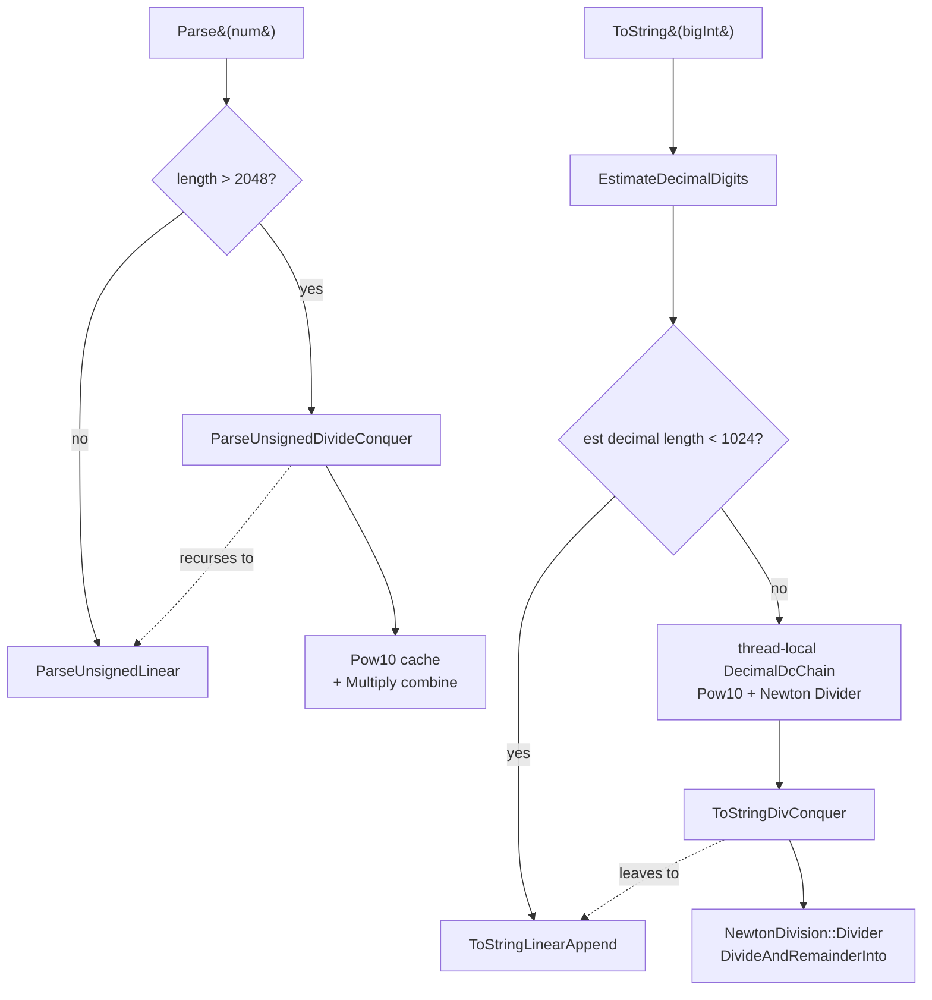

# String conversion in BigMath

A technical reference for the decimal I/O subsystem of this BigInteger library: parsing decimal strings into BigIntegers, formatting BigIntegers as decimal strings, the algorithms underlying both directions, optimization history, benchmark results against GMP, and a catalogue of approaches considered and rejected.

---

## Table of contents

1. [Scope and audience](#scope-and-audience)
2. [Why string conversion is its own problem](#why-string-conversion-is-its-own-problem)
3. [Number representation context](#number-representation-context)
4. [Parsing: decimal string → BigInteger](#parsing-decimal-string--biginteger)
   - [The chunking convention](#the-chunking-convention)
   - [Linear parser (`ParseUnsignedLinear`)](#linear-parser-parseunsignedlinear)
   - [Divide-and-conquer parser (`ParseUnsignedDivideConquer`)](#divide-and-conquer-parser-parseunsigneddivideconquer)
   - [The `Pow10` cache](#the-pow10-cache)
5. [Formatting: BigInteger → decimal string](#formatting-biginteger--decimal-string)
   - [Linear formatter (`ToStringLinearAppend`)](#linear-formatter-tostringlinearappend)
   - [Divide-and-conquer formatter (`ToStringDivConquer`)](#divide-and-conquer-formatter-tostringdivconquer)
   - [The Newton-Divider chain](#the-newton-divider-chain)
6. [Top-level dispatch](#top-level-dispatch)
7. [Benchmark results vs GMP](#benchmark-results-vs-gmp)
8. [Optimizations already implemented](#optimizations-already-implemented)
9. [Future opportunities](#future-opportunities)
10. [Explored but rejected](#explored-but-rejected)
11. [References](#references)

---

## Scope and audience

This document covers `Parse` and `ToString`, declared in `include/biginteger/common/Parser.h` (thresholds and constants) and implemented in `src/common/Parser.cpp`. Multiplication and division are companion documents — string conversion is deeply intertwined with both because parsing builds powers of 10 via multiplication and formatting consumes them via division.

- [BASE.md](BASE.md) — number representation (limb storage, limb bases, chunking conventions)
- [MULTIPLICATION.md](MULTIPLICATION.md) — multiplication algorithms used by parser's D&C path and `Pow10`
- [DIVISION.md](DIVISION.md) — division algorithms used by formatter's D&C path

Assumed reader: a working C++ engineer familiar with `std::string`, `std::vector`, and the rough shape of multi-precision arithmetic. No prior knowledge of base-conversion algorithms is assumed.

Code references use `path:line` where applicable.

---

## Why string conversion is its own problem

A `BigInteger` stores numbers in power-of-two limbs (base 2⁶⁴ by default). A decimal string represents the same number in base 10. The conversion between these representations is not a simple per-digit operation because **the limb base and the I/O base don't share enough factors** (`gcd(2⁶⁴, 10) = 2`, but only 2 cancels — the residual `10/2 = 5` factor cannot be peeled off cleanly).

Naïve approaches are quadratic:

```
   parse:    for each input digit: r = r·10 + digit            ← O(n²) for n digits
   format:   for each output digit: digit = r mod 10; r /= 10  ← O(n²)
```

Both involve O(n) multi-precision operations, each taking O(n) limb work, totalling O(n²). For 100 000-digit numbers this is unbearable.

The library uses two-level decompositions to escape the quadratic cost:

| direction | low-level | high-level |
|---|---|---|
| parse | base 10 → base 10¹⁸ via 18-digit chunks | base 10¹⁸ → limb base via D&C with cached Pow10 |
| format | limb base → base 10¹⁹ via divmod-10¹⁹ | base 10¹⁹ → base 10 ASCII via D&C with cached reciprocals |

The 10¹⁸/10¹⁹ chunking turns the inner loop's per-character work into per-18-or-19-character work, a constant-factor speedup. The D&C structure turns the O(n²) outer behavior into O(M(n) · log n), where M(n) is multiplication cost. With NTT in play, this is **O(n · log² n · log log n) effectively**.

---

## Number representation context

For full detail see [BASE.md](BASE.md). Briefly:

- `BigInteger` wraps `std::vector<DataT>` (`DataT = uint64_t`) plus a sign boolean.
- Limbs are little-endian (`vec[0]` is least significant).
- Default base is `Base2_64` — full 64-bit limbs (`BIGMATH_LIMB_64=1`, the default). `Base2_32` (value held in the low 32 bits of the 64-bit container) is the legacy fallback mode. The Parser code is written against `CurrentBase`, which resolves to whichever is compiled in.

The decimal I/O routines use additional bases internally:

- `Base10_18 = 10¹⁸` — the chunking base for the parser's inner loop. `10¹⁸ < 2⁶³ < 2⁶⁴`, so a chunk fits in a `uint64_t`, and chunk-times-limb products keep carry headroom in `ULong128` in both limb modes.
- `Base10_19 = 10¹⁹` — the formatter's divisor. Formatting only does scalar division by an invariant `uint64_t` divisor, so it can safely use the larger power and peel 19 digits per divmod.
- `Base10 = 10` — used only as a tutorial constant; never in production hot paths.

---

## Parsing: decimal string → BigInteger

### The chunking convention

Input strings are processed 18 ASCII digits at a time. The choice of 18 is dictated by `10¹⁸`:

```
   2⁶³ = 9 223 372 036 854 775 808
   10¹⁸ = 1 000 000 000 000 000 000
   10¹⁸ < 2⁶³ < 10¹⁹

   ⇒ 18 decimal digits fits in a signed int64 chunk with room to spare
   ⇒ chunk × 64-bit limb < 10¹⁸ · 2⁶⁴ < 2¹²⁴ fits in ULong128 (with carry headroom)
```

The chunk size matters because the inner loop of the linear parser does **one big-integer scalar-multiply per 18 input digits**, rather than one per input digit. The classical 1-digit-at-a-time parser would issue 18× as many scalar multiplications, each scaling 10× instead of 10¹⁸×. The total work is governed by the multiplication count, and reducing it by 18× is a free 18× speedup of the parser's outer loop.

### Linear parser (`ParseUnsignedLinear`)

For inputs up to `DecimalDcThreshold = 2 048 digits`, the parser uses a straightforward chunked accumulation:

```
   r = 0
   handle the leading remainder chunk (input_length mod 18 digits)
   while there are full 18-digit chunks remaining:
       chunk = parse next 18 ASCII digits as uint64
       r     = r · 10¹⁸ + chunk
   return r
```

Concretely (paraphrased from `ParseUnsignedLinear` in `src/common/Parser.cpp`):

```cpp
vector<DataT> r;
r.reserve(len / 9 + 2);          // rough size hint for the final BigInteger
r.push_back(0);

SizeT remainder = len % Base10_18_Zeroes;
Int pos = start;

if (remainder > 0) {
    ULong chunk = ParseChunk(num, pos, remainder);
    pos += (Int)remainder;
    AddTo(r, chunk, CurrentBase);
}

while (pos <= end) {
    ULong chunk = ParseChunk(num, pos, Base10_18_Zeroes);
    pos += (Int)Base10_18_Zeroes;
    ClassicMultiplication::MultiplyTo(r, Base10_18, CurrentBase);  // r ← r · 10¹⁸
    AddTo(r, chunk, CurrentBase);                                   // r ← r + chunk
}
```

Cost: O(L / 18) multi-precision scalar-multiplications, each O(|r|) ≈ O(L / 9.6) limbs. Total O(L²) for L decimal digits. Acceptable up to a few thousand digits; quickly painful above that.

### Divide-and-conquer parser (`ParseUnsignedDivideConquer`)

For inputs above the threshold (`> 8 192 digits`), the parser splits the input string in half and combines the halves with a single large multiplication:

```
   ParseDC(digits):
       if length(digits) ≤ threshold:
           return ParseLinear(digits)
       split digits into high_half | low_half     (low_half has len/2 digits)
       high = ParseDC(high_half)
       low  = ParseDC(low_half)
       scale = Pow10(len(low_half))
       return high · scale + low
```

The diagram:

```
                                                                
   ┌──────────────────────────────────────────────────────────┐ 
   │     "12345678...3456789012345678"   (L decimal digits)   │ 
   └──────────────────────────────────────────────────────────┘ 
                                │                               
                       split at digit L/2                       
                                │                               
              ┌─────────────────┴─────────────────┐             
              ▼                                   ▼             
       ┌──────────────┐                    ┌──────────────┐     
       │  high half   │                    │  low half    │     
       │  (L/2 chars) │                    │  (L/2 chars) │     
       └──────┬───────┘                    └──────┬───────┘     
              │ recurse                           │ recurse     
              ▼                                   ▼             
       ┌──────────────┐                    ┌──────────────┐     
       │  ParseDC     │                    │  ParseDC     │     
       └──────┬───────┘                    └──────┬───────┘     
              │                                   │             
              ▼                                   ▼             
       BigInteger high                    BigInteger low        
              │                                   │             
              │                                   │             
              ▼                                   │             
   scale ← Pow10(L/2)  ─── from cache             │             
              │                                   │             
              ▼                                   │             
       high · scale  ────  via Multiply() dispatcher            
              │                                   │             
              └────────────────┬──────────────────┘             
                               ▼                                
                         high · scale + low                     
                               │                                
                               ▼                                
                          final BigInteger                      
                                                                
```

The recurrence is `T(L) = 2·T(L/2) + M(L)`, where `M(L)` is multiplication cost. With NTT (`M(L) = O(L · log L)`):

```
   T(L) = 2·T(L/2) + O(L · log L)
        = O(L · log² L)   by the master theorem
```

vs the linear parser's `O(L²)`. For L = 100 000, the speedup is ~`L / log² L ≈ 100 000 / 289 ≈ 350×` in big-O terms. Empirically, the parser's win at 100 000 digits is closer to **4×** because the linear parser's inner loop is well-tuned and the D&C parser's `Multiply` calls have constant-factor overhead, but the asymptotic story is real and dominates at larger inputs.

### The `Pow10` cache

The D&C parser needs `Pow10(d)` for `d = L/2, L/4, L/8, ...` down to the leaf threshold. Naïvely computing each from scratch is wasteful — `Pow10(L/2)` is `Pow10(L/4)²`, so the chain can be constructed bottom-up with a sequence of squarings.

`Pow10(d)` (in `src/common/Parser.cpp`) uses recursive doubling with memoization:

```cpp
vector<DataT> Pow10(SizeT digits) {
    static thread_local unordered_map<SizeT, vector<DataT>> cache;

    auto it = cache.find(digits);
    if (it != cache.end())
      return it->second;

    vector<DataT> value;
    if (digits == 0)
        value = {1};
    else if (digits <= Base10_18_Zeroes)
        value = Convert(/* 10^digits computed in a ULong */);
    else if (digits % 2 == 0) {
        vector<DataT> p = Pow10(digits / 2);
        value = Square(p, CurrentBase);          // even d ⇒ Pow10(d) = Pow10(d/2)²
    } else {
        SizeT lo = digits / 2;
        SizeT hi = digits - lo;
        value = Multiply(Pow10(hi), Pow10(lo), CurrentBase);
    }
    return cache.emplace(digits, value).first->second;
}
```

The cache is `thread_local`, so each thread maintains its own. Because the implementation lives in one translation unit (`src/common/Parser.cpp`), every consumer shares the same per-thread cache — a real benefit of the `.cpp` split over the prior header-only design. The lifetime is the thread (or program for the main thread), which means repeated `Parse` and `ToString` calls amortize the `Pow10` build cost essentially to zero after the first invocation.

Even-`d` cases use [`Square`](MULTIPLICATION.md#squaring) rather than `Multiply(p, p)`. `Square` is structurally 1.4–1.6× faster than `Multiply(a, a)` (single FFT in the NTT case; half the partial products in the schoolbook case). The win is small in steady state (the cache absorbs it) but matters in cold-start scenarios.

---

## Formatting: BigInteger → decimal string

### Linear formatter (`ToStringLinearAppend`)

For inputs up to `BIGMATH_TOSTR_DC_THRESHOLD = 1 024 digits` (approximate; the threshold is in source-digit-count, not limb-count), the formatter divides the BigInteger by `10¹⁹` (`Base10_19`) repeatedly, peeling off 19 decimal digits per division. Formatting can use the larger power than parsing's 10¹⁸ because it only performs scalar division by an invariant divisor that fits in `uint64_t` — no chunk-times-limb carry headroom needed:

```
   chunks = []
   while r > 0:
       (r, chunk) = divmod(r, 10¹⁹)
       chunks.append(chunk)
   # chunks now holds the number in base 10¹⁹, little-endian
   format each chunk as up to 19 ASCII digits, right-to-left
```

Concretely (paraphrased from `ToStringLinearAppend` in `src/common/Parser.cpp`):

```cpp
vector<ULong> chunks;
chunks.reserve(r.size() + 1);
while (!(r.size() == 1 && r[0] == 0))
    chunks.push_back((ULong)ClassicDivision::DivModTo(r, Base10_19, CurrentBase));

// format top chunk without leading zeros, then all lower chunks with full 19 ASCII digits
```

Each `DivModTo` is O(|r|) limb operations. The number of iterations is O(L / 19) where L is the digit count. Total O(L · |r|) = O(L²). Same quadratic complexity as the linear parser; same role as the D&C leaf.

The inner loop of `DivModTo(vec, Base10_19, CurrentBase)` walks `vec` from high limb to low, carrying the running remainder. Each limb step is a Möller-Granlund "div2by1" reciprocal divide (`GranlundMollerDivider`, built once per call from the invariant divisor). In the default `Base2_64` mode each step consumes one full 64-bit limb (`gm.DivMod(r, vec[i], r)`); the legacy `Base2_32` mode packs `(r << 32) | vec[i]` into a `ULong128` accumulator first:

```
   gm  = GranlundMollerDivider(d=Base10_19)   ← precompute shift, dn, v once
   r   = 0
   for i = n-1 down to 0:
       (vec[i], r) = gm.DivMod(r, vec[i])     ← UMULH + add + ≤2 fixups
   return r                                   ← the remainder (a base-10¹⁹ digit)
```

Replacing the prior `__udivmodti4` libcall (one `UDIV` + multiply-subtract on ARM64, one `DIV` on x86) with `UMULH` + adds yields a measured 1.08–2.13× speedup on `ToString` depending on input size — small inputs that stay in the linear leaf gain the most, large inputs gain less because the D&C path dominates. See [Optimizations already implemented §Granlund–Möller](#granlundmöller-magic-number-divmod-in-classicdivision).

### Divide-and-conquer formatter (`ToStringDivConquer`)

For inputs above the threshold, the formatter mirrors the parser's structure — split the BigInteger at the middle decimal position, format each half independently, concatenate. The key operation is divmod by `10^k` where `k` is half the current decimal length.

```
   ToStringDC(n, level):
       if n is empty: emit padding zeros, return
       if level beyond chain: emit via linear formatter
       (q, r) = n divmod chain[level].value      ← chain[level].value = 10^k
       half   = chain[level].digits              ← k
       ToStringDC(q, level+1, padTo = parent_pad − half)   ← q → top half
       ToStringDC(r, level+1, padTo = half)                 ← r → bottom half, zero-padded
```

The diagram:

```
                                                                  
   ┌─────────────────────────────────────────────────────────┐    
   │  BigInteger n   (≈ L decimal digits)                    │    
   └─────────────────────────────────────────────────────────┘    
                              │                                   
              divmod n by 10^(L/2)                                
                              │                                   
              ┌───────────────┴───────────────┐                   
              ▼                               ▼                   
       ┌────────────┐                  ┌────────────┐             
       │  q (top)   │                  │  r (bot)   │             
       │  L/2 chars │                  │  L/2 chars │             
       └─────┬──────┘                  └─────┬──────┘             
             │ recurse                       │ recurse            
             │ no padding                    │ pad to L/2 zeros   
             ▼                               ▼                    
       ┌────────────┐                  ┌────────────┐             
       │  ToStrDC   │                  │  ToStrDC   │             
       └─────┬──────┘                  └─────┬──────┘             
             │                               │                    
             └───────────────┬───────────────┘                    
                             ▼                                    
                    output string                                 
                                                                  
```

Recurrence: `T(L) = 2·T(L/2) + Divmod(L → L/2)`. With Newton-Raphson reciprocal division running at `O(M(L))`, this is `T(L) = 2·T(L/2) + O(M(L))`, which solves to `O(M(L) · log L)`. With NTT: `O(L · log² L · log log L)` effectively.

vs the linear formatter's `O(L²)`. At L = 100 000 the empirical win is **8.4×** (45.5 ms vs 383 ms before this optimization landed).

**Critical design detail.** The chain must split parent at exactly the middle digit. An earlier attempt used a *power-of-2 tower* `chain[i] = 10^(18 · 2^i)` (10¹⁸, 10³⁶, 10⁷², ...) on the theory that bigger jumps would mean fewer levels. At 500 000 digits this took **1899 ms — slower than the linear formatter at 1700 ms** because each level's split was wildly unbalanced (the divmod at the top level reduced the problem from 500k digits to ≈ 363k + 137k, not the desired ≈ 250k + 250k). Two-thirds of the work cascaded into the larger half. The recurrence was `T(L) = T(0.73L) + T(0.27L) + M(L)` rather than `T(L) = 2·T(L/2) + M(L)`, which has no clean closed form but converges much slower than the balanced version. The fix was to construct the chain top-down with `chain[i] = 10^(L / 2^(i+1))`, guaranteeing every parent split exactly in half.

### The Newton-Divider chain

The D&C formatter divides repeatedly by a small set of `10^k` constants — exactly the cached-reciprocal use case that [`NewtonDivision::Divider`](DIVISION.md#reciprocal-cached-division) is designed for.

`BuildDecimalDcChain(topDigits)` (in `src/common/Parser.cpp`) constructs a chain of entries, each holding a power of 10 and its precomputed Newton reciprocal:

```cpp
struct DecimalDcEntry {
    SizeT digits;
    vector<DataT> value;                            // 10^digits in limb base
    std::shared_ptr<NewtonDivision::Divider> divider;  // precomputed reciprocal
};

vector<DecimalDcEntry> BuildDecimalDcChain(SizeT topDigits) {
    vector<DecimalDcEntry> chain;
    for (SizeT d = topDigits; d >= ToStringDcThreshold / 2; d /= 2) {
        DecimalDcEntry e;
        e.digits = d;
        e.value = Pow10(d);                                          // from cache (or built)
        e.divider = std::make_shared<NewtonDivision::Divider>(e.value, CurrentBase);
        chain.push_back(std::move(e));
    }
    return chain;
}
```

For a 100 000-digit number, the chain entries are at `d ∈ {50 000, 25 000, 12 500, 6 250, 3 125, 1 562, 781}` (until reaching `threshold / 2 = 512`). Seven chain entries, each with one `Pow10` build and one `Divider` setup. The `Divider` setup is the dominant cost of chain construction; it's amortized over every divmod at that level during the recursive descent.

**Why this is the key to the 8.4× win.** Before `NewtonDivision::Divider` existed, the D&C formatter rebuilt the reciprocal at *every* divmod call, restoring quadratic behavior to each level and making the whole D&C approach *slower* than linear formatting. The earlier "recursive D&C ToString" attempt in this codebase's history was correctly recognized as worse than linear and was reverted. Only after the `Divider` API landed (which made per-divide cost `O(M(n))` rather than `O(M(n) + reciprocal_setup)`) did the D&C structure pay off.

---

## Top-level dispatch

`ToString(BigInteger)` and `Parse(char const*)` (declared in `include/biginteger/common/Parser.h`, implemented in `src/common/Parser.cpp`) are the entry points. Both inspect the input size and route to either the linear or the D&C implementation.

Since PRs #118/#119 (2026-06-12), both directions also have a parallel fan-out above ~100 000 digits (`BIGMATH_TOSTR_PARALLEL_THRESHOLD` / `BIGMATH_PARSE_PARALLEL_THRESHOLD`, both 100 000; 3 splits each): the D&C tree descends serially for the first 3 levels, dispatches the 2³ subtrees via one `ParallelDo`, and runs the combines (parse) or string assembly (ToString) on the caller. See `CollectToStringSubtrees`, `CollectParseRanges`, and `CombineParsed` in `src/common/Parser.cpp`. Nested `ParallelDo` calls inside subtree workers (Newton/NTT internals) run inline via the pool's reentrancy guard — see [Explored but rejected §Parallel D&C recursion](#parallel-dc-recursion-deadlock-on-current-pool--overturned-2026-06-12).


```mermaid
flowchart TD
    P[Parse&#40;num&#41;] --> P2{length &gt; 2048?}
    P2 -- no --> PL[ParseUnsignedLinear]
    P2 -- yes --> PD[ParseUnsignedDivideConquer]
    PD --> PP[Pow10 cache<br/>+ Multiply combine]
    PD -. recurses to .-> PL

    T[ToString&#40;bigInt&#41;] --> TE[EstimateDecimalDigits]
    TE --> T2{est decimal length &lt; 1024?}
    T2 -- yes --> TL[ToStringLinearAppend]
    T2 -- no --> TC[thread-local DecimalDcChain<br/>Pow10 + Newton Divider]
    TC --> TD[ToStringDivConquer]
    TD --> NV[NewtonDivision::Divider<br/>DivideAndRemainderInto]
    TD -. leaves to .-> TL
```

Thresholds (overridable via `-D...`):

| macro | default | direction | meaning |
|---|---|---|---|
| `BIGMATH_PARSE_DC_THRESHOLD` (→ `DecimalDcThreshold` in `include/biginteger/common/Parser.h`) | `2 048` | parse | length below which linear parser runs |
| `BIGMATH_TOSTR_DC_THRESHOLD` | `1 024` | format | estimated decimal length below which linear formatter runs |

The asymmetry between the parser and formatter thresholds reflects that the formatter has lower per-call setup cost (the `BuildDecimalDcChain` builds a chain of size proportional to `log(L)`, with `Pow10` cache hits making each entry cheap), so it pays to switch to D&C at a smaller threshold than the parser.

---

## Benchmark results vs GMP

**Current numbers live in [BENCHMARK.md](../BENCHMARK.md)** (canonical run 2026-06-12, v13.0) — the tables below are a **historical 2026-05-27 snapshot** kept for the optimization narrative and are heavily superseded. Post PRs #118/#119 (parallel D&C fan-out for ToString and parse), decimal I/O **beats GMP from 500k digits in both directions**: parse 0.38–0.69×, warm ToString 0.49–0.62× of GMP's time.

Benchmark harness: `tests/performance/bench_vs_gmp.cpp`. Build:

```
cmake -S . -B build -DCMAKE_BUILD_TYPE=Release
cmake --build build -j8 --target bench_vs_gmp
./build/bench_vs_gmp
```

Hardware: Apple M1 Max. Reference: GMP 6.3.0 (Homebrew). Full default stack (`BIGMATH_LIMB_64=1` + `BIGMATH_NTT_CRT=1` + `BIGMATH_USE_THREADS=1`, 8-thread pool). Snapshot date 2026-05-27.

### Parse (historical snapshot, 2026-05-27)

| size | BigMath ms | GMP ms | BM / GMP |
|---|---:|---:|---:|
| 1 000 digits | 0.002 | 0.002 | 1.55 × |
| 10 000 digits | 0.112 | 0.038 | 2.97 × |
| 50 000 digits | 1.350 | 0.389 | 3.47 × |
| 100 000 digits | 3.287 | 1.042 | **3.15 ×** |
| 500 000 digits | 22.220 | 8.799 | **2.53 ×** |
| 1 000 000 digits | 48.652 | 20.301 | **2.40 ×** |
| 2 000 000 digits | 106.413 | 46.878 | **2.27 ×** |
| 5 000 000 digits | 266.531 | 148.477 | **1.80 ×** |
| 10 000 000 digits | 577.357 | 340.170 | **1.70 ×** |
| 20 000 000 digits | 1 252.454 | 803.190 | **1.56 ×** |
| 50 000 000 digits | 5 212.270 | 2 629.889 | **1.98 ×** |

At this snapshot, parse's BM/GMP ratio narrowed with size — 1.56× at 20M digits vs 3.2× at 100k — as the asymptotic D&C parser inherited BigMath's NTT lead. **Superseded:** the 2026-06-12 run in [BENCHMARK.md](../BENCHMARK.md) has parse *beating* GMP (0.38–0.69×) at every size from 500k digits up, after the parallel leaf fan-out of PR #119.

### ToString (historical snapshot, 2026-05-27)

| size | BigMath ms | GMP ms | BM / GMP |
|---|---:|---:|---:|
| 1 000 digits | 0.006 | 0.003 | 1.83 × |
| 10 000 digits | 0.268 | 0.078 | 3.46 × |
| 50 000 digits | 4.001 | 0.844 | 4.74 × |
| 100 000 digits | 19.484 | 2.334 | **8.35 ×** |
| 200 000 digits | 39.870 | 6.043 | 6.60 × |
| 500 000 digits | 107.239 | 20.426 | 5.25 × |
| 1 000 000 digits | 224.120 | 49.792 | **4.50 ×** |
| 2 000 000 digits | 477.132 | 120.276 | **3.97 ×** |
| 5 000 000 digits | 1 100.592 | 380.412 | 2.89 × |
| 10 000 000 digits | 2 414.564 | 900.384 | 2.68 × |
| 20 000 000 digits | 5 436.545 | 2 115.685 | **2.57 ×** |

At this snapshot, ToString's BM/GMP ratio narrowed from 8.4× at 100k to 2.57× at 20M. **Superseded:** the 2026-06-12 run in [BENCHMARK.md](../BENCHMARK.md) has warm ToString *beating* GMP (0.49–0.62×) from 500k digits up, after the cached divider chains, chain-top rounding, and the PR #118 parallel subtree fan-out. (A note here previously called the then-current `2^24` MFA gate "mostly neutral" for ToString — the gate has since moved to `2^20`; see [Future opportunities](#mfa-threshold-effects).)

**Historical view** showing the cumulative wins across the 2026-05 optimization pass:

| size | early 2026 | CRT + threads | + radix-4+8 (now) | total |
|---|---|---|---|---|
| Parse 100 000 | 7.1 × | 3.10 × | **3.15 ×** | **2.3 ×** |
| Parse 1 000 000 | 6.0 × | 2.33 × | **2.40 ×** | **2.5 ×** |
| Parse 10 000 000 | — | 1.73 × | **1.70 ×** | — |
| ToString 10 000 | 47 × | 11.2 × | **3.46 ×** | **13.6 ×** |
| ToString 100 000 | **160 ×** | 9.57 × | **8.35 ×** | **19.2 ×** |
| ToString 1 000 000 | — | 4.92 × | **4.50 ×** | — |
| ToString 10 000 000 | — | 2.84 × | **2.68 ×** | — |

The 100k ToString case went from 160× to 8.35× over the session — **19.2× cumulative improvement**. Wins came from:

1. D&C ToString with Newton-Divider chain (8.4× at 100k).
2. 64-bit hybrid Karatsuba leaf (improved every `Multiply` and `Divide` call in the chain).
3. Squaring specialization in `Pow10` cache build.
4. Reduced Karatsuba recursive overhead.
5. **64-bit limb refactor** halved Newton's internal limb counts (PRs #18-#30).
6. **`digitsPerLimb` fix** correctly sized D&C leaf chunks under LIMB_64 (PR #29 — caught a 2× regression that the limb refactor had introduced).
7. **Multi-prime CRT NTT** dropped per-coefficient modular cost (PRs #34-#37).
8. **Multithreaded NTT** parallelizes the 3 CRT primes' transforms across the pool (PRs #32, #38-#39).
9. **Radix-4 + radix-8 fused NTT butterflies** cut memory-pass count from log₂(n) to log₈(n) (PRs #59, #60). Every Newton-chain `Multiply` and `Divide` inherits ~1.6× wall-clock at ≥2M limbs.

### Where the ToString time goes (post-optimization)

Profile of `ToString 100 000 digits` under default stack (sample(1), M1 Max):

| function group | % of ToString time |
|---|---:|
| `NewtonDivision::Divider::DivideAndRemainder` (D&C chain divmod calls) | ~55% |
| `NttCrt::Multiply` (internal mults inside Newton's `ApproxReciprocal` + `DivideChunk`) | ~25% |
| `ToStringLinearAppend` (linear leaf, divmod-10¹⁹ loop) | ~10% |
| `ToStringDivConquer` orchestration + Compare/Shift/TrimZeros | ~7% |
| Allocation + misc | ~3% |

The distribution is now dominated by Newton's divmod chain calling NTT mults. The earlier hot spots (39% in `MultiplyClassicPtr` schoolbook leaf, 5-10% in `__udivmodti4`) were eliminated by the 64-bit hybrid leaf + `digitsPerLimb` fix. The next algorithmic candidate — Mulders' short-mult inside Newton — was implemented exactly and measured flat at the bench sizes (see [DIVISION.md §Mulders'](DIVISION.md#reduce-ntt-calls--mulders-short-multiplication-implemented-rejected-2026-05-26)), so the remaining gap concentrates in the NTT butterfly inner loop itself rather than in Newton's call count.

### Parse: where the time goes

Profile of `Parse 100 000 digits`:

| function | % of Parse time |
|---|---:|
| `ParseUnsignedDivideConquer` recursion + Multiply calls | ~39% (inclusive) |
| `ParseUnsignedLinear` (at leaves) | ~2% |
| `ClassicMultiplication::MultiplyTo` (scalar mul in linear leaf) | ~3.4% |
| underlying `Multiply` dispatcher calls (for scale·high) | rest |

The dominant cost is the multiplications inside the D&C combination step (`high · scale + low`). At 100 000 digits this is ~17 NTT-range multiplications (one per recursion level). Parser performance tracks NTT performance directly.

---

## Optimizations already implemented

A loosely chronological summary of optimizations that landed and stuck.

### Linear parser with 10¹⁸ chunking

The base case for all parsing. Reads 18 ASCII digits at a time, multiplies the partial result by 10¹⁸ via `ClassicMultiplication::MultiplyTo`, adds the chunk via `AddTo`. 18× fewer multi-precision multiplications than a per-digit parser. Has always existed.

### Linear formatter with divmod-10¹⁹

The base case for all formatting. Divides by 10¹⁹ in place via `ClassicDivision::DivModTo`, emits 19 ASCII digits per division. Parsing still uses 10¹⁸ so scalar chunk multiplication keeps broad carry headroom; formatting can use the larger divisor safely because it only performs scalar division and the divisor fits in `uint64_t`.

### `Pow10` memoization

Recursive doubling with `thread_local` cache. Stale entries never evict; the chain of `Pow10` values for any given operation builds incrementally and persists across calls. Cache lookup is the inner cost on warm calls (one hash map probe).

### Divide-and-conquer parser (`ParseUnsignedDivideConquer`)

Splits input string at the middle digit, recurses on both halves, combines via one large multiplication. Builds powers of 10 via the `Pow10` cache. Threshold = 8 192 digits. Reduces parse complexity from `O(L²)` to `O(M(L) · log L)`. **100 000-digit parse: 36.5 ms → 8.9 ms** when this landed.

### Divide-and-conquer ToString (`ToStringDivConquer`) with Newton-Divider chain

The 2026-05 optimization that produced the largest single ToString win. Chain of `NewtonDivision::Divider` instances, one per recursion level, each holding `10^(L/2^i)` and its precomputed Newton reciprocal. Recursion splits parent exactly in half via the carefully constructed chain. Threshold = 2 048 estimated decimal digits. **100 000-digit ToString: 383 ms → 45.5 ms (8.4×)**.

Critical detail: the chain must be constructed top-down with `chain[i] = 10^(L / 2^(i+1))`. An earlier power-of-2-tower construction (`chain[i] = 10^(18 · 2^i)`) gave catastrophically unbalanced splits and made the D&C formatter slower than the linear formatter at 500k digits.

### Cached ToString divider chains

The D&C formatter now keeps a thread-local cache of full decimal divider chains keyed by the top split digit count. `Pow10` values were already cached, but warm `ToString` calls still rebuilt every `NewtonDivision::Divider` reciprocal. Reusing the chain targets the previous chain-construction cost directly and benefits repeated conversions of similarly sized values.

Focused warm benchmark on this repository's `tests/performance/tostring_bench.cpp`:

| size | baseline ms | cached-chain stack ms | speedup |
|---|---:|---:|---:|
| 1 000 | 0.0079 | 0.0062 | 1.27× |
| 10 000 | 1.1224 | 0.5097 | 2.20× |
| 50 000 | 9.4674 | 4.4633 | 2.12× |
| 100 000 | 19.8435 | 9.4409 | 2.10× |
| 200 000 | 41.1607 | 20.5682 | 2.00× |
| 500 000 | — | 61.1404 | — |
| 1 000 000 | — | 135.8015 | — |
| 2 000 000 | — | 299.5458 | — |

The cache is `thread_local` like `Pow10`; entries grow monotonically for the lifetime of the thread.

### Squaring in `Pow10` even-`d` branch

For even `d`, `Pow10(d) = Pow10(d/2)²`. Using [`Square`](MULTIPLICATION.md#squaring) instead of `Multiply(p, p)` saves one FFT in the NTT case (1.4×) and half the partial products in the Karatsuba/schoolbook case (1.5×). Real-world impact: ~3% on cold-start parse and ToString (caught by the `Pow10` cache after the first invocation).

### `ToStringLinearAppend` direct ASCII formatting

The linear formatter formats each chunk's digits directly into a `char` buffer, then `out.append`s the buffer. No intermediate `std::string` allocations per chunk. The top chunk is special-cased to skip leading zeros; lower chunks always emit full 19 digits. The current code uses a 100-entry digit-pair table to halve the number of scalar decimal divisions in the ASCII emission loop.

### Approximate decimal length estimation

`ToString` estimates the output decimal length from the actual bit length of the most significant limb, using `floor(bits * log10(2)) + 1`. The estimate is used to:

1. Pre-reserve the output string buffer (avoids re-allocation during append).
2. Decide whether to take the linear or D&C path.
3. Choose the top `Pow10` for the chain.

This is still a safe upper bound, but it is tighter than multiplying by total limb count because the most significant limb is often only partially full. That avoids some oversized top-level divider chains near D&C boundaries.

### 64-bit hybrid Karatsuba leaf (indirect)

Discussed in detail in [MULTIPLICATION.md §Classic schoolbook](MULTIPLICATION.md#classic-schoolbook). Every `Multiply` and `Square` call inside the parser's D&C combine and the ToString's `Pow10` build hits Karatsuba (for the mid-sized intermediate products) and benefits from the 64-bit hybrid leaf. The ToString 10k case went from 31× to 22× vs GMP largely thanks to this multiplication-level change, even though no string-conversion code was modified.

### Granlund–Möller magic-number divmod in `ClassicDivision`

Landed 2026-05-26. `ClassicDivision::DivideTo`, `DivModTo`, and `DivideAndRemainder` all replaced their `ULong128 / d` inner loops with Möller-Granlund "div2by1" reciprocal arithmetic (paper Algorithm 4). Reciprocal is built once per call (`(2^128 - 1) / dn` precompute) and amortized across the per-limb loop; each limb step then costs one 64×64→128 `UMULH` plus a 128-bit add and 1–2 fixup branches, vs the prior `__udivmodti4` libcall.

`ToString` benefits directly — every `DivModTo(r, Base10_19, ...)` call in `ToStringLinearAppend` runs through the new path, and the D&C formatter routes hundreds of <2 048-digit leaf subproblems through the same loop. Measured wins (M1 Max, default stack):

| size | pre-GM BM ms | post-GM BM ms | speedup | pre-GM × GMP | post-GM × GMP |
|---|---:|---:|---:|---:|---:|
| ToString 1 000 | 0.017 | 0.008 | **2.13×** | 5.67 × | 2.34 × |
| ToString 10 000 | 0.863 | 0.724 | **1.19×** | 11.2 × | 8.78 × |
| ToString 50 000 | 10.1 | 9.07 | **1.11×** | 12.0 × | 10.4 × |
| ToString 100 000 | 22.5 | 20.85 | **1.08×** | 9.57 × | 8.62 × |

Pre-implementation estimate in this doc was "1–2% on ToString 100k" (capped by `__udivmodti4` being only 2.2% of profile). Realized win at 100k is ~8%, larger than predicted because the D&C path's leaves all hit the linear formatter, not just the top-level dispatch. Small-N wins are large (2.13× at 1k) because that range stays entirely in the linear leaf — exactly the regime where the prior `__udivmodti4` libcall dominated.

`Parse` is unaffected (parser uses `MultiplyTo`, not `DivModTo`). `FastDivision` and friends call `ClassicDivision::DivModTo` for their single-limb-divisor fallback, so any caller passing a single-limb divisor now benefits.

---

## Future opportunities

Ranked by expected ROI per unit of effort.

### MFA threshold effects

Large `ToString` calls spend most of their time in Newton division, and Newton's hot path is multiplication. The MFA gate has moved twice: `2^21` → `2^24` (2026-05, when whole-transform `ParallelDo` batching made MFA lose through ~2^23) → **`2^20`** (2026-06-12, after PR #107's row-chunked fused stages flipped the break-even; canonical value in `include/biginteger/build/DispatchThresholds.h`). ToString inherits whatever the multiplication stack does here; any further string-conversion gain should come from multiplication improvements or deeper Newton scratch reuse rather than formatter orchestration.

### `BIGMATH_TOSTR_DC_THRESHOLD` tuning (re-swept 2026-06-11 — default now 1 024)

**Re-swept 2026-06-11** after the multiplication-stack changes since May (radix-4/8 fused NTT PR #59/#60, MFA PR #65, Newton balanced band PR #79) shifted the linear→D&C crossover. The May conclusion below no longer holds: paired old/new runs showed T=1024 wins or ties at every measured size — 1 500 digits −19%, 2 000 −31%, 10 000 −33%, 100k–1M ~−7%. The 22–34% regression zone at 1.5–2k digits from the May sweep has inverted. `DecimalDcThreshold` (parse) was re-swept the same day: 8 192 → 2 048 with no regression at any size and −28% at 10k, −53% at 8k, −11–12% at 100k–1M digits.

#### Historical: 2026-05-26 sweep (superseded)

The threshold defaulted to 2 048. **Re-swept 2026-05-26** after the GM div2by1 in `ClassicDivision` (PR #43) made the linear leaf 2.13× faster at 1k digits — that shift could have moved the linear→D&C crossover. It didn't. 2 048 remains the right compromise.

Best ToString time (ms, min over many iters, M1 Max, full default stack) at each (size, threshold) cell:

| size (digits) | T=256 | T=512 | T=1024 | **T=2048** | T=4096 | T=8192 |
|---|---:|---:|---:|---:|---:|---:|
| 500    | 0.0053 | 0.0020 | 0.0020 | **0.0020** | 0.0020 | 0.0020 |
| 1 000  | 0.0170 | 0.0141 | 0.0078 | **0.0077** | 0.0128 | 0.0079 |
| 1 500  | 0.0314 | 0.0293 | 0.0263 | **0.0196** | 0.0213 | 0.0213 |
| 2 000  | 0.0458 | 0.0433 | 0.0385 | **0.0316** | 0.0317 | 0.0316 |
| 3 000  | 0.0962 | 0.0924 | 0.0900 | **0.0878** | 0.0717 | 0.0717 |
| 5 000  | 0.2297 | 0.2228 | 0.2207 | **0.2217** | 0.2224 | 0.2004 |
| 10 000 | 0.6926 | 0.6797 | 0.6791 | **0.6905** | 0.7223 | 0.7722 |
| 50 000 | 8.899  | 8.887  | 8.922  | **9.049**  | 9.399  | 10.145 |
| 100 000| 19.461 | 19.603 | 19.527 | **19.743** | 20.562 | 22.163 |

**Why 2048 was the right default (May 2026).** No single threshold dominates across the size range — at 1.5–2k T=2048 is best (the doc's stated sweet spot), at 3k T=4096 wins by 18%, at 10k+ T=1024 marginally faster (1–2%). 2048 sits at the corner of the curve. Lowering to 1024 costs 22–34% at 1500–2000 digits in exchange for ~1–2% at 10k+ — net loss. Raising to 4096 saves 18% at 3k but costs 66% at 1k (puny tier 0.013ms but a common case). 2048 minimizes the worst-case regression across the typical workload mix.

**Don't tune without re-measuring.** The pre-PR-#43 sweep gave the same answer with different absolute times. If further optimizations land that shift the linear-leaf cost again, re-run the sweep before changing the default.

### Cyclic-NTT gate retune for chain construction (2026-06-11)

Cold-path profiling (fresh `topDigits` per call, so the divider-chain cache never hits) showed
~100% of a cold 100k-digit `ToString` inside `Divider` construction — `ApproxReciprocal` towers
whose multiplies all sit below the 5120-limb NTT dispatch threshold, i.e. pure Karatsuba.

The wraparound machinery (cyclic `mod B^L−1` products in the reciprocal iteration and
`WrappedRemainder`) had inherited `NTT_MULTIPLICATION_THRESHOLD` as its gate — but a cyclic
product runs at HALF the transform length of the full product that threshold was tuned for, so
its crossover vs Karatsuba sits proportionally lower. New `BIGMATH_CYCLIC_NTT_THRESHOLD`
(default **1280** total limbs) gates the cyclic paths independently.

Paired sweep (cold ToString, BM/GMP ratio, machine under load so ratios not absolute):
100k digits 7.3–7.4× → **4.6–5.2×**, 200k −33%, 500k+ neutral, 640 regresses. The win flows to
every Newton divide with sub-5120-limb internals, not just ToString.

### Chain-top rounding — shared chains across nearby sizes (2026-06-12)

The divider-chain cache key was the EXACT estimated digit count: a workload
converting many values of slightly different lengths (~100k ± a few hundred
digits) rebuilt the entire chain — the dominant cold cost — on every call.
`ToString` now rounds the chain top up to a 1/16-octave grid
(`grid = 2^(bit_width(d)-5)`), so all sizes in a grid slice share one cached
chain. The first split becomes at worst ~56/44 instead of exactly half —
benign (the rejected power-of-2 tower below failed at 73/27). Measured: a
200-conversion mixed-size ~100k-digit workload dropped 2 714 → 1 801 ms
(−34%); single-size cold and warm behavior unchanged within noise.
Round-trips verified at grid edges (±1 around 2^k boundaries, 1024–1M digits).

### True scratch-buffer reuse inside Newton division

The current `NewtonDivision::Divider::DivideAndRemainderInto` boundary API avoids rebuilding the divisor reciprocal, but it still delegates to internals that allocate temporary quotient, remainder, normalization, and multiplication vectors. A deeper scratch-aware Newton path could reduce allocation churn in `ToStringDivConquer`. Expected win is small, probably low single digits, because profiling shows the dominant cost is still NTT multiplication. This is not a first-choice optimization unless allocation profiles show otherwise.

---

## Explored but rejected

Each rejection has a concrete reason. Don't re-propose without new evidence overturning the reason.

### Power-of-2 tower chain for D&C ToString

Tried 2026-05. Constructed `chain[i] = 10^(18 · 2^i)` (10¹⁸, 10³⁶, 10⁷², 10¹⁴⁴, ...) on the theory that bigger chunks per level would mean fewer levels. At 500 000 digits this took **1 899 ms — slower than the linear formatter at 1 700 ms**. Root cause: the top divmod at 500k digits used divisor 10¹⁴⁷ ≈ 488 KB worth of decimal digits, leaving ~363k digits in `q` and ~147k in `r`. This 73%/27% split persisted at every level, giving a recurrence `T(L) = T(0.73L) + T(0.27L) + M(L)` rather than `T(L) = 2T(L/2) + M(L)`. The unbalanced split's recurrence is unfriendly.

Fixed by constructing the chain top-down with `chain[i] = 10^(L / 2^(i+1))`, guaranteeing every parent split exactly in half. Final 500k-digit ToString: 444 ms; 1M-digit: 940 ms.

### Earlier recursive D&C ToString attempt (pre-`Divider`)

Historical context. Before the `NewtonDivision::Divider` cached-reciprocal API existed, an earlier D&C ToString implementation rebuilt the Newton reciprocal at every divmod call. Each per-level divmod was effectively quadratic in `n`, making the whole D&C approach slower than the linear formatter. The implementation was correctly recognized as a regression and reverted.

The 2026-05 D&C ToString worked specifically because `Divider` made per-divide cost O(M(n)) — the same divmod that had been quadratic before became O(M(n) log n) across the chain, finally beating the linear formatter's O(L²).

### Parallel D&C recursion (deadlock on current pool) — OVERTURNED 2026-06-12

**This rejection no longer holds.** `ParallelDo` is now reentrant-safe: a thread-local nesting guard (`tl_chunkDepth` in `src/common/Parallel.cpp`) makes any `ParallelDo` issued from inside a chunk body run inline serially instead of corrupting the pool's single work slot. On top of that guard, parallel D&C fan-out shipped in **both directions**: ToString subtree fan-out in PR #118 (`CollectToStringSubtrees`) and parse leaf fan-out in PR #119 (`CollectParseRanges` / `CombineParsed`), both in `src/common/Parser.cpp`. The shape that won is not the per-level `ParallelDo(2)` rejected below, but a serial descent to a fixed split depth followed by one flat `ParallelDo` over the 2³ subtrees — workers' nested NTT dispatches run inline, and the result is the ≥500k-digit win over GMP recorded in [BENCHMARK.md](../BENCHMARK.md).

The original 2026-05-26 analysis, kept as historical context:

Attempted 2026-05-26. Wrapped `ToStringDivConquer` in a return-style variant that dispatched the two halves via `ParallelDo(2)` with a depth-cap derived from `ParallelNumThreads()`. ToString at 100k digits: 20.85 ms → 16.83 ms (1.24×). ToString at 200k digits: **deadlock**.

Root cause: nested `ParallelDo` on the shared thread pool. Outer `ParallelDo(2)` workers ran Newton, which calls NTT-CRT, which calls `ParallelDo(3)` internally for the per-prime forwards/inverses. The pool (`src/common/Parallel.cpp`) has a single `(curBody, curCtx, generation)` slot — second dispatch overwrites the first, `remaining` counter races, outer wait condition never satisfied. At 100k the per-Newton-call NTT stayed below the CRT threshold so no inner dispatch occurred; at 200k+ the inner CRT fired and deadlocked.

The analysis predicted that a reentrancy guard would "avoid deadlock but lose" because outer split 2× × inner serial 1× = 2× total vs inner CRT-threaded ~2.5×. That arithmetic assumed per-level fan-out of exactly 2; the shipped design fans out 8 subtrees at once, which keeps the pool saturated and beats the inner-parallelism-only baseline.

### Direct in-place D&C formatting (measured flat at orchestration layer)

Attempted 2026-05-26. Doc previously estimated 3–5% on ToString by "avoiding the std::move chain" in `ToStringDivConquer`. Built a lite variant that passes `n` by mutable reference and uses `std::vector::swap` to reuse the caller's slot for `qr.first` and `qr.second` between recursive calls — eliminates the by-value pass entirely at the orchestration layer.

Result (M1 Max, ToString 100k/200k/500k/1M/2M, 3 runs each, min):

| size | baseline | in-place lite | delta |
|---|---:|---:|---:|
| 100k | 20.81 ms | 20.82 ms | flat |
| 200k | 43.3 ms  | 43.1 ms  | flat (-0.5%, within noise) |
| 500k | 118.6 ms | 118.5 ms | flat |
| 1M   | 243.5 ms | 246.3 ms | flat (+1%, noise) |
| 2M   | 527.1 ms | 533.5 ms | flat (+1%, noise) |

Why doc estimate was wrong: `std::move` of a `std::vector` is already an O(1) pointer swap — not an allocation. The "orchestration" bucket in the profile (~7% of ToString) is dominated by `Compare`, `TrimZeros`, and Newton's internal `ShiftLeftBits` during normalize — none of those go away by removing the std::move chain.

The boundary `Divider::DivideAndRemainderInto(a, q_out, r_out)` API now exists, but it still delegates to Newton internals that allocate their own temporaries. The missing piece is deeper scratch-aware `DivideChunk` / reciprocal multiplication plumbing. That is a broader division refactor for low-single-digit expected gain, not an orchestration-layer string-formatting change.

Reverted. Don't re-propose at the orchestration layer.

### Per-digit parser (no chunking)

The classical textbook parser processes one ASCII digit at a time: `r = r * 10 + digit`. 18× more multi-precision operations than the chunked parser, each scaling by 10 instead of 10¹⁸. Has been universally superseded by chunked variants in production libraries since at least the 1980s. Not implemented; not on any future opportunity list.

### Per-digit formatter (no chunking)

The classical textbook formatter computes `r mod 10` and `r / 10` for each output digit. Same 18× overhead as the per-digit parser. Same rejection.

### Formatting via base conversion tables

Some libraries precompute large tables of `10^k` values for `k` up to some bound and use them for both direction conversions. This codebase's `Pow10` cache is essentially this idea, but lazy — entries are computed on demand and cached. A pre-populated table at process start would frontload the cost but save first-call latency. Not worth the complexity: the lazy cache hits the same steady state after one call.

### Schönhage's asymptotically fast base conversion

[Schönhage's algorithm for base conversion](https://gmplib.org/list-archives/gmp-discuss/2008-January/003078.html) achieves the asymptotic optimum `O(M(n) · log n)` for both parse and format, matching what the D&C approaches here achieve. The implementation differs in details (Schönhage uses a different chain construction with sharper precision tracking). The library's D&C parse and format already hit the same asymptotic complexity class; a Schönhage rewrite would offer at best constant-factor improvements over the current D&C with cached Newton dividers.

Not pursued because the constant-factor difference between the current implementation and Schönhage's is small (both bottleneck on NTT multiplication), and the implementation effort would be substantial.

### Fixed-base radix conversion (e.g., always emit hex)

`ToString` for hex would skip all the base-10 conversion machinery. Hexadecimal output is `O(n)` instead of `O(n · log n)` because the conversion is per-limb bit-extraction. Not implemented because the API is fixed to decimal; adding a `ToHexString` is straightforward but hasn't been requested.

### Pre-allocated thread-local scratch buffers for D&C

Each `ToStringDivConquer` recursion level constructs fresh `vector<DataT>` for `q` and `r`, but the measured in-place-lite attempt above showed that moving/swapping those vectors is not the bottleneck. A plain thread-local arena at the formatter layer is unlikely to matter. Any real buffer-reuse win has to move down into Newton division's temporary vectors, as noted in [Future opportunities](#future-opportunities).

### Customized small-int parsing (≤ 18 digits)

For inputs that fit in a single 10¹⁸ chunk (≤ 18 digits), the parser could skip the BigInteger machinery entirely and return a single-limb result directly. The current `ParseUnsignedLinear` already handles this case efficiently (one `AddTo` call after the initial `push_back(0)`), so there's no real overhead to skip. Not worth specialization.

---

## References

### Algorithms

- Knuth, D. E. *The Art of Computer Programming, Vol. 2: Seminumerical Algorithms*, §4.4 — "Radix Conversion." The canonical treatment of integer base conversion, including the quadratic and asymptotically-fast variants.
- [Brent, R. P. and Zimmermann, P. — *Modern Computer Arithmetic* (Cambridge, 2010)](https://members.loria.fr/PZimmermann/mca/pub226.html) — Chapter 1.7 ("Base Conversion") and §1.7.2 ("Subquadratic Algorithms") cover the D&C parse and format with cached powers, including the precision analysis.
- [Schönhage's base conversion idea (GMP mailing list summary)](https://gmplib.org/list-archives/gmp-discuss/2008-January/003078.html) — discussion of asymptotically-optimal base conversion in the GMP context.

### Magic-number division

- [Granlund, T. and Möller, N. — "Improved Division by Invariant Integers" (IEEE Trans. Comput., 2010)](https://gmplib.org/~tege/division-paper.pdf) — magic-number division by constants; relevant to optimizing the linear formatter's divmod-10¹⁹.

### Reference implementations

- [GMP — The GNU Multiple Precision Arithmetic Library](https://gmplib.org/) — canonical reference.
- [GMP manual: `mpz_get_str` / `mpz_set_str`](https://gmplib.org/manual/Converting-Integers) — GMP's parse and format API. GMP's `mpz_get_str` uses a divide-and-conquer approach for large inputs; `mpz_set_str` uses chunked accumulation similar to this library's linear parser.
- [GMP manual: "Radix to Binary"](https://gmplib.org/manual/Radix-to-Binary) — the algorithm class that the parser falls into.
- [GMP manual: "Binary to Radix"](https://gmplib.org/manual/Binary-to-Radix) — the algorithm class that the formatter falls into.
- [Python's `int.__str__` implementation](https://github.com/python/cpython/blob/main/Objects/longobject.c) — uses a similar two-level (chunk × ASCII) approach with a configurable D&C threshold via `sys.set_int_max_str_digits` (the threshold is also a CVE-mitigation, since unbounded int → string conversion is a DoS vector for untrusted input).
- [Java `BigInteger.toString(int radix)`](https://docs.oracle.com/en/java/javase/17/docs/api/java.base/java/math/BigInteger.html#toString(int)) — supports D&C formatting for large inputs.

### This codebase

- `include/biginteger/common/Parser.h` — declarations, thresholds (`DecimalDcThreshold`, `ToStringDcThreshold`), `Base10_18`/`Base10_19` constants.
- `src/common/Parser.cpp` — both parse and format implementations, `Pow10` cache, D&C chain construction (`DecimalDcEntry`, `BuildDecimalDcChain`), parallel fan-outs (`CollectParseRanges`, `CombineParsed`, `CollectToStringSubtrees`).
- `include/biginteger/algorithms/multiplication/ClassicMultiplication.h::MultiplyTo` — scalar-by-vector multiplication used in parser's linear leaf.
- `include/biginteger/algorithms/division/ClassicDivision.h::DivModTo` — scalar divisor divmod used in formatter's linear leaf.
- `include/biginteger/algorithms/division/NewtonDivision.h::Divider` — cached-reciprocal API that makes D&C formatter viable; see [DIVISION.md §Reciprocal-cached division](DIVISION.md#reciprocal-cached-division).
- `include/biginteger/algorithms/Multiplication.h` and `Squaring.h` — used by `Pow10` cache build; see [MULTIPLICATION.md](MULTIPLICATION.md).
- `tests/performance/bench_vs_gmp.cpp` — GMP comparison for parse and ToString.

### Companion documents

- [BASE.md](BASE.md) — number representation underlying both directions (the `Base2_64` limbs and `Base10_18`/`Base10_19` chunking).
- [MULTIPLICATION.md](MULTIPLICATION.md) — multiplication algorithms that power the parser's D&C combine step and `Pow10` cache build.
- [DIVISION.md](DIVISION.md) — division algorithms that power the formatter's D&C chain. In particular, the [`NewtonDivision::Divider` class](DIVISION.md#reciprocal-cached-division) is the foundation of the 8.4× D&C ToString win.
